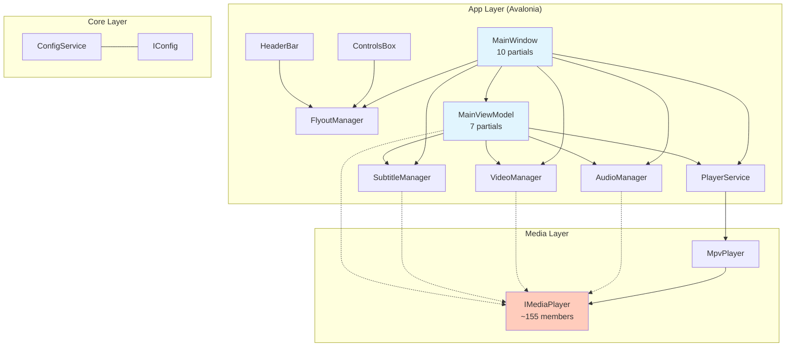
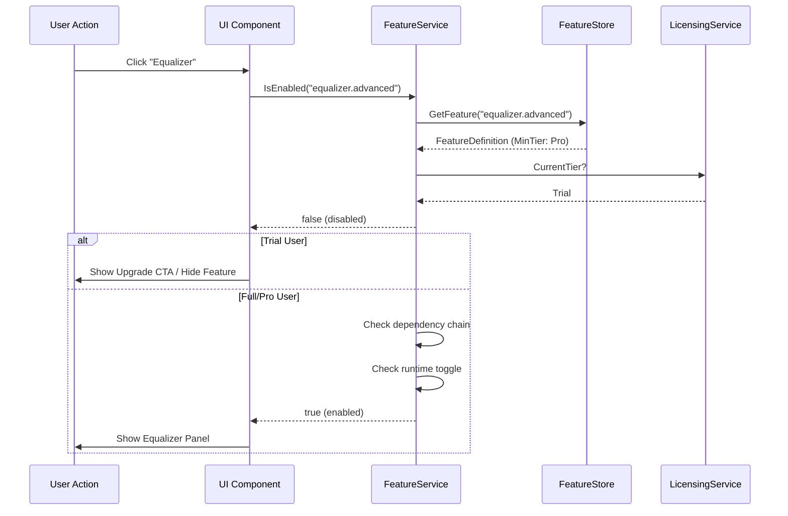
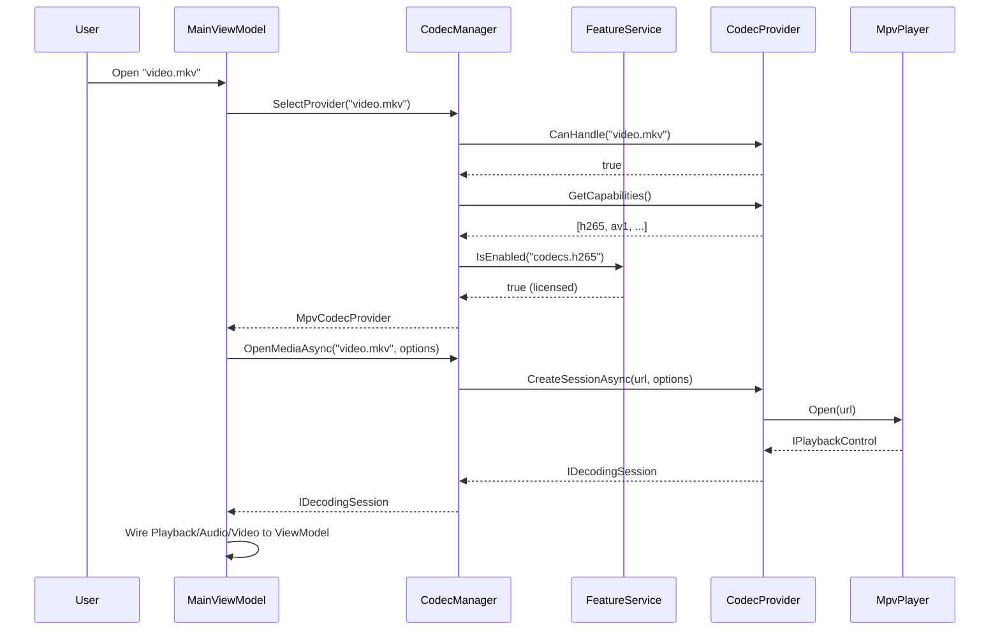
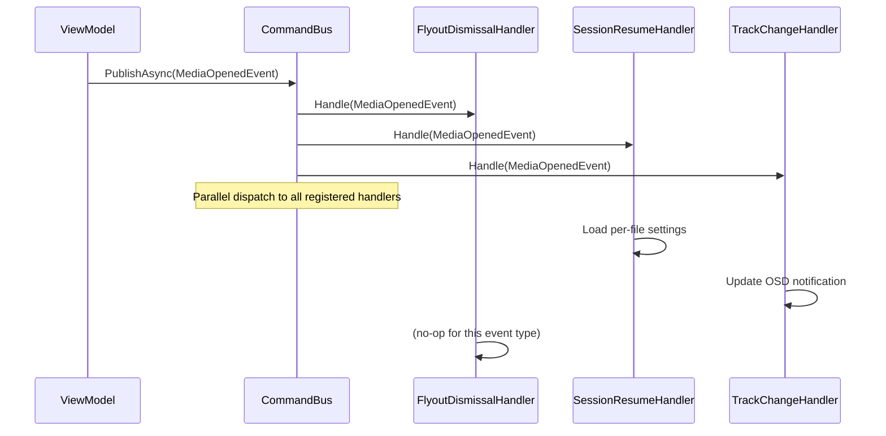

# Phase 5: Target Architecture Design — Cine Media Player

> **Version:** 1.0  
> **Date:** 2026-07-02  
> **Scope:** Full-stack architecture redesign for scalability, maintainability, licensing, and codec extensibility.

---

## Table of Contents

1. [Executive Summary](#1-executive-summary)
2. [Current Architecture Analysis](#2-current-architecture-analysis)
3. [Architectural Gaps & Problems](#3-architectural-gaps--problems)
4. [Target Architecture Overview](#4-target-architecture-overview)
5. [Layer-by-Layer Design](#5-layer-by-layer-design)
6. [Design Patterns Catalog](#6-design-patterns-catalog)
7. [Dependency Injection Topology](#7-dependency-injection-topology)
8. [Feature Flag & Licensing System](#8-feature-flag--licensing-system)
9. [Codec Plugin Architecture](#9-codec-plugin-architecture)
10. [Cross-Cutting Concerns](#10-cross-cutting-concerns)
11. [Visual Architecture Diagrams](#11-visual-architecture-diagrams)
12. [SOLID Compliance Matrix](#12-solid-compliance-matrix)

---

## 1. Executive Summary

Cine is a 3-tier .NET 10 media player: **Core** (pure net10.0) → **Media** (net10.0-windows, native interop) → **App** (net10.0-windows, Avalonia UI). The current architecture is serviceable but has accumulated organic growth patterns that limit scalability, testability, and feature extensibility.

**Target Architecture** introduces:
- **Formal DI composition root** replacing ad-hoc `new()` chains
- **Plugin-style codec providers** via strategy + factory patterns
- **Feature flag system** for licensing tiers (Trial / Full / Pro)
- **Mediator pattern** for decoupled cross-component communication
- **Formalized repository + unit-of-work** for settings persistence
- **Decorator pattern** for cross-cutting concerns (logging, caching, timing)
- **Aspect-oriented feature gating** via attributes

---

## 2. Current Architecture Analysis

### 2.1 Layer Structure

```
┌─────────────────────────────────────────────────────────────┐
│                    App (Avalonia UI)                        │
│  net10.0-windows                                           │
│  ┌──────────────────────────────────────────────────────┐   │
│  │  UI/Shell (MainWindow + 9 partials)                  │   │
│  │  UI/Components (ControlsBox, HeaderBar, Flyouts...)  │   │
│  │  UI/Dialogs (9 dialogs)                              │   │
│  │  Application/ViewModels (MainViewModel + 6 partials) │   │
│  │  Application/Services (36 services/interfaces)       │   │
│  │  Application/State (8 managers/stores)               │   │
│  └──────────────────────────────────────────────────────┘   │
├─────────────────────────────────────────────────────────────┤
│                    Media (Player Backend)                    │
│  net10.0-windows                                            │
│  Interfaces/IMediaPlayer.cs (~155 members)                  │
│  Implementations/mpv/MpvPlayer.cs                           │
│  Implementations/mediafoundationplayer/MFPlayer.cs          │
│  Events/ (11 event arg types)                               │
│  Models/ (7 model types)                                    │
├─────────────────────────────────────────────────────────────┤
│                    Core (Shared Foundation)                  │
│  net10.0 (no Windows dependency)                            │
│  Services/ConfigService.cs, FileLogger.cs, StartupManager   │
│  Interfaces/IConfigService.cs, ILoggingService.cs           │
│  Models/AppSettings.cs                                      │
└─────────────────────────────────────────────────────────────┘
```

### 2.2 Current Dependency Flow

```
MainWindow (partials)
    ├──► PlayerService ──► IPlayerFactory ──► MpvPlayer / MediaFoundationPlayer
    ├──► AudioManager ──► IMediaPlayer
    ├──► VideoManager ──► IMediaPlayer
    ├──► SubtitleManager ──► IMediaPlayer
    ├──► FlyoutManager (singleton, thread-safe)
    ├──► FileDialogHandler
    └──► MainViewModel
              ├──► AudioManager, VideoManager, SubtitleManager
              ├──► SessionManager, PlaylistCoordinator
              ├──► MediaFileService, FileDialogService
              └──► IMediaPlayer (direct event subscription)
```

### 2.3 What Works Well

| Aspect | Strengths |
|--------|-----------|
| **3-tier separation** | Core has zero Windows dependency; Media is swappable |
| **Manager-as-Facade** | `AudioManager`, `VideoManager`, `SubtitleManager` wrap `IMediaPlayer` with observable properties |
| **FlyoutManager** | Thread-safe singleton with mutual exclusion, reopen support (good use of lock-based state machine) |
| **ConfigService** | Atomic writes (temp → File.Replace → .bak), lock-based sync, backup restoration |
| **SettingsStoreBase** | Pattern for typed JSON stores with error resilience (auto-delete corrupt, hash-based keys) |
| **PlayerService** | Factory pattern (`IPlayerFactory`) enables testability; timeout on shutdown |
| **Partial classes** | `MainWindow` split into 10 concern-based files; `MainViewModel` split into 7 |

---

## 3. Architectural Gaps & Problems

### 3.1 Composition & DI

| # | Problem | Impact |
|---|---------|--------|
| G1 | **No composition root** — `new PlayerService()`, `new AudioManager(player)`, `new FlyoutManager()` scattered across `MainWindow.Initialization.cs` | Impossible to swap implementations without code changes |
| G2 | **Conditional nullables** — most constructor params are `= null` with fallback `?? new Xxx()` | Hides DI misconfiguration; produces silent fallback behavior |
| G3 | **Circular-ish reference** — `MainViewModel` holds `IMediaPlayer` directly + domain managers that also hold it | Violates single-responsibility; ViewModel knows too much |
| G4 | **No DI container** — `Microsoft.Extensions.DependencyInjection` 9.0.3 is referenced in `.csproj` but never used | Manual wiring everywhere |

### 3.2 Service Boundaries

| # | Problem | Impact |
|---|---------|--------|
| G5 | **FlyoutManager is concrete singleton** — passed via property injection (`ControlsBox.FlyoutManager = ...`) | No interface abstraction in consumers; tight coupling |
| G6 | **Domain managers manually wired to flyouts** — `AudioManager.DismissFlyoutAsync`, `SubtitleManager.DismissFlyoutAsync` as delegates | Scattered cross-cutting concern |
| G7 | **IMediaPlayer has ~155 members** — includes playback, video filters, subtitles, chapters, playlists, screenshots | Violates Interface Segregation Principle (ISP) |

### 3.3 Extensibility

| # | Problem | Impact |
|---|---------|--------|
| G8 | **No codec abstraction** — `MpvPlayer` hardcoded; `MediaFoundationPlayer` exists but no selection mechanism | Adding new backends (VAAPI, VDPAU, CUDA) requires modifying core code |
| G9 | **No plugin system** — all features compile together | Cannot add/remove features per deployment |
| G10 | **No feature toggles** — no licensing, no trial mode | Every user gets everything; no monetization path |

### 3.4 Cross-Cutting

| # | Problem | Impact |
|---|---------|--------|
| G11 | **Event wiring duplicated** — `MainViewModel` subscribes to `IMediaPlayer` events directly + `PlaybackStateManager` also subscribes | Duplicate handlers, potential desync |
| G12 | **No formal mediator** — components communicate by property injection + direct method calls | Tight coupling, hard to trace communication |
| G13 | **No decorator chain** — logging, timing, error handling inline | Scattered cross-cutting concerns |

---

## 4. Target Architecture Overview

### 4.1 Architecture Principles

1. **Dependency Inversion** — All cross-layer references go through interfaces; concrete types registered in composition root only
2. **Interface Segregation** — Large interfaces (`IMediaPlayer`) broken into focused roles
3. **Open/Closed** — New codecs, features, and renderers added via extension, not modification
4. **Single Responsibility** — Each class has exactly one reason to change
5. **Liskov Substitution** — All implementations of an interface must be interchangeable
6. **Explicit Dependencies** — Constructor injection for all services; no hidden `new()` or service locator

### 4.2 High-Level Target Layer Architecture

```
┌─────────────────────────────────────────────────────────────────────┐
│                        PRESENTATION LAYER                          │
│  (App/UI)                                                          │
│                                                                     │
│  ┌─────────────┐  ┌──────────────┐  ┌───────────────────────────┐   │
│  │ Shell Views  │  │ Components   │  │ Dialogs                   │   │
│  │ (MainWindow) │  │ (ControlsBox,│  │ (Playlist, Prefs,        │   │
│  │              │  │  HeaderBar,  │  │  About, Keyboard, etc.)  │   │
│  │              │  │  Flyouts)    │  │                           │   │
│  └──────┬───────┘  └──────┬───────┘  └──────────────┬────────────┘   │
│         │                 │                         │                │
│  ┌──────▼─────────────────▼─────────────────────────▼────────────┐   │
│  │                    VIEWMODEL LAYER                             │   │
│  │  (App/Application/ViewModels)                                 │   │
│  │  MainViewModel — delegates to feature-specific ViewModels     │   │
│  │  PlaylistViewModel, SubtitlesViewModel, AudioViewModel...     │   │
│  └──────────────────────────┬────────────────────────────────────┘   │
│                             │                                        │
│  ┌──────────────────────────▼────────────────────────────────────┐   │
│  │                    APPLICATION LAYER                          │   │
│  │  (App/Application)                                            │   │
│  │  ┌────────────────┐  ┌──────────────┐  ┌──────────────────┐   │   │
│  │  │ Services        │  │ State/       │  │ Feature Flags    │   │   │
│  │  │ (Use Cases)     │  │ Managers     │  │ (Toggles)        │   │   │
│  │  │ IFlyoutService  │  │ AudioMgr     │  │ IFeatureService  │   │   │
│  │  │ IPlayerService  │  │ VideoMgr     │  │ FeatureGateAttr  │   │   │
│  │  │ INavigationSvc  │  │ SubtitleMgr  │  │ LicensingTier    │   │   │
│  │  │ ICommandService │  │ PlaybackSt   │  │                  │   │   │
│  │  └────────────────┘  └──────────────┘  └──────────────────┘   │   │
│  └──────────────────────────┬────────────────────────────────────┘   │
├─────────────────────────────┼───────────────────────────────────────┤
│  DOMAIN/PLUGIN LAYER        │                                       │
│  (App/Plugins + Media)      │                                       │
│  ┌──────────────────────────▼──────────────────────────────────┐   │
│  │                    MEDIA LAYER                              │   │
│  │  IPlayerBackend (ISP-refactored from IMediaPlayer)          │   │
│  │  ├── IMpvPlayerBackend ──► MpvPlayer                       │   │
│  │  ├── IMFPlayerBackend  ──► MediaFoundationPlayer            │   │
│  │  └── (Future: IVaapiBackend, ICudaBackend, IVdpauBackend)  │   │
│  │                                                             │   │
│  │  ICodecProvider (Plugin Interface)                          │   │
│  │  ├── MpvCodecProvider (built-in)                            │   │
│  │  ├── MfCodecProvider  (built-in alternative)                │   │
│  │  └── (Future: External plugins via MEF/Composition)         │   │
│  └─────────────────────────────────────────────────────────────┘   │
├─────────────────────────────────────────────────────────────────────┤
│                        CORE LAYER                                   │
│  (Pure net10.0 — no Platform dependencies)                         │
│  Interfaces: IConfigService, ILoggingService, IFeatureStore         │
│  Services: ConfigService, FileLogger, StartupManager                │
│  Models: AppSettings, LicensingModel, FeatureDefinition             │
└─────────────────────────────────────────────────────────────────────┘
```

### 4.3 Package/Assembly Dependencies

```
Cine.Core ───────────────────────────────────── (net10.0, no deps)
    ↑                    ↑
    │                    │
Cine.Media ──────────────┤──────────────────── (net10.0-windows)
    ↑                    │
    │                    │
Cine.App ────────────────┼──────────────────── (net10.0-windows)
    │                    │
    └──► Cine.Plugins.*  ┘  (future: individually loadable assemblies)
```

---

## 5. Layer-by-Layer Design

### 5.1 Core Layer (`Cine.Core`)

#### 5.1.1 Refactored Interfaces

```csharp
// ── Repository-style config (replaces existing ConfigService) ──
public interface IAppConfigRepository
{
    T Get<T>(string key, T defaultValue);
    void Set<T>(string key, T value);
    void Save();
    void Reload();
}

// ── Feature flag storage ──
public interface IFeatureStore
{
    bool IsEnabled(string featureKey);
    FeatureDefinition? GetFeature(string featureKey);
    IReadOnlyCollection<FeatureDefinition> GetAllFeatures();
}

// ── Licensing data model ──
public record LicenseInfo(
    string LicenseId,
    LicensingTier Tier,
    DateTime? ExpiresAt,
    string? HardwareId);

public enum LicensingTier { Trial, Full, Pro }

public record FeatureDefinition(
    string Key,
    string DisplayName,
    LicensingTier MinimumTier,
    bool IsExperimental,
    string? DependsOnFeature = null);
```

#### 5.1.2 ConfigService (Upgraded)

- Add `IFeatureStore` implementation alongside existing `IAppConfigRepository`
- Keep atomic-write + backup pattern
- Add migration support for versioned config schemas

---

### 5.2 Media Layer (`Cine.Media`)

#### 5.2.1 ISP Refactoring — Split IMediaPlayer

The current 155-member `IMediaPlayer` is split into focused interfaces:

```csharp
// ── Core player contract ──
public interface IPlaybackControl : IDisposable
{
    void Open(string path);
    void Play();
    void Pause();
    void Stop();
    void Seek(TimeSpan position);
    PlaybackState State { get; }
    TimeSpan Position { get; }
    TimeSpan Duration { get; }
    event EventHandler? Opened;
    event EventHandler<PlaybackStateChangedEventArgs>? PlaybackStateChanged;
    event EventHandler<PositionChangedEventArgs>? PositionChanged;
}

// ── Audio control ──
public interface IAudioControl
{
    double Volume { get; set; }
    double VolumeMax { get; }
    bool IsMuted { get; }
    void Mute(bool mute);
    float AudioDelay { get; set; }
    void SelectAudioTrack(int trackId);
    event EventHandler<VolumeChangedEventArgs>? VolumeChanged;
}

// ── Video control ──
public interface IVideoControl
{
    double Contrast { get; set; }
    double Brightness { get; set; }
    double Gamma { get; set; }
    double Saturation { get; set; }
    double Hue { get; set; }
    double Zoom { get; set; }
    double AspectRatio { get; set; }
    void Command(string action, params string[] args);
}

// ── Subtitle control ──
public interface ISubtitleControl
{
    int CurrentSubtitleTrack { get; }
    void AddSubtitle(string path);
    void SelectSubtitleTrack(int trackId);
    void SetSubtitleFontSize(double size);
    void SetSubtitleVisibility(bool visible);
    // ... remaining subtitle members
}

// ── Chapter navigation ──
public interface IChapterNavigation
{
    ChapterInfo? CurrentChapter { get; }
    IReadOnlyList<ChapterInfo> ChapterList { get; }
    void NextChapter();
    void PreviousChapter();
    event EventHandler<ChapterListChangedEventArgs>? ChapterListChanged;
}

// ── Playlist management ──
public interface IPlaylistManagement
{
    IReadOnlyList<string> Playlist { get; }
    int PlaylistPosition { get; set; }
    LoopMode LoopMode { get; set; }
    bool IsShuffleEnabled { get; set; }
    event EventHandler<PlaylistChangedEventArgs>? PlaylistChanged;
}

// ── Composite for backward compatibility (not required for consumers) ──
public interface IMediaPlayer : IPlaybackControl, IAudioControl, IVideoControl,
    ISubtitleControl, IChapterNavigation, IPlaylistManagement
{
}
```

#### 5.2.2 Backend Selection via Strategy Pattern

```csharp
public enum MediaBackendType
{
    AutoDetect,   // Default: picks best available
    Mpv,          // libmpv via native interop
    MediaFoundation, // Windows Media Foundation
    // Future: Vlc, GStreamer, LibVLCSharp
}

public interface IMediaBackendProvider
{
    MediaBackendType BackendType { get; }
    bool IsAvailable { get; }
    IPlaybackControl CreatePlayback();
    IAudioControl CreateAudio();
    IVideoControl CreateVideo();
    ISubtitleControl CreateSubtitles();
    IChapterNavigation CreateChapters();
    IPlaylistManagement CreatePlaylist();
}

public class MediaBackendSelector
{
    private readonly IEnumerable<IMediaBackendProvider> _providers;

    public IMediaBackendProvider Select(MediaBackendType preferred)
    {
        if (preferred == MediaBackendType.AutoDetect)
            return _providers
                .OrderByDescending(p => p.Priority)
                .First(p => p.IsAvailable);
        return _providers.First(p => p.BackendType == preferred);
    }
}
```

---

### 5.3 Application Layer

#### 5.3.1 Refactored Service Interfaces

```csharp
// ── Player service (application boundary) ──
public interface IPlayerService
{
    IPlaybackControl Playback { get; }
    IAudioControl Audio { get; }
    IVideoControl Video { get; }
    ISubtitleControl Subtitles { get; }
    IChapterNavigation Chapters { get; }
    IPlaylistManagement Playlist { get; }
    Task InitializeAsync(CancellationToken ct = default);
    Task ShutdownAsync(CancellationToken ct = default);
}

// ── Flyout service (already clean — keep as-is) ──
// IFlyoutService remains unchanged

// ── Navigation / workspace service ──
public interface INavigationService
{
    void NavigateTo(NavigationTarget target);
    void GoBack();
    event EventHandler<NavigationEventArgs>? NavigationChanged;
}

// ── Command bus / mediator ──
public interface ICommandBus
{
    Task<TResponse> SendAsync<TResponse>(ICommand<TResponse> command);
    Task PublishAsync<TEvent>(TEvent @event) where TEvent : IEvent;
}
```

#### 5.3.2 Domain Managers — Refactored Base

```csharp
// Common base for all domain managers
public abstract class DomainManager<TPlayerInterface> : IDomainManager
    where TPlayerInterface : class
{
    protected TPlayerInterface Player { get; }
    protected ILogger Logger { get; }

    protected DomainManager(TPlayerInterface player, ILogger logger)
    {
        Player = player ?? throw new ArgumentNullException(nameof(player));
        Logger = logger ?? throw new ArgumentNullException(nameof(logger));
    }

    public abstract void Dispose();
}

// After refactor:
public class AudioManager : DomainManager<IAudioControl>, IAudioManager
{
    public AudioManager(IAudioControl audioControl, ILogger logger, IAudioSettingsStore store)
        : base(audioControl, logger)
    {
        // Constructor injection replaces ad-hoc new AudioSettingsStore()
    }
}
```

#### 5.3.3 Mediator-Based Cross-Component Communication

Instead of property injection delegates (`DismissFlyoutAsync`, `RequestAudioFileAsync`):

```csharp
// ── Event types ──
public record FlyoutDismissingEvent(string FlyoutKey) : IEvent;
public record FileDialogRequestingEvent(FileDialogType DialogType) : IEvent;
public record TrackChangedEvent(TrackType TrackType, int TrackId, string DisplayName) : IEvent;
public record PlaybackStateChangedEvent(PlaybackState NewState) : IEvent;
public record MediaOpenedEvent(string FilePath) : IEvent;

// ── Handler ──
public class FlyoutDismissalHandler : IEventHandler<FileDialogRequestingEvent>
{
    private readonly IFlyoutService _flyoutService;

    public FlyoutDismissalHandler(IFlyoutService flyoutService)
    {
        _flyoutService = flyoutService;
    }

    public Task Handle(FileDialogRequestingEvent @event, CancellationToken ct)
    {
        _flyoutService.CloseAll();
        return Task.CompletedTask;
    }
}
```

---

## 6. Design Patterns Catalog

| # | Pattern | Where Applied | SOLID Principle |
|---|---------|---------------|-----------------|
| P1 | **Strategy** | Codec/backend selection (`IMediaBackendProvider`) | OCP — new backends added without modifying selection logic |
| P2 | **Factory Method** | `IPlayerFactory` (already present), `ICodecProviderFactory` | DIP — creation abstracted |
| P3 | **Facade** | `IPlayerService` wraps `IPlaybackControl + IAudioControl + IVideoControl` | SRP — unified entry point |
| P4 | **Mediator** | `ICommandBus` for cross-component events (flyout dismiss, file dialog) | SRP, DIP — decouples senders from receivers |
| P5 | **Decorator** | `LoggingPlayerDecorator`, `TimingPlayerDecorator`, `CachingPlayerDecorator` | OCP — add cross-cutting without modifying core |
| P6 | **Observer** | `INotifyPropertyChanged` + event aggregator pattern | SRP — event source separates from handler |
| P7 | **Adapter** | MpvInterop → `IPlaybackControl`; WinForms → Avalonia | SRP, OCP — wraps native APIs |
| P8 | **Repository** | `IAppConfigRepository`, `IAudioSettingsRepository`, `ISubtitleSettingsRepository` | DIP — data access abstracted |
| P9 | **Unit of Work** | `ISettingsUnitOfWork` — batch save across settings stores | SRP — transactional persistence |
| P10 | **Command Pattern** | `ICommand<T>` + `IRelayCommand` (already present) | SRP — action as object |
| P11 | **Feature Flag** | `IFeatureService` + `[FeatureGate]` attribute | OCP — toggles without code change |
| P12 | **Singleton** | `IFlyoutService`, `IFeatureService`, `ICommandBus` — single instance per app domain | Controlled lifecycle |
| P13 | **Template Method** | `SettingsStoreBase` (already present — Load/Save template) | OCP — base defines skeleton |
| P14 | **Chain of Responsibility** | Keyboard shortcut routing, pipeline behaviors in command bus | SRP — each handler does one thing |
| P15 | **Composite** | `VideoFilterCollection` — treat individual filters + filter groups uniformly | LSP — uniform interface |
| P16 | **Builder** | `FlyoutContentBuilder` — constructs complex flyout content step by step | SRP — construction separated |
| P17 | **Proxy** | `LazyPlayerProxy` — defers native player initialization until first use | LSP — transparent lazy init |

---

## 7. Dependency Injection Topology

### 7.1 Composition Root (`App/CompositionRoot.cs`)

```csharp
public static class CompositionRoot
{
    public static IServiceProvider Build(ServiceLifetime defaultLifetime = ServiceLifetime.Singleton)
    {
        var services = new ServiceCollection();

        // ── Core ──
        services.AddSingleton<IAppConfigRepository, ConfigService>();
        services.AddSingleton<IFeatureStore, FeatureStore>();
        services.AddSingleton<ILogger>(sp => sp.GetRequiredService<ILoggingService>()
            .CreateLogger("Cine"));

        // ── Media Backend ──
        services.AddSingleton<IMediaBackendProvider, MpvBackendProvider>();
        services.AddSingleton<IMediaBackendProvider, MediaFoundationBackendProvider>();
        services.AddSingleton<MediaBackendSelector>();

        // ── Player Service (Facade over media backends) ──
        services.AddSingleton<IPlayerService>(sp =>
        {
            var selector = sp.GetRequiredService<MediaBackendSelector>();
            var backend = selector.Select(MediaBackendType.AutoDetect);

            // Decorator chain: Core → Timing → Logging
            var playback = backend.CreatePlayback();
            var timedPlayback = new TimingPlayerDecorator(playback, sp.GetRequiredService<ILogger>());
            var loggedPlayback = new LoggingPlayerDecorator(timedPlayback, sp.GetRequiredService<ILogger>());

            return new PlayerService(loggedPlayback, backend);
        });

        // ── Domain Managers ──
        services.AddSingleton<IAudioManager, AudioManager>();
        services.AddSingleton<IVideoManager, VideoManager>();
        services.AddSingleton<ISubtitleManager, SubtitleManager>();
        services.AddSingleton<IPlaybackStateManager, PlaybackStateManager>();

        // ── Flyout Ecosystem ──
        services.AddSingleton<IFlyoutService, FlyoutManager>();

        // ── Command Bus / Mediator ──
        services.AddSingleton<ICommandBus, CommandBus>();
        services.AddTransient<IEventHandler<FileDialogRequestingEvent>, FlyoutDismissalHandler>();
        services.AddTransient<IEventHandler<MediaOpenedEvent>, SessionResumeHandler>();

        // ── Feature Flags ──
        services.AddSingleton<IFeatureService, FeatureService>();

        // ── ViewModels ──
        services.AddTransient<MainViewModel>();
        services.AddTransient<FirstLaunchViewModel>();

        // ── Views ──
        services.AddTransient<MainWindow>();
        services.AddTransient<FirstLaunchDialog>();

        return services.BuildServiceProvider();
    }
}
```

### 7.2 Decorator Chain for Player

```
MpvPlayer (concrete, native)
    ↑
TimingPlayerDecorator (wraps: logs position timing every 5s)
    ↑
LoggingPlayerDecorator (wraps: logs all method calls + errors)
    ↑
PlayerService (facade: exposes ISP interfaces)
    ↑
AudioManager, VideoManager, SubtitleManager (domain managers)
```

### 7.3 Service Lifetimes

| Lifetime | Services |
|----------|----------|
| **Singleton** | `IFlyoutService`, `IPlayerService`, `IFeatureService`, `ICommandBus`, `IAppConfigRepository`, `MediaBackendSelector`, loggers |
| **Transient** | `MainWindow`, all dialogs (`PlaylistDialog`, `PreferencesDialog`, etc.) |
| **Singleton (shared)** | Domain managers (`IAudioManager`, etc.) — they must outlive views but track per-session state |

---

## 8. Feature Flag & Licensing System

### 8.1 Feature Flag Architecture

```
                          ┌─────────────────────────┐
                          │   IFeatureService        │
                          │   (Singleton)            │
                          │   ┌───────────────────┐  │
                          │   │ In-Memory Cache   │  │
                          │   │ + IFeatureStore   │  │
                          │   └───────────────────┘  │
                          └─────────────────────────┘
                                   │
              ┌────────────────────┼────────────────────┐
              ▼                    ▼                    ▼
        ┌──────────┐        ┌──────────┐         ┌──────────┐
        │ Compile  │        │ Runtime  │         │ License  │
        │ Time     │        │ Toggle   │         │ Tier     │
        │ Constants│        │ (JSON)   │         │ Gate     │
        └──────────┘        └──────────┘         └──────────┘
```

### 8.2 Feature Toggle Types

```csharp
public enum FeatureToggleType
{
    /// <summary>On/off per deployment (compile constant).</summary>
    CompileTime,
    /// <summary>On/off per app config (JSON-driven, restart required).</summary>
    RuntimeConfig,
    /// <summary>On/off per licensing tier.</summary>
    LicensingTier,
    /// <summary>On/off per user percentage (gradual rollout).</summary>
    PercentageRollout,
    /// <summary>On/off per A/B test group.</summary>
    ExperimentGroup
}

public class FeatureDefinition
{
    public string Key { get; init; }          // e.g. "codecs.hdr10"
    public string DisplayName { get; init; }  // e.g. "HDR10 Support"
    public FeatureToggleType ToggleType { get; init; }
    public LicensingTier MinimumTier { get; init; }
    public bool IsExperimental { get; init; }
    public double RolloutPercentage { get; init; } // 0.0–100.0
    public string? DependsOnFeature { get; init; } // e.g. "codecs.4k"
    public IReadOnlyList<string> RequiredCapabilities { get; init; } = []; // e.g. ["native.hdr"]
}
```

### 8.3 License Tiers

```csharp
public enum LicensingTier
{
    /// <summary>Limited features, 14-day trial, watermark.</summary>
    Trial = 0,
    /// <summary>All standard features, no watermark.</summary>
    Full = 1,
    /// <summary>All features including experimental codecs, DPI scaling, multi-monitor.</summary>
    Pro = 2
}

// Tier-to-Feature Map (stored in IFeatureStore, loaded from embedded resource)
// Trial:   Basic playback, MP4/AVI, volume, seek, subtitles
// Full:    All codecs (H.264, H.265, VP9, AV1), equalizer, chapters, playlist
// Pro:     HDR10, Dolby Vision (if available), D3D11 video processing, custom shaders
```

### 8.4 Feature Gate Attribute

```csharp
[AttributeUsage(AttributeTargets.Class | AttributeTargets.Method, Inherited = false)]
public class FeatureGateAttribute : Attribute
{
    public string FeatureKey { get; }
    public LicensingTier MinimumTier { get; }

    public FeatureGateAttribute(string featureKey, LicensingTier minimumTier = LicensingTier.Full)
    {
        FeatureKey = featureKey;
        MinimumTier = minimumTier;
    }
}

// ── Usage in UI ──
[FeatureGate("codecs.hdr10", LicensingTier.Pro)]
public partial class HdrSettingsPanel : UserControl { ... }

// ── Usage in ViewModel ──
public class AudioViewModel
{
    [FeatureGate("equalizer.pro", LicensingTier.Pro)]
    public bool IsAdvancedEqualizerEnabled =>
        _featureService.IsEnabled("equalizer.pro") && !_featureService.IsEnabled("equalizer.pro");
}
```

### 8.5 Runtime Enforcement

```csharp
public class FeatureService : IFeatureService
{
    private readonly IFeatureStore _store;
    private readonly ILicensingService _licensing;
    private readonly ConcurrentDictionary<string, bool> _cache;

    public bool IsEnabled(string featureKey)
    {
        return _cache.GetOrAdd(featureKey, key =>
        {
            var feature = _store.GetFeature(key);
            if (feature == null) return false; // Unknown feature → disabled

            // 1. License tier check
            if (_licensing.CurrentTier < feature.MinimumTier)
                return false;

            // 2. Dependency check
            if (feature.DependsOnFeature != null && !IsEnabled(feature.DependsOnFeature))
                return false;

            // 3. Runtime toggle check
            if (feature.ToggleType == FeatureToggleType.RuntimeConfig)
                return _store.IsEnabled(key);

            // 4. Percentage rollout check
            if (feature.ToggleType == FeatureToggleType.PercentageRollout)
                return (Math.Abs(key.GetHashCode()) % 100) < feature.RolloutPercentage;

            // 5. Compile-time: resolved at build, reflected in store
            return true;
        });
    }

    public void InvalidateCache(string? featureKey = null) { ... }
}
```

### 8.6 UI Integration for Trial Users

```csharp
// ── Trial banner shown in controls box ──
public class TrialBannerViewModel
{
    public bool IsVisible => _licensing.CurrentTier == LicensingTier.Trial;
    public int DaysRemaining => (_license.ExpiresAt - DateTime.UtcNow)?.Days ?? 14;
    public string Message => $"Trial — {DaysRemaining} days remaining. {UpgradeAction}";
    public string UpgradeAction => "Click to unlock all features →";
}

// ── Flyout upgrade prompt ──
[FeatureGate("equalizer.advanced", LicensingTier.Pro)]
public partial class AudioEqualizerFlyout : UserControl
{
    public bool ShowUpgradeCta => !_featureService.IsEnabled("equalizer.advanced");
}
```

### 8.7 Feature Definitions (Sample)

| Feature Key | Display Name | Min Tier | Dependency | Toggle Type |
|---|---|---|---|---|
| `playback.basic` | Basic Playback | Trial | — | CompileTime |
| `playback.4k` | 4K/UHD Playback | Full | `playback.basic` | LicensingTier |
| `codecs.hdr10` | HDR10 Support | Pro | `playback.4k` | LicensingTier |
| `codecs.dovi` | Dolby Vision | Pro | `codecs.hdr10` | LicensingTier |
| `equalizer.basic` | Basic Equalizer | Trial | — | CompileTime |
| `equalizer.advanced` | Advanced Equalizer (10-band) | Pro | `equalizer.basic` | LicensingTier |
| `audio.dialogueboost` | Dialogue Boost | Full | — | LicensingTier |
| `audio.normalization` | Audio Normalization | Full | — | LicensingTier |
| `subtitles.advanced` | Advanced Subtitle Styling | Full | `playback.basic` | LicensingTier |
| `playlist` | Playlist Management | Full | `playback.basic` | LicensingTier |
| `chapters` | Chapter Navigation | Full | `playback.basic` | LicensingTier |
| `codecs.h265` | H.265/HEVC Hardware Decode | Full | `playback.4k` | RuntimeConfig |
| `codecs.av1` | AV1 Hardware Decode | Pro | `playback.4k` | LicensingTier |
| `renderer.d3d11` | D3D11 Video Processing | Pro | — | RuntimeConfig |
| `renderer.customshaders` | Custom Shader Support | Pro | `renderer.d3d11` | LicensingTier |
| `experimental.vulkan` | Vulkan Render Path (Preview) | Pro | — | PercentageRollout (5%) |

---

## 9. Codec Plugin Architecture

### 9.1 Architecture Overview

```
┌─────────────────────────────────────────────────────────────────────┐
│                       APPLICATON LAYER                              │
│                                                                     │
│  ┌─────────────────────────────────────────────────────────────┐    │
│  │                  CodecManager (Facade)                       │    │
│  │  - Selects best codec for media file                        │    │
│  │  - Manages codec provider lifecycle                         │    │
│  │  - Caches codec capability queries                          │    │
│  └────────────────────┬────────────────────────────────────────┘    │
│                       │                                             │
│  ┌────────────────────▼────────────────────────────────────────┐    │
│  │                 ICodecProvider                               │    │
│  │  ┌─────────────────┐  ┌──────────────────┐                  │    │
│  │  │ CanHandle(url)   │  │ GetCapabilities()│                  │    │
│  │  │ CreateSession()  │  │ Priority         │                  │    │
│  │  └─────────────────┘  └──────────────────┘                  │    │
│  └────────────────────┬────────────────────────────────────────┘    │
│                       │                                             │
├───────────────────────┼─────────────────────────────────────────────┤
│  MEDIA LAYER          │                                             │
│                       │                                             │
│  ┌────────────────────▼────────────────────────────────────────┐    │
│  │  Built-in Providers                                        │    │
│  │  ┌──────────────┐  ┌──────────────────┐  ┌────────────────┐ │    │
│  │  │ MpvCodec     │  │ MediaFoundation  │  │ SoftwareFallback│ │    │
│  │  │ Provider     │  │ CodecProvider    │  │ CodecProvider   │ │    │
│  │  └──────────────┘  └──────────────────┘  └────────────────┘ │    │
│  └─────────────────────────────────────────────────────────────┘    │
│                                                                     │
│  ┌─────────────────────────────────────────────────────────────┐    │
│  │  External Plugin Providers (Future)                         │    │
│  │  ┌──────────────┐  ┌──────────────────┐  ┌────────────────┐ │    │
│  │  │ VlcCodec     │  │ FFMpegCodec      │  │ Custom         │ │    │
│  │  │ Provider     │  │ Provider (MEF)   │  │ Provider API   │ │    │
│  │  └──────────────┘  └──────────────────┘  └────────────────┘ │    │
│  └─────────────────────────────────────────────────────────────┘    │
└─────────────────────────────────────────────────────────────────────┘
```

### 9.2 Codec Provider Interface

```csharp
/// <summary>Provides codec/decoding capabilities for a media backend.</summary>
public interface ICodecProvider
{
    /// <summary>Unique identifier for this provider.</summary>
    string ProviderId { get; }

    /// <summary>Display name for UI.</summary>
    string DisplayName { get; }

    /// <summary>Priority (higher = preferred when multiple can handle the same format).</summary>
    int Priority { get; }

    /// <summary>Whether this provider is available on the current system.</summary>
    bool IsAvailable { get; }

    /// <summary>Check if this provider can handle the given media URL/file.</summary>
    bool CanHandle(string mediaUrl);

    /// <summary>Get all codec/container formats this provider supports.</summary>
    IReadOnlyCollection<CodecCapability> GetCapabilities();

    /// <summary>Create a decoding session for the given media.</summary>
    Task<IDecodingSession> CreateSessionAsync(string mediaUrl,
        DecodingOptions options, CancellationToken ct);
}

public record CodecCapability(
    string CodecName,        // e.g. "h264", "hevc", "vp9"
    string ContainerFormat,  // e.g. "mp4", "mkv", "avi"
    MediaBackendType Backend,
    bool IsHardwareAccelerated,
    int MaximumResolutionInPixels,
    HdrSupportLevel HdrSupport);

public enum HdrSupportLevel { None, Hdr10, Hdr10Plus, DolbyVision }

public class DecodingOptions
{
    public bool EnableHardwareDecoding { get; init; } = true;
    public HwdecMode HardwareDecoderMode { get; init; } = HwdecMode.Auto;
    public int TargetWidth { get; init; }
    public int TargetHeight { get; init; }
    public bool Enable10BitOutput { get; init; }
    public string? CustomDecoderOptions { get; init; }
}

/// <summary>Represents an active decoding session.</summary>
public interface IDecodingSession : IDisposable
{
    string ProviderId { get; }
    string MediaUrl { get; }
    IPlaybackControl Playback { get; }
    IAudioControl Audio { get; }
    IVideoControl Video { get; }
    ISubtitleControl Subtitles { get; }
    event EventHandler<SessionErrorEventArgs>? Error;
}
```

### 9.3 Codec Selection Algorithm

```csharp
public class CodecManager
{
    private readonly IEnumerable<ICodecProvider> _providers;
    private readonly IFeatureService _featureService;

    public CodecManager(IEnumerable<ICodecProvider> providers, IFeatureService featureService)
    {
        _providers = providers.OrderByDescending(p => p.Priority).ToList();
        _featureService = featureService;
    }

    public ICodecProvider? SelectProvider(string mediaUrl)
    {
        var extension = Path.GetExtension(mediaUrl)?.ToLowerInvariant();

        foreach (var provider in _providers)
        {
            if (!provider.IsAvailable) continue;
            if (!provider.CanHandle(mediaUrl)) continue;

            // Check feature gate for this codec
            foreach (var cap in provider.GetCapabilities())
            {
                var featureKey = $"codecs.{cap.CodecName}";
                if (!_featureService.IsEnabled(featureKey)) continue;
                return provider; // First matching + licensed provider wins
            }
        }

        return null; // No suitable provider
    }

    public async Task<IDecodingSession?> OpenMediaAsync(
        string mediaUrl, DecodingOptions options, CancellationToken ct)
    {
        var provider = SelectProvider(mediaUrl);
        if (provider == null) return null;
        return await provider.CreateSessionAsync(mediaUrl, options, ct);
    }
}
```

### 9.4 Future: External Plugin Loading (MEF)

```csharp
// ── Plugin discovery via MEF (System.ComponentModel.Composition) ──
[InheritedExport(typeof(ICodecProvider))]
public interface IExternalCodecProvider : ICodecProvider
{
    string PluginVersion { get; }
    string Author { get; }
    string? LicenseKey { get; }
}

// ── Plugin loader (future phase) ──
public class CodecPluginLoader
{
    private readonly string _pluginPath;

    public IReadOnlyList<ICodecProvider> LoadPlugins()
    {
        var catalog = new DirectoryCatalog(_pluginPath, "*.CodecPlugin.dll");
        var container = new CompositionContainer(catalog);
        return container.GetExportedValues<ICodecProvider>().ToList();
    }
}
```

---

## 10. Cross-Cutting Concerns

### 10.1 Logging Decorator

```csharp
public class LoggingPlayerDecorator : IPlaybackControl
{
    private readonly IPlaybackControl _inner;
    private readonly ILogger _logger;

    public LoggingPlayerDecorator(IPlaybackControl inner, ILogger logger)
    {
        _inner = inner;
        _logger = logger;
    }

    public void Open(string path)
    {
        _logger.Debug("Open: {Path}", path);
        _inner.Open(path);
    }

    public void Play()
    {
        _logger.Trace("Play");
        _inner.Play();
    }

    // ── All other members delegate with logging ──
    public void Dispose() => _inner.Dispose();
    public PlaybackState State { get => _inner.State; }
    // ...
}
```

### 10.2 Performance Timing Decorator

```csharp
public class TimingPlayerDecorator : IPlaybackControl
{
    private readonly IPlaybackControl _inner;
    private readonly ILogger _logger;
    private readonly Stopwatch _sw = new();

    public TimingPlayerDecorator(IPlaybackControl inner, ILogger logger)
    {
        _inner = inner;
        _logger = logger;
    }

    public void Open(string path)
    {
        _sw.Restart();
        _inner.Open(path);
        _logger.Info("Open({Path}) completed in {Elapsed}ms", path, _sw.ElapsedMilliseconds);
    }

    // ── Timing on all members ──
}
```

### 10.3 Error Boundary (Avalonia)

```csharp
// ── Existing ErrorBoundary.cs can be extended ──
public class ErrorBoundary
{
    private readonly ILogger _logger;

    public void Guard(Action action, string context)
    {
        try { action(); }
        catch (Exception ex) when (!Debugger.IsAttached)
        {
            _logger.Error(ex, "Error in {Context}", context);
            // Show user-friendly toast instead of crash
            ShowUserFriendlyError(context);
        }
    }

    public async Task GuardAsync(Func<Task> action, string context)
    {
        try { await action(); }
        catch (Exception ex) when (!Debugger.IsAttached)
        {
            _logger.Error(ex, "Error in {Context}", context);
            ShowUserFriendlyError(context);
        }
    }
}
```

### 10.4 UI Thread Marshaling

```csharp
// ── Extend DispatcherExtensions with automatic marshaling ──
public static class UiThreadMarshaller
{
    public static void OnUiThread(this Action action,
        DispatcherPriority priority = DispatcherPriority.Normal)
    {
        if (Dispatcher.UIThread.CheckAccess())
            action();
        else
            Dispatcher.UIThread.Post(action, priority);
    }

    public static async Task OnUiThreadAsync(this Func<Task> asyncAction,
        DispatcherPriority priority = DispatcherPriority.Normal)
    {
        if (Dispatcher.UIThread.CheckAccess())
            await asyncAction();
        else
            await Dispatcher.UIThread.InvokeAsync(asyncAction, priority);
    }
}
```

---

## 11. Visual Architecture Diagrams

### 11.1 Current Architecture (as-is)



### 11.2 Target Architecture (to-be)

```mermaid
graph TB
    subgraph "Presentation Layer"
        MW[MainWindow] --> DI[DI Container<br/>Microsoft.Extensions.DependencyInjection]
        CB[ControlsBox] --> DI
        HB[HeaderBar] --> DI
        Dialogs[Dialogs] --> DI
    end

    subgraph "ViewModel Layer"
        MVM[MainViewModel]
        PVM[PlaylistViewModel]
        SVM[SubtitlesViewModel]
        AVM[AudioViewModel]

        MVM --> PVM
        MVM --> SVM
        MVM --> AVM
    end

    subgraph "Application Layer"
        IPS[IPlayerService<br/>Facade]
        IFS[IFlyoutService]
        IFSvc[IFeatureService]
        ICB[ICommandBus<br/>Mediator]
        IAR[IAppConfigRepository]
        IFL[IFeatureStore]

        IPS --> DM
        subgraph DM["Domain Managers"]
            AM[AudioManager]
            VM[VideoManager]
            SM[SubtitleManager]
            PSM[PlaybackStateManager]
        end
    end

    subgraph "Media Layer (ISP Refactored)"
        direction LR
        IPC[IPlaybackControl]
        IAC[IAudioControl]
        IVC[IVideoControl]
        ISC[ISubtitleControl]
        IChN[IChapterNavigation]
        IPM[IPlaylistManagement]

        Mpv[MpvPlayer] --> IPC
        Mpv --> IAC
        Mpv --> IVC
        Mpv --> ISC
        Mpv --> IChN
        Mpv --> IPM
    end

    subgraph "Decorator Chain"
        MPC[MpvPlayer Concrete]
        TPD[TimingPlayerDecorator]
        LPD[LoggingPlayerDecorator]

        MPC --> TPD
        TPD --> LPD
    end

    subgraph "Codec Plugin System"
        CPM[CodecManager]
        CP1[MpvCodecProvider]
        CP2[MFCodecProvider]
        CP3[Future Plugins]
    end

    subgraph "Core Layer"
        CS[ConfigService]
        FS[FeatureStore]
        LS[LicensingService]
    end

    DI --> MVM
    DI --> IPS
    DI --> IFS
    DI --> IFSvc
    DI --> ICB
    DI --> IAR

    IPS --> LPD
    AM --> IAC
    VM --> IVC
    SM --> ISC
    PSM --> IPC

    IFSvc --> FS
    IFSvc --> LS
    CPM --> IFSvc
    CPM --> CP1
    CPM --> CP2
    CPM --> CP3

    style DI fill:#c8e6c9
    style IPC fill:#ffccbc
    style IFSvc fill:#fff9c4
    style CPM fill:#e1bee7
```



### 11.3 Feature Flag Flow



### 11.4 Codec Selection Flow



### 11.5 Command Bus / Mediator Flow



---

## 12. SOLID Compliance Matrix

| Principle | Current State | Target State | Key Changes |
|-----------|--------------|--------------|-------------|
| **S**ingle Responsibility | Partial — MainWindow has 10 partials but MainViewModel still holds player + 7 concerns | Full — ViewModel split into feature-specific ViewModels; each manager owns one domain | Extract AudioViewModel, SubtitleViewModel, PlaylistViewModel from MainViewModel |
| **O**pen/Closed | Low — adding codec requires modifying MpvPlayer | High — new codecs via ICodecProvider strategy; new features via FeatureGate | Strategy pattern + plugin architecture |
| **L**iskov Substitution | Medium — MpvPlayer and MediaFoundationPlayer both implement IMediaPlayer | Full — all ISP interfaces in Media have multiple implementations; decorators are transparent | Decorator chain for logging/timing is transparent to consumers |
| **I**nterface Segregation | Poor — IMediaPlayer has ~155 members | Full — 6 focused interfaces (Playback, Audio, Video, Subtitle, Chapters, Playlist) | Break IMediaPlayer into role interfaces |
| **D**ependency Inversion | Partial — many internal classes depend on concretes (new FlyoutManager(), new AudioSettingsStore()) | Full — all dependencies injected via constructor; composition root is sole wiring point | DI container + formal composition root |

---

## Appendix A: Impact Matrix

| Change | Files Affected | Risk | Effort |
|--------|---------------|------|--------|
| DI Container setup (CompositionRoot) | +1 file | Low | 1 day |
| ISP refactor (split IMediaPlayer) | 30+ files | Medium | 3 days |
| Domain Manager refactor (DI) | 20 files | Low | 2 days |
| Feature flag system | +5 files | Low | 2 days |
| Licensing service | +3 files | Medium | 2 days |
| Mediator/CommandBus | +8 files | Medium | 2 days |
| Codec plugin architecture | +10 files | Medium | 3 days |
| Decorator chain | +3 files | Low | 1 day |
| UI feature gating | 15+ files | Low | 2 days |
| **TOTAL** | ~95 files | — | **~18 days** |

## Appendix B: Glossary

| Term | Definition |
|------|------------|
| **Composition Root** | Single location where all dependencies are registered and wired |
| **ISP** | Interface Segregation Principle — split large interfaces into focused roles |
| **MEF** | Managed Extensibility Framework — for plugin loading |
| **OCP** | Open/Closed Principle — open for extension, closed for modification |
| **Feature Gate** | Attribute-based mechanism to enable/disable features per license tier |
| **Codec Provider** | Strategy encapsulating codec/format support for a media backend |
| **Command Bus** | Mediator implementation for decoupled command/event dispatch |
| **Licensing Tier** | Level of access (Trial, Full, Pro) determining available features |

---

> **Next Document:** [phase5-feature-toggles.md](./phase5-feature-toggles.md) — Detailed feature toggle and licensing specification  
> **Implementation Plan:** [phase5-implementation-roadmap.md](./phase5-implementation-roadmap.md) — Phased rollout plan