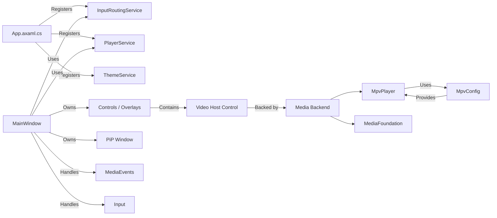

# Cine Project Memory Map

## Overview

Cine is a Windows-focused Avalonia media player built around a layered architecture:

- `src/App/` — Avalonia UI, shell, services, view models, window wiring, and app lifecycle.
- `src/Core/` — shared infrastructure, models, interfaces, logging, and configuration.
- `src/Media/` — playback backends and media abstraction, including libmpv and Media Foundation.
- `tests/` — unit and integration tests under `tests/Cine.Tests`; performance benchmarks under `tests/Cine.Benchmarks`.

## Key Concepts

- **UI Shell**: `src/App/UI/` contains the main window, shell partials, input handling, and overlay controls.
- **Input Routing**: `src/App/Application/Services/InputRoutingService.cs` registers shortcut bindings and handles keyboard scope dispatch.
- **Playback Engine**: `src/Media/Implementations/mpv/MpvConfig.cs` defines mpv launch options, quality profiles, and render API options.
- **PiP Mode**: The app has a Picture-in-Picture mode with special input gating and window management in `MainWindow.Input.cs`.
- **Dependency Injection**: `src/App/App.axaml.cs` configures DI for core services like `InputRoutingService`, `ThemeService`, `PlayerService`, and view models.

## Important Folders

- `src/App/Application/Services/` — application services, including keyboard routing and feature coordination.
- `src/App/UI/Shell/` — main window partials, startup logic, media event handling, and input wiring.
- `src/App/UI/Views/` — top-level views such as `MainWindow.axaml.cs`.
- `src/App/Controls/` — custom controls and native host elements used by the UI.
- `src/App/Application/ViewModels/` — primary view models that drive UI state and commands.
- `src/Media/Implementations/mpv/` — libmpv-specific player and configuration.
- `src/Media/Implementations/mediafoundationplayer/` — Media Foundation fallback implementation.
- `docs/` — design notes and broader documentation.
- `upgradeV2/md/` — migrated planning docs and action plans.
- `upgradeV2/canvas/` — visual mockups and UI canvas artifacts.
- `upgradeV2/memory-map/` — living architecture maps and project memory files.

## Current Implementation Status

### Phase 2 — Playback Smoothness & Rendering Stability (mpv OpenGL)
**Completed: 2026-06-29**

#### New Services
- **`PerformanceMonitor`** (`src/App/Application/Services/PerformanceMonitor.cs`): Frame pacing and drop detection. Counts fps, logs warnings via `CrashReporter.LogError()` when < 50fps.
- **`RenderThrottleService`** (`src/App/Application/Services/RenderThrottleService.cs`): Throttles render submissions to ~60fps using Stopwatch-based timing. Thread-safe via Interlocked.

#### Improved Files
- **`MpvConfig.cs`**: Added `GetPremiumTuningOptions()` — low-latency audio buffer (100ms), early OpenGL flush, cache disabled, display-resample sync, hwdec=auto.
- **`MpvPlayer.cs`**: `InitializeRenderApi()` now applies premium tuning after base options.
- **`MpvVideoView.cs`**: Render loop checks `RenderThrottleService.ShouldRender()` before processing frames; calls `PerformanceMonitor.OnFrameRendered()` after display dispatch.
- **`MainWindow.Startup.cs`**: Wires both services via `MpvVideoView.SetPerformanceServices()`.

### Phase 3 — Focus and Input Architecture Rebuild
**Completed: 2026-06-29**

#### Enhanced Services
- **`InputRoutingService.cs`**: Added stack-based scope management (`Stack<InputScope>` with `PushScope`/`PopScope`/`ClearScopes`/`CurrentScope`). Added `TextEdit` scope value. `TryHandle()` now reads scope from the stack — no explicit scope parameter needed.
- **`KeyboardConflictValidator.cs`** (new): Startup conflict detection. Groups bindings by `(Key, Modifiers, Scope)` and logs duplicates.

#### Improved Files
- **`MainWindow.Input.cs`**: Rewrote `OnKeyDown` with push/pop for each scope region (TextEdit, DialogOpen, PipActive, Normal). Added `ShowDialogWithScope` helper. Calls `KeyboardConflictValidator.Validate()` at end of registration.

### Input and Shortcut Architecture

- `InputRoutingService.cs` is implemented and registered as a singleton in DI.
- `MainWindow.Input.cs` routes `KeyDown` events through `InputRoutingService.TryHandle`.
- The service supports scoped shortcuts with `Normal`, `DialogOpen`, `Fullscreen`, and `PipActive` states.
- PiP mode blocks most keys and only allows `Escape` and `Ctrl+Shift+P` while active.
- Modal dialogs are detected via `OwnedWindows` and switch the routing scope to `DialogOpen`.

### Media Playback Configuration

- `MpvConfig.cs` exposes:
  - `GetBaseOptions()` for common mpv init flags.
  - `GetQualityOptions()` for high-quality main playback.
  - `GetLowQualityOptions()` for PiP/low-power playback.
  - `GetFullOptions(bool highQuality, IntPtr hwnd)` for windowed mpv playback.
  - `GetRenderApiOptions()` for `libmpv` render API usage.
- The current libmpv setup uses `vo=gpu` for windowed playback and `vo=libmpv` when rendering through the render API.
- Hardware decoding defaults to `auto-safe`; subtitle styling and color levels are configured in the mpv options.

### App Shell and Window Flow

- `MainWindow.axaml.cs` is the primary window entry point and loads the app icon.
- `MainWindow.Initialization.cs` sets up startup behavior, event wiring, and service references.
- `MainWindow.Core.cs` contains shell logic, state management, and startup/resume paths.
- `MainWindow.Input.cs` handles keyboard, pointer, and flyout interactions.
- `MainWindow.MediaEvents.cs` and `MainWindow.Pip.cs` manage media state and PiP transitions.

## App Surface Summary

### Primary Layers

1. **Shell / MainWindow**
   - `src/App/UI/Shell/` contains most of the user-facing window management and feature entry points.
2. **Controls**
   - `src/App/Controls/` contains custom UI controls, native video host integration, and other reusable components.
3. **ViewModels**
   - `src/App/Application/ViewModels/` contains shared view models for playback, settings, and UI state.
4. **Media Backends**
   - `src/Media/Implementations/mpv/` — primary playback engine using libmpv.
   - `src/Media/Implementations/mediafoundationplayer/` — fallback path for Windows-native playback.

### Supporting Artifacts

- `upgradeV2/md/action-plan.md` — premium product transformation masterplan and current planning doc.
- `upgradeV2/canvas/action-plan.canvas` — copied current UI canvas artifact from `.kombai/canvas/cine-alignment.canvas`.
- `upgradeV2/README.md` — artifact folder conventions and guidance.

## Architecture Graph

## Artifact Notes

- `upgradeV2/memory-map/project-memory-map.md` is the living architecture summary.
- `upgradeV2/canvas/action-plan.canvas` is the current UI layout starting point for canvas-based edits.
- `upgradeV2/md/action-plan.md` is the working product strategy and phase plan.

## Next Focus Areas

- Align the action plan with actual code implementation and identify missing work.
- Audit UI shell, flyout behavior, and renderer paths for premium quality debt.
- Update `upgradeV2/canvas/action-plan.canvas` with a canvas view of the current app state.
- Keep the artifact docs in `upgradeV2/` as the single source of truth for planning and design.
