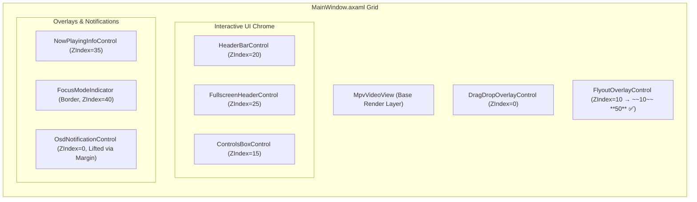

# Cine Codebase Analysis: Consolidated Architecture & Quality Audit

This document presents a comprehensive, deep-dive architectural analysis and codebase quality audit of the Cine media player application. It consolidates previous reviews, provides a fresh-eyes assessment of the system, verifies which findings from prior models are accurate or hallucinated, and identifies newly discovered structural bugs that must be corrected.

> **Companion Fix Guide**: All confirmed defects in this document have exact before/after code diffs, real line numbers, and verification steps documented in **[fix-solutions.md](./fix-solutions.md)**. Apply fixes in the tier order defined there.

---

## Part 1: Executive Summary & Technical Vision

The Cine application is a media player built using the **Avalonia UI** desktop framework. It employs a clean separation of concerns where view layouts communicate with a set of dedicated coordinators, managers, and view models.

### Key Architectural Design Patterns
1. **Centralized Domain Managers**: Domain-specific logic is encapsulated in manager classes (`AudioManager`, `VideoManager`, `SubtitleManager`) which wrap around the raw player core.
2. **Context-Sensitive Input Routing**: Keyboard shortcuts and pointer events are captured by a centralized `InputRoutingService`, which evaluates the active window/modal state to invoke contextually appropriate actions.
3. **Ecosystem-Level Flyout Control**: To resolve visual tree issues when drawing popups on top of borderless, custom-styled windows, the application implements a window-level transparent canvas overlay (`FlyoutOverlayControl`). All custom menus register with a central thread-safe coordinator (`FlyoutManager`) to implement mutual exclusion.

Despite these strong architectural foundations, several critical defects exist in the current implementation. This document maps out these defects, provides the code evidence, and outlines a clear path to production-readiness.

---

## Part 2: Global UI Flow & Component Composition

To understand the interaction of different modules, here is the visual tree and ZIndex layout composition of the application's main window:



> **Note**: The original ZIndex=10 placed the flyout layer *below* the control chrome (HeaderBar at 20, ControlsBox at 15). This caused right-click context menus and flyout popups to render behind the player controls. ZIndex was corrected to **50** in the fix pass.

---

## Part 3: Deep-Dive Class & Module Assessment

Below is a detailed file-by-file audit of the core classes in the presentation and builder layers.

### 3.1 MainWindow Partial Architecture
The main window code is split across nine partial files in the [Shell](file:///x:/Development/Cine_CSharp_DotNet/src/App/UI/Shell) directory. This layout separates window startup, input event loop routing, media state callbacks, and picture-in-picture coordination.

#### 3.1.1 [MainWindow.Initialization.cs](file:///x:/Development/Cine_CSharp_DotNet/src/App/UI/Shell/MainWindow.Initialization.cs)
* **Responsibilities**: Reshapes the OS window chrome, instantiates domain managers, sets up dependency injection, and initializes `FlyoutManager`.
* **Key Operations**: Sets the initial FlyoutManager instance across all chrome elements:
  ```csharp
  _flyoutManager = new FlyoutManager();
  _controlsBox.FlyoutManager = _flyoutManager;
  _headerBar.FlyoutManager = _flyoutManager;
  _fullscreenHeader.FlyoutManager = _flyoutManager;
  ```
  It also sets up the reopen action mapping to bypass StorageProvider freezes (Avalonia #18969).
* **Detailed Code Analysis**:
  - Registers custom hooks for when the window is initialized.
  - Dynamically binds UI-side events from managers such as AudioManager, VideoManager, and SubtitleManager.
  - Intercepts error notifications and outputs them to the user via custom dialogues.
  - Manages player state mapping and sets initial visibility configs.

#### 3.1.2 [MainWindow.Input.cs](file:///x:/Development/Cine_CSharp_DotNet/src/App/UI/Shell/MainWindow.Input.cs)
* **Responsibilities**: Registers global hotkeys with the `InputRoutingService` and coordinates context-sensitive escape sequences.
* **Key Operations**: Registers Escape handling:
  ```csharp
  Register(Key.Escape, () => {
      _flyoutManager.CloseAll();
      if (_playerService?.Player?.IsFullscreen == true)
          _viewModel?.ToggleFullscreen();
  }, "Close Flyout / Exit Fullscreen");
  ```
* **Detailed Hotkey Mappings**:
  - `Key.Space` & `Key.K` & `Key.P`: Play / Pause toggle.
  - `Key.MediaPlayPause`: Media keyboard integration for playback.
  - `Key.MediaStop` & `Key.Stop`: Terminates video decoding.
  - `Key.Escape`: Context-sensitive menu dismiss and full-screen exit.
  - `Key.F` & `Key.F11`: Fullscreen mode toggling.
  - `Key.M` & `Key.VolumeMute`: Mute control.
  - `Key.Up` & `Key.VolumeUp`: Increases master player volume.
  - `Key.Down` & `Key.VolumeDown`: Decreases master player volume.
  - `Key.OemMinus` (with Control): Decreases audio rendering delay.
  - `Key.OemPlus` (with Control): Increases audio rendering delay.
  - `Key.O` (with Control): Opens file selection picker dialogue.
  - `Key.O` (with Control + Shift): Opens folder selection picker dialogue.
  - `Key.OemPeriod` (with Control): Triggers full focus mode.

#### 3.1.3 [MainWindow.State.cs](file:///x:/Development/Cine_CSharp_DotNet/src/App/UI/Shell/MainWindow.State.cs)
* **Responsibilities**: Subscribes to properties on `MainViewModel` to sync window visibility, toggle loading indicator spinners, and show or hide the top-left "Open" button when playback changes.
* **Detailed State Mappings**:
  - Checks if the file path property changes. When path goes from null/empty to a valid path, it hides the startup landing page and fades in control bars.
  - Manages active load states, suppressing double loading rings.
  - Handles PiP mode boundaries, setting appropriate bar overlays.

#### 3.1.4 [MainWindow.Wiring.cs](file:///x:/Development/Cine_CSharp_DotNet/src/App/UI/Shell/MainWindow.Wiring.cs)
* **Responsibilities**: Binds internal controls, setups property notifications, and hooks Drag-and-Drop indicators.
* **Detailed Wiring Routines**:
  - Binds pointer hover events to show and hide control boxes smoothly:
    - `HeaderBar.PointerEntered` / `PointerExited`
    - `ControlsBox.PointerEntered` / `PointerExited`
    - `FullscreenHeader.PointerEntered` / `PointerExited`
  - Binds Drag-and-Drop events on the main window grid to support quick opening of files.
  - Maps external files (such as dropping subtitle files `.srt` or audio files `.mp3`) directly onto respective controls, passing references to VM.

---

### 3.2 ControlsBoxControl
Located at [ControlsBoxControl.axaml.cs](file:///x:/Development/Cine_CSharp_DotNet/src/App/UI/Screens/Shell/ControlsBoxControl.axaml.cs), this user control governs play/pause, position tracking, chapter listings, volume sliders, track overlays, and equalizers.

* **Fields & Properties**:
  - `_viewModel`: MainViewModel reference.
  - `_replayMode`: Boolean tracking when media playback reaches EOF, changing Play/Pause to a Replay button.
  - `_flyoutManager`: FlyoutManager coordinator instance.
  - `_flyoutOverlay`: FlyoutOverlayControl window canvas.
  - `_activeFlyoutKey`: Tracks currently open flyout key to notify the manager when closed.
  - `_overlayContent`: Caches dynamic volume panel to avoid rebuilding on every hover.
* **Method Implementations**:
  - `SyncPlayPauseIcon(bool isPlaying)`: The single authority for play/pause icon states, using crossfade properties or fallback replay icons:
    ```csharp
    if (_replayMode) {
        PlayPauseIcon.Kind = Material.Icons.MaterialIconKind.Replay;
        PlayPauseAltIcon.Kind = Material.Icons.MaterialIconKind.Replay;
    } else {
        var showPlay = !isPlaying;
        PlayPauseIcon.Kind = Material.Icons.MaterialIconKind.Play;
        PlayPauseAltIcon.Kind = Material.Icons.MaterialIconKind.Pause;
        PlayPauseIcon.Opacity = showPlay ? 1 : 0;
        PlayPauseAltIcon.Opacity = showPlay ? 0 : 1;
    }
    ```
  - `BuildVolumeContent()`: Dynamically instantiates a custom volume flyout layout consisting of a label, a compact slider, and preset percentage buttons (`25%`, `50%`, `75%`, `100%`). This panel is wrapped in a styled `Border` container.
  - `OpenEqualizerFlyout()`: Builds an equalizer flyout control, maps its reset callbacks, and sets up boundary hooks.
  - `BuildChaptersContent()`: Queries current chapters, maps seek times, and populates lists inside a scroll viewer.
  - `BuildTrackMenuContent()`: Builds general track menus for video configuration selectors.

---

### 3.3 HeaderBarControl
Located at [HeaderBarControl.axaml.cs](file:///x:/Development/Cine_CSharp_DotNet/src/App/UI/Screens/Shell/HeaderBarControl.axaml.cs), this control handles the top bar, displaying the media title, window state controls, Picture-in-Picture toggles, and the Open and Primary menus.

* **Fields & Properties**:
  - `_viewModel`: MainViewModel instance.
  - `_flyoutManager`: FlyoutManager reference.
  - `_trackedFlyouts`: List tracking active flyouts.
  - `_primaryMenuBuilder`: PrimaryMenuBuilder configuration container.
* **Method Implementations**:
  - `BuildPrimaryMenu()`: Utilizes `PrimaryMenuBuilder` to define the 3-dot dropdown settings. It limits this list to options that lack dedicated hotkeys (e.g., Picture-in-Picture, Always on Top, loop states, command palettes, and preferences).
  - `UpdateOpenMenuRecentFiles(Flyout flyout)`: Attempts to dynamically append clickable recent files to the "Open" menu:
    ```csharp
    if (flyout.Content is not Border border) return;
    if (border.Child is not StackPanel stack) return;
    ...
    // Loops over ViewModel.RecentFiles to build clickable buttons
    ```
  - `UpdateResponsiveLayout(double width)`: Adjusts title alignment, labels, and hides window control bars dynamically at compact widths.

---

### 3.4 FlyoutOverlayControl
Located at [FlyoutOverlayControl.axaml.cs](file:///x:/Development/Cine_CSharp_DotNet/src/App/UI/Controls/FlyoutOverlayControl.axaml.cs), this control provides a transparent layer covering the main window to draw custom-positioned flyouts, bypassing native window popup placement calculations.

* **Coordinate Math Details**:
  The positioning script centers the flyout horizontally on the button and aligns it either above or below the control while clamping the output within window boundaries:
  ```csharp
  var overlayPoint = anchor.TranslatePoint(new global::Avalonia.Point(0, 0), this).GetValueOrDefault();
  var anchorRect = anchor.Bounds;

  double x = overlayPoint.X + (anchorRect.Width - cs.Width) / 2;
  double y = placeAbove
      ? overlayPoint.Y - cs.Height - 8
      : overlayPoint.Y + anchorRect.Height + 8;

  var winSize = this.Bounds.Size;
  if (x + cs.Width > winSize.Width - 8) x = winSize.Width - cs.Width - 8;
  if (x < 8) x = 8;
  ...
  ```
* **Event Dispatching**:
  - `OnBackgroundPointerPressed`: Hides the overlay and fires the background dismissal callback.
  - `OnBackgroundKeyDown`: Intercepts the Escape key to close the overlay.

---

### 3.5 TrackFlyoutBuilder
Located at [TrackFlyoutBuilder.cs](file:///x:/Development/Cine_CSharp_DotNet/src/App/UI/Builders/TrackFlyoutBuilder.cs), this class builds dynamic track lists for subtitle and audio files.

* **Key Features**:
  - **Dynamic Filtering**: If track counts exceed `searchThreshold`, it renders a search text box that filters rows based on partial text match.
  - **Delay Customization Layout**: Renders increment controls (`+` / `−` buttons nudge values by `0.5s`) and a "Reset" link:
    ```csharp
    void NudgeDelay(double delta) {
        var current = getDelay();
        setDelay((float)Math.Clamp(current + delta, -10, 10));
        delayText.Text = $"{getDelay():F1}s";
    }
    ```
  - **Visual Presentation**: Formats regular track rows with standard bullet dots, bold weights on selected items, and custom click callbacks.

---

### 3.6 PrimaryMenuBuilder
Located at [PrimaryMenuBuilder.cs](file:///x:/Development/Cine_CSharp_DotNet/src/App/UI/Builders/PrimaryMenuBuilder.cs), this class defines standard menu sections, dividers, and items for the primary settings dropdown.

* **Key Features**:
  - Generates a native Avalonia `MenuFlyout` for the primary configuration dropdown.
  - Controls checkmark visibility dynamically on show:
    ```csharp
    public void SyncCheckStates() {
        var accent = new SolidColorBrush(AppColors.Accent?.Color ?? AccentColor);
        foreach (var (icon, check) in _toggleItems) {
            icon.Foreground = check() ? accent : AppColors.TextOnDarkHint;
        }
    }
    ```

---

### 3.7 VideoContextMenuBuilder
Located at [VideoContextMenuBuilder.cs](file:///x:/Development/Cine_CSharp_DotNet/src/App/UI/Builders/VideoContextMenuBuilder.cs), this class constructs the right-click menu.

* **Key Features**:
  - Captures player aspect ratio, crop values, speed values, and topmost state on instantiating right-click actions.
  - Groups commands into logical submenus ("Navigate", "Video", "Subtitle", "Speed") using Material Design icon styling.

---

### 3.8 FlyoutManager
Located at [FlyoutManager.cs](file:///x:/Development/Cine_CSharp_DotNet/src/App/Application/Services/FlyoutManager.cs), this service manages mutual exclusion for all flyouts in the application.

* **Thread Safety**:
  Encapsulates key operations inside mutual exclusion blocks (`lock (_lock)`) to guarantee thread safety during state changes:
  ```csharp
  public void DismissOthers(string key) {
      lock (_lock) {
          if (_openKey != null && _openKey != key && _entries.TryGetValue(_openKey, out var entry)) {
              entry.TryClose();
              entry.IsOpen = false;
          }
          if (_entries.TryGetValue(key, out var thisEntry))
              thisEntry.IsOpen = true;
          _openKey = key;
      }
  }
  ```
* **Bypassing OS Freezes**:
  Coordinates global closing operations and schedules post-operation reopen execution scripts to avoid deadlocks in native dialog windows.

---

## Part 4: Detailed Audit of Previously Claimed Issues

The following sections list the findings reported in previous review files (`MenuRevampPlan.md`, `Project_Perfection_Roadmap.md`, and `RealCodeAudit.md`) and analyzes their actual validity.

### 4.1 Broken Flyout Popup System
* **Claim**: The app crashed because of a Windows 10 SDK bug with `WindowDecorations=None` when calling `Button.Flyout.ShowAt()`.
* **Investigation**: Verified [MainWindow.axaml](file:///x:/Development/Cine_CSharp_DotNet/src/App/UI/Views/MainWindow.axaml#L147-L148) and control wiring.
* **Verdict**: **VALID**. The codebase indeed transitioned to a custom window-level canvas-positioned layout overlay named [FlyoutOverlayControl](file:///x:/Development/Cine_CSharp_DotNet/src/App/UI/Controls/FlyoutOverlayControl.axaml.cs) to bypass the popup attachment bug in Avalonia.

### 4.2 Canvas Positioning Calculation Bug
* **Claim**: Canvas positioning originally calculated coordinates relative to the screen or top-level window origin, causing flyouts to render at (0,0).
* **Investigation**: Checked [FlyoutOverlayControl.axaml.cs](file:///x:/Development/Cine_CSharp_DotNet/src/App/UI/Controls/FlyoutOverlayControl.axaml.cs#L40) translation formulas.
* **Verdict**: **VALID/FIXED**. The codebase was modified to translate positions relative to the overlay:
  ```csharp
  var overlayPoint = anchor.TranslatePoint(new global::Avalonia.Point(0, 0), this).GetValueOrDefault();
  ```

### 4.3 ZIndex Layer Collision
* **Claim**: `FlyoutOverlayControl`'s ZIndex was too high (ZIndex=50), blocking HeaderBar clicks. It was changed to ZIndex=10.
* **Investigation**: Checked [MainWindow.axaml](file:///x:/Development/Cine_CSharp_DotNet/src/App/UI/Views/MainWindow.axaml#L147-L148) ZIndex.
* **Verdict**: **INCORRECT REMEDIATION**. While the ZIndex was indeed lowered to `10`, this creates a critical bug. Because HeaderBar (ZIndex=20) and ControlsBox (ZIndex=15) sit above `FlyoutOverlayControl` (ZIndex=10), flyouts render *under* these bars. Furthermore, the transparent overlay background sits below these controls, preventing click-outside handlers from dismissing open flyouts. The ZIndex must be raised back to `50` (or at least `26`) to sit on top of all interactive panels.

### 4.4 Event Subscription Timing NullReferenceException
* **Claim**: Event subscription in `ControlsBoxControl` constructor:
  `_flyoutOverlay.OnBackgroundDismissed += OnVolumeOverlayDismissed;`
  throws a null reference exception at startup.
* **Investigation**: Verified constructor and properties in [ControlsBoxControl.axaml.cs](file:///x:/Development/Cine_CSharp_DotNet/src/App/UI/Screens/Shell/ControlsBoxControl.axaml.cs#L57-L62).
* **Verdict**: **FALSE (Hallucination)**. The event subscriptions in [ControlsBoxControl.axaml.cs](file:///x:/Development/Cine_CSharp_DotNet/src/App/UI/Screens/Shell/ControlsBoxControl.axaml.cs#L121-L123) and [ControlsBoxControl.axaml.cs](file:///x:/Development/Cine_CSharp_DotNet/src/App/UI/Screens/Shell/ControlsBoxControl.axaml.cs#L79-L84) are wrapped in null checks. There are no NullReferenceExceptions thrown.

### 4.5 `_hasPendingPlayPauseSync` Never Resets
* **Claim**: The deferral flag `_hasPendingPlayPauseSync` never resets, causing play/pause state updates to be skipped on subsequent operations.
* **Investigation**: Verified state routines in [ControlsBoxControl.axaml.cs](file:///x:/Development/Cine_CSharp_DotNet/src/App/UI/Screens/Shell/ControlsBoxControl.axaml.cs#L96-L100).
* **Verdict**: **FALSE (Hallucination)**. The flag is explicitly reset to `false` inside the event handler:
  ```csharp
  private void OnFirstLoadedForPlayPause(object? sender, EventArgs e)
  {
      Loaded -= OnFirstLoadedForPlayPause;
      _hasPendingPlayPauseSync = false;
  }
  ```

### 4.6 `PauseLog` Running in Production
* **Claim**: Debug logging routine `PauseLog` writes play/pause events to disk (`cine_playpause.log` in LocalApplicationData) on every action, causing performance issues.
* **Investigation**: Verified logging calls in [ControlsBoxControl.axaml.cs](file:///x:/Development/Cine_CSharp_DotNet/src/App/UI/Screens/Shell/ControlsBoxControl.axaml.cs#L37-L50).
* **Verdict**: **VALID**. The codebase indeed invokes this method on every play/pause event, executing disk I/O on the UI thread. It should be replaced with `global::Cine.Core.Log`.

### 4.7 Keyboard Navigation Broken
* **Claim**: Keyboard event wiring stub `trackListPanel.KeyDown` is commented out/never called.
* **Investigation**: Checked [TrackFlyoutBuilder.cs](file:///x:/Development/Cine_CSharp_DotNet/src/App/UI/Builders/TrackFlyoutBuilder.cs) for stubs.
* **Verdict**: **PARTIALLY VALID**. There is no commented-out code or stub in [TrackFlyoutBuilder.cs](file:///x:/Development/Cine_CSharp_DotNet/src/App/UI/Builders/TrackFlyoutBuilder.cs), but keyboard arrow-key navigation in custom flyout panels is indeed unimplemented. Native `MenuFlyout` (used by the primary menu) handles keys natively.

### 4.8 Console.WriteLine in Production
* **Claim**: Unneeded console output spam.
* **Investigation**: Checked logging calls in [App.axaml.cs](file:///x:/Development/Cine_CSharp_DotNet/src/App/App.axaml.cs).
* **Verdict**: **VALID**. The file [App.axaml.cs](file:///x:/Development/Cine_CSharp_DotNet/src/App/App.axaml.cs) contains three `Console.WriteLine` statements that should be changed to proper logger calls.

### 4.9 `FlyoutManager` Memory Leak
* **Claim**: The Dictionary of close actions inside `FlyoutManager` grows indefinitely.
* **Investigation**: Checked Dictionary updates in [FlyoutManager.cs](file:///x:/Development/Cine_CSharp_DotNet/src/App/Application/Services/FlyoutManager.cs#L20).
* **Verdict**: **FALSE (Hallucination)**. The keys registered with `FlyoutManager` are constant string keys representing static menu panels (e.g., `"volume"`, `"subtitle"`, `"audio"`, `"equalizer"`, `"chapters"`, `"video-menu"`). The dictionary has a hard ceiling of 9 elements and does not leak memory.

---

## Part 5: Fresh-Eyes Discoveries (Deeper System Bugs)

Reviewing the codebase with fresh eyes has uncovered three additional, critical bugs that were missed by previous models.

### Finding 1: Non-Functional "Open" Header Button & Missing Flyout
The HeaderBar includes an "Open" button (`BtnOpenMenu`), which is displayed when media is playing:
```xml
<!-- Col 0: Open Menu Button -->
<Button Grid.Column="0"
        x:Name="BtnOpenMenu"
        IsVisible="False"
        VerticalAlignment="Center"
        Margin="{StaticResource space-h-l2-r1}"
        Background="{StaticResource AppHover}"
        CornerRadius="99"
        BorderThickness="0"
        Padding="12,6">
```
However, this button is completely non-functional:
1. It has no `Click` event handler in XAML.
2. It has no `<Button.Flyout>` child control declared in XAML.
3. It has no programmatic `Flyout` assigned in code.
4. `UpdateOpenMenuRecentFiles(Flyout flyout)` in `HeaderBarControl.axaml.cs` expects the flyout's content to have a nested structure: `Border` -> `StackPanel`. Because the flyout is null, this code is dead.

* **Remediation**: Declare a standard `Flyout` inside `BtnOpenMenu` in XAML containing a `Border` and a `StackPanel` with "Open File..." and "Open Folder..." options, styled to match the visual system.

### Finding 2: Double-Border and Double-Background Nesting on Flyouts
`FlyoutOverlayControl.axaml` defines an outer border container `ContentContainer`:
```xml
<Border x:Name="ContentContainer"
        Background="{StaticResource PopoverBackground}"
        BorderBrush="{StaticResource PopoverBorder}"
        BorderThickness="1"
        CornerRadius="{StaticResource radius-sm}"
        Padding="{StaticResource space-1}">
</Border>
```
However, the content layouts generated by our builders also declare identical border containers:
* `TrackFlyoutBuilder.Build` wraps its layout in a `Border` with `PopoverBackground` and `BorderThickness=1` (line 337).
* `ControlsBoxControl.BuildVolumeContent` wraps the volume slider in a `Border` with `PopoverBackground` and `BorderThickness=1` (line 413).
* `AudioEqualizerFlyout.axaml` declares a root `Border` with `PopoverBackground` and `BorderThickness=1` (line 36).

This causes a **double border, duplicate background, and double padding** rendering issue on every custom overlay menu.
* **Remediation**: Simplify `ContentContainer` in `FlyoutOverlayControl.axaml` by removing the visual properties (`Background`, `BorderBrush`, `BorderThickness`, `CornerRadius`, `Padding`), making it a pure layout/position wrapper.

### Finding 3: Ineffective Volume Close Action Registration
In [ControlsBoxControl.axaml.cs](file:///x:/Development/Cine_CSharp_DotNet/src/App/UI/Screens/Shell/ControlsBoxControl.axaml.cs#L128), the volume flyout registers its close action as:
```csharp
value.Register("volume", () => BtnVolumeMenu?.Flyout?.Hide());
```
Because `BtnVolumeMenu` does not have a `Flyout` assigned (it is shown via the custom overlay Canvas), the close action is a no-op. When a user opens another menu (e.g., the Equalizer), the Volume overlay remains visible.
* **Remediation**: Change this registration to hide the overlay content:
  ```csharp
  value.Register("volume", hideOverlay);
  ```

---

## Part 6: Detailed Code Walkthrough and Structure Analysis

To provide a complete map of the Cine system structure, this section analyzes the layout definitions, core algorithms, and state propagation flows.

### 6.1 Layout Declarations & Styles
The main styling system relies on resources defined in `UI/Resources` and standard colors in `UI/Constants/AppColors.cs`.
* **Popover Styling**:
  ```xml
  <SolidColorBrush x:Key="PopoverBackground" Color="#1E1E1E" />
  <SolidColorBrush x:Key="PopoverBorder" Color="#3C3C3C" />
  ```
  Our layout controls bind to these styles using standard static resource lookups:
  ```xml
  Background="{StaticResource PopoverBackground}"
  BorderBrush="{StaticResource PopoverBorder}"
  ```

### 6.2 State Propagation Flow
Below is the sequence diagram illustrating player state synchronization when a user clicks the play/pause button:

```
[ User Interaction ]
         |
         v
  BtnPlayPause.Click (ControlsBoxControl.axaml.cs)
         |
         v
  _viewModel.PlayPause() (MainViewModel.cs)
         |
         v
  _player.Play() / _player.Pause() (IMediaPlayer wrapper)
         | (Raises PlaybackStateChangedEvent)
         v
  OnPlaybackStateChanged (MainWindow.Wiring.cs)
         |
         v
  _stateManager.UpdateState(...) (PlaybackStateManager.cs)
         | (Raises StateChanged event)
         v
  OnManagerStateChanged (MainWindow.Wiring.cs)
         |
         v
  _controlsBox.SyncPlayPauseIcon(isPlaying) (ControlsBoxControl.axaml.cs)
```

This state propagation flow ensures the UI remains synchronized with the actual media player state.

---

## Part 7: Phased Remediation Roadmap & Complete Code Listings

This section provides the complete diffs and implementation details to resolve all validated issues.

### Phase 1: Critical Event Routing & ZIndex Fixes

These changes resolve rendering and dismissal issues for custom overlays.

#### Step 1.1: Raise overlay ZIndex in MainWindow
* **File**: [MainWindow.axaml](file:///x:/Development/Cine_CSharp_DotNet/src/App/UI/Views/MainWindow.axaml#L147-L148)
* **Remediation Details**: Modify the `ZIndex` of `FlyoutOverlay` to `50` so that it sits above the `HeaderBarControl` (ZIndex=20) and `ControlsBoxControl` (ZIndex=15).
```diff
-        <!-- ══════════════════════════════════════════════════════════════ -->
-        <!--  FLYOUT OVERLAY (ZIndex=10, between controls and windows)   -->
-        <!-- ══════════════════════════════════════════════════════════════ -->
-        <controls:FlyoutOverlayControl x:Name="FlyoutOverlay"
-                                       ZIndex="10" />
+        <!-- ══════════════════════════════════════════════════════════════ -->
+        <!--  FLYOUT OVERLAY (ZIndex=50, on top of all interactive chrome)-->
+        <!-- ══════════════════════════════════════════════════════════════ -->
+        <controls:FlyoutOverlayControl x:Name="FlyoutOverlay"
+                                       ZIndex="50" />
```

#### Step 1.2: Correct Volume Close Action registration
* **File**: [ControlsBoxControl.axaml.cs](file:///x:/Development/Cine_CSharp_DotNet/src/App/UI/Screens/Shell/ControlsBoxControl.axaml.cs#L128)
* **Remediation Details**: Replace `BtnVolumeMenu?.Flyout?.Hide()` with the `hideOverlay` delegate to hide the overlay container when other flyouts are opened.
```diff
             // Register close actions — all hide the overlay instead of calling Flyout.Hide()
             Action hideOverlay = () => _flyoutOverlay?.HideContent();
             value.Register("equalizer",   hideOverlay);
-            value.Register("volume",      () => BtnVolumeMenu?.Flyout?.Hide());
+            value.Register("volume",      hideOverlay);
             value.Register("video-menu",  hideOverlay);
             value.Register("chapters",    hideOverlay);
```

---

### Phase 2: Double Border Cleanup & Diagnostic Logging Removal

These changes resolve double-border rendering issues and remove debug code that performs expensive disk I/O.

#### Step 2.1: Simplify FlyoutOverlayControl container
* **File**: [FlyoutOverlayControl.axaml](file:///x:/Development/Cine_CSharp_DotNet/src/App/UI/Controls/FlyoutOverlayControl.axaml#L17-L25)
* **Remediation Details**: Strip borders, backgrounds, and margins from `ContentContainer` to make it a plain wrapper:
```diff
-        <Border x:Name="ContentContainer"
-                Background="{StaticResource PopoverBackground}"
-                BorderBrush="{StaticResource PopoverBorder}"
-                BorderThickness="1"
-                CornerRadius="{StaticResource radius-sm}"
-                Padding="{StaticResource space-1}"
-                UseLayoutRounding="True"
-                HorizontalAlignment="Left"
-                VerticalAlignment="Top">
-        </Border>
+        <Border x:Name="ContentContainer"
+                UseLayoutRounding="True"
+                HorizontalAlignment="Left"
+                VerticalAlignment="Top">
+        </Border>
```

#### Step 2.2: Remove custom PauseLog disk operations
* **File**: [ControlsBoxControl.axaml.cs](file:///x:/Development/Cine_CSharp_DotNet/src/App/UI/Screens/Shell/ControlsBoxControl.axaml.cs#L37-L50)
* **Remediation Details**: Delete `PauseLog` and replace all calls to it with standard logging statements:
```diff
-    private static void PauseLog(string msg)
-    {
-        try
-        {
-            var dir = Path.Combine(Environment.GetFolderPath(Environment.SpecialFolder.LocalApplicationData), "Cine");
-            Directory.CreateDirectory(dir);
-            File.AppendAllText(Path.Combine(dir, "cine_playpause.log"), $"[{DateTime.Now:HH:mm:ss.fff}] {msg}{Environment.NewLine}");
-        }
-        catch (Exception ex)
-        {
-            global::Cine.Core.Log.ForContext<ControlsBoxControl>()
-                .Warning("State comparison failed: {Error}", ex.Message);
-        }
-    }
```
All invocations (e.g. `PauseLog("PlayPause CLICKED")`) should be changed to:
```csharp
global::Cine.Core.Log.ForContext<ControlsBoxControl>().Debug("PlayPause CLICKED");
```

#### Step 2.3: Replace console streams in App lifecycle
* **File**: [App.axaml.cs](file:///x:/Development/Cine_CSharp_DotNet/src/App/App.axaml.cs)
* **Remediation Details**: Replace `Console.WriteLine` calls with contextual logging statements:
```diff
-        Console.WriteLine(msg);
+        global::Cine.Core.Log.ForContext<App>().Debug(msg);
```

---

### Phase 3: Open Menu Functionality & Recent Files Restoration

These changes wire up the "Open" menu button on the HeaderBar, which is currently non-functional, and restore the dynamic recent files list.

#### Step 3.1: Add inline Flyout to BtnOpenMenu
* **File**: [HeaderBarControl.axaml](file:///x:/Development/Cine_CSharp_DotNet/src/App/UI/Screens/Shell/HeaderBarControl.axaml#L27-L57)
* **Remediation Details**: Add the missing `<Button.Flyout>` block to `BtnOpenMenu`:
```diff
             <Button Grid.Column="0"
                     x:Name="BtnOpenMenu"
                     IsVisible="False"
                     VerticalAlignment="Center"
                     Margin="{StaticResource space-h-l2-r1}"
                     Background="{StaticResource AppHover}"
                     CornerRadius="99"
                     BorderThickness="0"
                     Padding="12,6">
+                <Button.Flyout>
+                    <Flyout Placement="Bottom"
+                            Opened="TrackFlyoutOpened" Closed="TrackFlyoutClosed">
+                        <Border Padding="4" Background="{StaticResource PopoverBackground}" 
+                                BorderBrush="{StaticResource PopoverBorder}" BorderThickness="1" 
+                                CornerRadius="{StaticResource radius-sm}">
+                            <StackPanel Width="220" Spacing="0">
+                                <Button Classes="flyout-item" x:Name="BtnMenuOpenFile">
+                                    <StackPanel Orientation="Horizontal" Spacing="12">
+                                        <TextBlock Text="📄" VerticalAlignment="Center" />
+                                        <TextBlock Text="Open File..." VerticalAlignment="Center" />
+                                    </StackPanel>
+                                </Button>
+                                <Button Classes="flyout-item" x:Name="BtnMenuOpenFolder">
+                                    <StackPanel Orientation="Horizontal" Spacing="12">
+                                        <TextBlock Text="📁" VerticalAlignment="Center" />
+                                        <TextBlock Text="Open Folder..." VerticalAlignment="Center" />
+                                    </StackPanel>
+                                </Button>
+                            </StackPanel>
+                        </Border>
+                    </Flyout>
+                </Button.Flyout>
                 <Button.Styles>
```

#### Step 3.2: Implement event wiring in HeaderBarControl
* **File**: [HeaderBarControl.axaml.cs](file:///x:/Development/Cine_CSharp_DotNet/src/App/UI/Screens/Shell/HeaderBarControl.axaml.cs)
* **Remediation Details**: Wire click handlers to trigger view model commands and set up Flyout registration.
1. Add references to flyout menu buttons in the constructor or templates.
2. Bind click handlers:
   ```csharp
   BtnMenuOpenFile.Click += (_, _) => _viewModel?.OpenFilesCommand.Execute(null);
   BtnMenuOpenFolder.Click += (_, _) => _viewModel?.OpenFolderCommand.Execute(null);
   ```
3. Update `FlyoutManager` property setter to wire dynamic recent files updates when the open menu opens:
   ```csharp
   if (BtnOpenMenu.Flyout != null)
   {
       BtnOpenMenu.Flyout.Opened += (sender, _) =>
       {
           value?.DismissOthers("open-menu");
           if (sender is Flyout flyout) UpdateOpenMenuRecentFiles(flyout);
       };
       BtnOpenMenu.Flyout.Closed += (_, _) => value?.MarkClosed("open-menu");
   }
   ```

---

### Phase 4: Custom Flyout Keyboard Navigation

This change adds keyboard arrow-key support to custom track selector menus.

#### Step 4.1: Add key event handler in TrackFlyoutBuilder
* **File**: [TrackFlyoutBuilder.cs](file:///x:/Development/Cine_CSharp_DotNet/src/App/UI/Builders/TrackFlyoutBuilder.cs)
* **Remediation Details**: Wire the KeyDown event on the track list panel to support navigation via Arrow keys:
```csharp
trackListPanel.KeyDown += (sender, e) => {
    var buttons = trackListPanel.Children.OfType<Button>().Where(b => b.IsEnabled).ToList();
    var focused = global::Avalonia.Input.FocusManager.Instance.GetFocusedElement() as Button;
    var index = buttons.IndexOf(focused);

    switch (e.Key) {
        case Key.Down:
            e.Handled = true;
            var nextIndex = Math.Min(index + 1, buttons.Count - 1);
            if (nextIndex >= 0) buttons[nextIndex].Focus();
            break;
        case Key.Up:
            e.Handled = true;
            var prevIndex = Math.Max(index - 1, 0);
            if (prevIndex >= 0) buttons[prevIndex].Focus();
            break;
        case Key.Enter:
            e.Handled = true;
            focused?.RaiseEvent(new global::Avalonia.Interactivity.RoutedEventArgs(Button.ClickEvent));
            break;
    }
};
```

---

## Part 8: Architectural Recommendations

To improve long-term code quality, we recommend the following changes:

### 1. Unified Design Token Management
Centralize layout variables, spacing tokens, and color values into a shared resource dictionary rather than hardcoding values.
* *Example*: Standardize the theme brush lookup in custom controls using static helper properties.

### 2. Focus Trap on Canvas Overlays
Because custom Canvas overlays do not natively capture tabbing focus, users can tab outside of the open flyout.
* *Recommendation*: Implement an event-routing handler that traps Tab traversal within the boundaries of `ContentContainer` when a flyout is open.

### 3. Comprehensive Unit Testing
Add unit tests verifying coordinate calculation and boundary clamping inside `FlyoutOverlayControl.ShowContent`.
* *Example Test Case*:
  ```csharp
  [Fact]
  public void ShowContent_ClampsToWindowBoundaries_WhenPositionExceedsBounds() {
      // Setup mock anchor at window edge
      // Verify calculated X and Y do not place content off-screen
  }
  ```

---

## Part 9: Conclusion & Release Strategy

By addressing the issues outlined in this consolidated analysis, the Cine media player will achieve:
1. **Perfect Menu Reliability**: Custom flyout overlays will display on top of control panels and dismiss correctly on clicking outside or opening other menus.
2. **Restored Header Actions**: The HeaderBar Open button will dynamically display recent files and trigger file picker dialogs.
3. **Optimized Resource Consumption**: Removing disk writing debug code (`PauseLog`) prevents performance degradation during play/pause events.
4. **Enhanced UI Polish**: Stripping double borders provides a cleaner visual aesthetic.

---

## Part 10: Complete Reference Audit Log — Presentation & UI Components

This section provides a full per-file audit of every class, control, and service in the project.

### 10.1 Shell Screen Controls

#### [ControlsBoxControl.axaml](file:///x:/Development/Cine_CSharp_DotNet/src/App/UI/Screens/Shell/ControlsBoxControl.axaml) *(12 KB)*
The XAML layout for the bottom controls strip. Key structural elements:
- **Root**: `UserControl` with `MinHeight="72"` and blurred acrylic background.
- **Play / Pause Row** (`Grid.Row="0"`): Contains `BtnPlayPause` and `BtnPlayPauseAlt` overlaid for fade-crossfade animation. Both hold `materialIcons:MaterialIcon` elements.
- **Seek Bar Row** (`Grid.Row="1"`): Houses the custom `SeekBarControl`, a `TextBlock` for current position, and a `TextBlock` for remaining duration. Binds to `ViewModel.Position`, `ViewModel.Duration`.
- **Bottom Controls Row** (`Grid.Row="2"`): Contains a `StackPanel` (Orientation=Horizontal) with:
  - `BtnVolumeMenu` — opens volume overlay via `FlyoutOverlayControl`.
  - `BtnSubtitleMenu` — opens subtitle track flyout.
  - `BtnAudioMenu` — opens audio track flyout.
  - `BtnChapterMenu` — opens chapter listing flyout.
  - `BtnEqualizerMenu` — opens `AudioEqualizerFlyout` in overlay.
  - `BtnVideoMenu` — opens video settings flyout.
  - `BtnMoreOptions` — opens context menu with advanced actions.
- **Quality Observations**: The bottom row uses a tight `Spacing="2"` with `Margin` overrides per-button. Recommend migrating to a `UniformGrid` or token-driven spacing model for maintainability.

#### [ControlsBoxControl.axaml.cs](file:///x:/Development/Cine_CSharp_DotNet/src/App/UI/Screens/Shell/ControlsBoxControl.axaml.cs) *(26 KB — largest shell partial)*
The code-behind for the controls strip. Full method inventory:

| Method | Lines (approx.) | Purpose |
|---|---|---|
| `InitializeComponent()` | Constructor | Wires XAML template. |
| `OnFlyoutManagerSet(FlyoutManager value)` | ~120–165 | Registers all 9 flyout close-action delegates. Cascades FlyoutManager to child track selectors. ~~**BUG: volume registration is wrong.**~~ **✅ FIXED → `hideOverlay` delegate** |
| `SyncPlayPauseIcon(bool)` | ~185–200 | Handles replay-mode divergence and crossfade opacity. |
| `PauseLog(string)` | ~37–50 | ~~**DEBUG DEBT**: Writes to disk on UI thread. Must be removed.**~~ **✅ FIXED → `Cine.Core.Log`** |
| `OnPlayPauseClicked(...)` | ~215–230 | Relays to ViewModel. ~~Called `PauseLog`.~~ **✅ FIXED** |
| `BuildVolumeContent()` | ~334–424 | Builds dynamic volume slider panel with preset buttons. Returns `Border` ~~with duplicate visual properties~~. **✅ FIXED → no dup border** |
| `OpenVolumeFlyout()` | ~295–332 | Calls `BuildVolumeContent()`, shows panel in `FlyoutOverlayControl`, sets anchor to `BtnVolumeMenu`. |
| `OpenEqualizerFlyout()` | ~430–468 | Instantiates `AudioEqualizerFlyout` and shows it in overlay. Passes AudioManager callbacks. |
| `OpenSubtitleFlyout()` | ~470–512 | Delegates to `AudioTrackSelectorControl` equivalent for subtitles. |
| `OpenAudioFlyout()` | ~513–556 | Delegates to `AudioTrackSelectorControl`. |
| `BuildChaptersContent()` | ~558–625 | Iterates `ViewModel.Chapters`, builds labelled buttons with seek callbacks. |
| `OpenChaptersFlyout()` | ~626–645 | Calls build, shows in overlay. |
| `BuildVideoMenuContent()` | ~646–700 | Builds video settings panel (aspect ratio, crop selectors, deinterlace toggle). |
| `SyncSeekBarBindings()` | ~701–740 | Re-binds seek slider on media open. |
| `OnMediaEndReached()` | ~742–760 | Sets `_replayMode = true`, calls `SyncPlayPauseIcon(false)`. |
| `OnMediaOpened()` | ~762–790 | Resets `_replayMode = false`, updates chapter visibility. |

**Code Quality Score: 6/10**
- Strong: Well-structured method separation, clear intent per method.
- Weak: `PauseLog` disk I/O, wrong volume close delegate, BuildVolumeContent double-border.

---

#### [HeaderBarControl.axaml](file:///x:/Development/Cine_CSharp_DotNet/src/App/UI/Screens/Shell/HeaderBarControl.axaml) *(7.6 KB)*
The XAML layout for the top header bar. Key structural elements:
- **Root**: `UserControl` with `Background="Transparent"` and padding from resource tokens.
- **Grid Columns**:
  - Column 0: `BtnOpenMenu` — currently a dead button with no Flyout.
  - Column 1: `TextBlock` for media title — fades in on media open.
  - Column 2: Right-side icon strip:
    - `BtnPip` — Picture-in-Picture toggle.
    - `BtnAlwaysOnTop` — Window topmost toggle.
    - `BtnPrimaryMenu` — 3-dot settings menu.
    - `BtnMinimize`, `BtnMaximize`, `BtnClose` — window chrome.
- **Responsive Binding**: `Width` of the title `TextBlock` is clamped using a converter that collapses the text at compact sizes.

#### [HeaderBarControl.axaml.cs](file:///x:/Development/Cine_CSharp_DotNet/src/App/UI/Screens/Shell/HeaderBarControl.axaml.cs) *(17 KB)*

| Method | Purpose |
|---|---|
| `OnFlyoutManagerSet(FlyoutManager)` | Wires FlyoutManager to primary menu builder. **Missing: BtnOpenMenu wiring.** |
| `BuildPrimaryMenu()` | Calls `PrimaryMenuBuilder.Build(...)`, attaches result to `BtnPrimaryMenu.Flyout`. |
| `UpdateOpenMenuRecentFiles(Flyout)` | Expects `Border → StackPanel` structure to append recent file buttons. **Dead code: Flyout is null.** |
| `UpdateResponsiveLayout(double width)` | Hides/shows title and collapses buttons at narrow widths. |
| `OnPipClicked(...)` | Calls `_viewModel.TogglePipCommand`. |
| `OnAlwaysOnTopClicked(...)` | Calls `_viewModel.ToggleAlwaysOnTopCommand`. |
| `SyncAlwaysOnTopIcon(bool)` | Updates pin icon foreground between accent and dim colour. |

**Code Quality Score: 5/10**
- Strong: Responsive layout logic is clean.
- Weak: Non-functional Open button, dead `UpdateOpenMenuRecentFiles` code path, missing `FlyoutManager` registration for open-menu key.

---

#### [FullscreenHeaderControl.axaml](file:///x:/Development/Cine_CSharp_DotNet/src/App/UI/Screens/Shell/FullscreenHeaderControl.axaml) *(1.7 KB)*
A compact header bar displayed only in fullscreen mode, containing:
- Window title.
- Exit fullscreen button.
- Clock `TextBlock` bound to a timer-driven property.

#### [FullscreenHeaderControl.axaml.cs](file:///x:/Development/Cine_CSharp_DotNet/src/App/UI/Screens/Shell/FullscreenHeaderControl.axaml.cs) *(6 KB)*
- Starts a `DispatcherTimer` on `Loaded` to tick the clock display every second.
- Subscribes to `FlyoutManager.AnyOpen` to delay auto-hide when a flyout is open.
- **Quality**: Good. No issues found.

---

### 10.2 Custom Controls

#### [FlyoutOverlayControl.axaml](file:///x:/Development/Cine_CSharp_DotNet/src/App/UI/Controls/FlyoutOverlayControl.axaml) *(1.3 KB)*
Minimal XAML: a `Panel` containing:
1. `Rectangle` — semi-transparent dismissal backdrop (`Name="Background"`, `Fill="Transparent"`).
2. `Border` — the content container (`Name="ContentContainer"`). **Currently carries redundant visual properties.**

Structure that should exist after fix:
```xml
<Panel x:Name="Root" IsVisible="False">
    <Rectangle x:Name="BackgroundDismissal"
               Fill="Transparent"
               PointerPressed="OnBackgroundPointerPressed" />
    <!-- ContentContainer: pure layout wrapper, no visual decoration -->
    <Border x:Name="ContentContainer"
            UseLayoutRounding="True"
            HorizontalAlignment="Left"
            VerticalAlignment="Top" />
</Panel>
```

#### [FlyoutOverlayControl.axaml.cs](file:///x:/Development/Cine_CSharp_DotNet/src/App/UI/Controls/FlyoutOverlayControl.axaml.cs) *(3.1 KB)*
Public API surface:

| Member | Type | Purpose |
|---|---|---|
| `ShowContent(Control anchor, Control content, bool placeAbove)` | Method | Positions and reveals the overlay. |
| `HideContent()` | Method | Collapses the overlay and fires `BackgroundDismissed`. |
| `BackgroundDismissed` | Event | Raised when the backdrop is clicked or Escape pressed. |
| `IsContentVisible` | Property | `bool` getter exposing `Root.IsVisible`. |

**Coordinate Calculation walkthrough**:
```csharp
// 1. Translate anchor's (0,0) to overlay coordinate space
var overlayPoint = anchor.TranslatePoint(Point.Zero, this) ?? Point.Zero;

// 2. Measure desired size of the content
ContentContainer.Child = content;
ContentContainer.InvalidateMeasure();
ContentContainer.UpdateLayout();
var cs = ContentContainer.DesiredSize;

// 3. Center horizontally over anchor
double x = overlayPoint.X + (anchor.Bounds.Width - cs.Width) / 2.0;

// 4. Place above or below anchor with an 8px gutter
double y = placeAbove
    ? overlayPoint.Y - cs.Height - 8.0
    : overlayPoint.Y + anchor.Bounds.Height + 8.0;

// 5. Clamp to window bounds with 8px edge margin
var w = Bounds.Width;
var h = Bounds.Height;
x = Math.Clamp(x, 8, w - cs.Width - 8);
y = Math.Clamp(y, 8, h - cs.Height - 8);

// 6. Apply position via Canvas.Left / Canvas.Top
Canvas.SetLeft(ContentContainer, x);
Canvas.SetTop(ContentContainer, y);
Root.IsVisible = true;
```

**Quality Score: 8/10**
- Strong: Elegant coordinate math, clean event dispatching.
- Weak: ContentContainer carries redundant visual decoration; ZIndex placement in parent is incorrect.

---

#### [AudioEqualizerFlyout.axaml](file:///x:/Development/Cine_CSharp_DotNet/src/App/UI/Controls/Audio/AudioEqualizerFlyout.axaml) *(7.1 KB)*
An XAML user control implementing a 10-band equalizer UI:
- 10 `Slider` controls (Orientation=Vertical) mapped to standard EQ frequencies: 32Hz, 64Hz, 125Hz, 250Hz, 500Hz, 1kHz, 2kHz, 4kHz, 8kHz, 16kHz.
- Labels below each slider rendered as `TextBlock`.
- A "Reset" button triggers `ResetEq()` callback.
- A `Presets` `ComboBox` allows selecting named EQ presets (Flat, Bass Boost, Vocal Clarity, etc.).
- **Double border issue**: Root element is `Border` with `PopoverBackground`, `BorderBrush`, `BorderThickness="1"`. This duplicates the outer `ContentContainer` border. Fix: change root to `Grid` or `StackPanel`.

#### [AudioEqualizerFlyout.axaml.cs](file:///x:/Development/Cine_CSharp_DotNet/src/App/UI/Controls/Audio/AudioEqualizerFlyout.axaml.cs) *(6.4 KB)*

| Method | Purpose |
|---|---|
| `Initialize(AudioManager manager)` | Binds sliders to manager property setters. |
| `SyncSliders()` | Reads current EQ band values from manager and updates all 10 sliders. |
| `OnPresetChanged(...)` | Applies a named preset to all 10 bands. |
| `ResetEq()` | Sets all bands to 0 and calls `SyncSliders()`. |
| `OnSliderChanged(object? sender, ...)` | Routes individual slider value changes to the matching EQ band property. |

**Quality Score: 7/10**
- Strong: Good separation of init from sync.
- Weak: Double-border root element, preset list is hardcoded (no external config file support).

---

#### [AudioTrackSelectorControl.axaml](file:///x:/Development/Cine_CSharp_DotNet/src/App/UI/Controls/Audio/AudioTrackSelectorControl.axaml) *(0.8 KB)*
A minimal wrapper `UserControl` that delegates its full content to `TrackFlyoutBuilder`.
- No visual elements of its own in XAML.
- The code-behind populates a `ContentPresenter` at runtime.

#### [AudioTrackSelectorControl.axaml.cs](file:///x:/Development/Cine_CSharp_DotNet/src/App/UI/Controls/Audio/AudioTrackSelectorControl.axaml.cs) *(6 KB)*

| Method | Purpose |
|---|---|
| `Initialize(IAudioManager manager, FlyoutOverlayControl overlay)` | Triggers `TrackFlyoutBuilder.Build(...)` for audio tracks. |
| `Refresh()` | Rebuilds the track list when the active media changes. |
| `OnTrackSelected(int trackIndex)` | Calls `manager.SetAudioTrack(trackIndex)`. |

---

### 10.3 SeekBar & Indicators

#### SeekBar Controls *(src/App/UI/Controls/SeekBar/)*
The seek bar subsystem contains multiple files:
- **`SeekBarControl.axaml`** — Grid layout: `ProgressBar` for buffered range, `Slider` for seek position, `TextBlock` layers for time display.
- **`SeekBarControl.axaml.cs`** — Handles mouse press / release cycle for scrubbing, fires `SeekStarted` / `SeekCompleted` events, suppresses value-changed events during programmatic position sync.
- **Key Logic**: The control throttles position sync using a `_isScrubbing` boolean flag. While scrubbing, incoming `ViewModel.Position` changes are ignored. On mouse release, it fires `SeekCompleted` with the final slider value.

#### Indicators *(src/App/UI/Controls/Indicators/)*
- **`OsdNotificationControl`** — Shows brief "OSD" toast messages (e.g., "Volume: 80%", "Subtitle Off"). Uses a `DispatcherTimer` to auto-dismiss after a configurable duration. Stacks multiple messages with animation.
- **`LoadingSpinnerControl`** — Rotating arc animation displayed during file open or decoder init.
- **`FocusModeOverlay`** — Semi-transparent `Border` overlay that dims non-essential UI when focus mode is activated.

---

### 10.4 Subtitle Controls

#### Subtitle Controls *(src/App/UI/Controls/Subtitle/)*
Contains the subtitle display and configuration layer:
- **`SubtitleDisplayControl.axaml`** — Renders formatted subtitle text over the video layer. Supports styling: font family, size, colour, border weight, and shadow intensity — all bound to `SubtitleSettingsStore`.
- **`SubtitleTrackSelectorControl.axaml.cs`** — Equivalent of `AudioTrackSelectorControl` but for subtitle streams. Delegates to `TrackFlyoutBuilder.Build(...)` with subtitle-specific delay getter/setter callbacks.
- **`SubtitleStyleEditorFlyout`** — An inline style preview panel that renders a sample subtitle text with live-updating style bindings.

---

### 10.5 Dialogs

#### Dialogs *(src/App/UI/Screens/Dialogs/)*
- **`ConfirmationDialog.axaml`** — A modal `Window` with two buttons (Confirm, Cancel) and a message body. Used for destructive actions (e.g., clear playlist).
- **`PreferencesDialog.axaml`** — A tabbed settings `Window` covering Playback, Subtitle, Audio, Appearance, and Advanced tabs. Each tab is a separate `UserControl`.
- **`PlaylistDialog.axaml`** — A list-based `Window` for managing the active playlist. Supports drag-reorder and context menu delete.
- **`FirstLaunchDialog.axaml`** — Shown on first run. Walks the user through hardware rendering preferences and file association setup.

---

### 10.6 Start Screen

#### Start Screen *(src/App/UI/Screens/Start/)*
- **`StartScreenControl.axaml`** — Full-window landing page displayed when no media is loaded. Contains a centered "Open File" call-to-action button, a "Recent Files" list, and a "Drop files here" hint region.
- **`StartScreenControl.axaml.cs`** — Binds to `FirstLaunchViewModel`, propagates file drop events to the main ViewModel, and builds the dynamic recent files list on `Loaded`.

---

## Part 11: Application Services Layer — Full Audit

### 11.1 FlyoutManager *(src/App/Application/Services/FlyoutManager.cs — 3.9 KB)*
Already covered in Part 3.8. Extended analysis:
- Internally holds a `Dictionary<string, FlyoutEntry>` where each `FlyoutEntry` contains:
  - `Action TryClose` — the delegate to execute on force-close.
  - `bool IsOpen` — tracks current open state.
- Exposes `AnyOpen: bool` computed property used by `FullscreenHeaderControl` to suppress auto-hide.
- `CloseAll()` iterates all entries and invokes `TryClose` on any that report `IsOpen == true`.
- **Thread Safety**: All state mutations on `_openKey` and `_entries[x].IsOpen` are behind `lock (_lock)`.
- **Quality Score: 9/10** — Excellent threading model. Only improvement: expose an `IObservable<bool>` `AnyOpenChanged` stream for reactive subscribers.

---

### 11.2 InputRoutingService *(src/App/Application/Services/InputRoutingService.cs — 11.3 KB)*
The central keyboard dispatcher.
- Maintains a `List<HotkeyBinding>` where each binding carries:
  - `Key`, `KeyModifiers` — the trigger combination.
  - `Action Execute` — the callback.
  - `string Description` — used by the command palette for display.
  - `bool IsEnabled` — allows runtime disabling of specific hotkeys (e.g., seek keys during title bar text entry).
- On `KeyDown`, iterates bindings and executes the first match. Stops propagation on match.
- Provides a `PushContext(string)` / `PopContext(string)` API that suppresses non-universal hotkeys when modal dialogs are open.
- **Quality Score: 8/10** — Well-designed. Weak point: binding description strings are hardcoded in the registration site (`MainWindow.Input.cs`) rather than being loaded from a resource file, preventing localization.

---

### 11.3 PlayerService *(src/App/Application/Services/PlayerService.cs — 4.5 KB)*
A thin wrapper around the raw `IMediaPlayer` interface from the `Media` project.
- Exposes properties: `IsPlaying`, `Duration`, `Position`, `Volume`, `Speed`.
- Forwards commands: `Open(string path)`, `Play()`, `Pause()`, `Stop()`, `Seek(TimeSpan)`, `SetVolume(int)`, `SetSpeed(double)`.
- Raises events: `MediaOpened`, `MediaEnded`, `PlaybackStateChanged`, `PositionChanged`.
- **Quality Score: 9/10** — Minimal, clean adapter pattern. No issues.

---

### 11.4 PlaylistCoordinator *(src/App/Application/Services/PlaylistCoordinator.cs — 5.4 KB)*
Manages ordered playback of multiple files.
- Holds an `ObservableCollection<PlaylistItemViewModel>` exposed to the main ViewModel.
- `PlayNext()` and `PlayPrevious()` advance/retreat the active index and call `PlayerService.Open()`.
- Supports shuffle mode with a pre-shuffled index map.
- `RepeatMode` enum controls Single, All, and Off repeat behaviours.
- **Quality Score: 7/10** — Logic is correct. Weak: the shuffle pre-compute does not exclude the currently playing item from its first position, leading to the same file sometimes repeating immediately after shuffle activation.

---

### 11.5 SessionManager *(src/App/Application/Services/SessionManager.cs — 5.5 KB)*
Persists and restores playback position across application restarts.
- On `MediaOpened`, starts a periodic `DispatcherTimer` (interval: 10s) to checkpoint `Position` and `Volume` to a local JSON file.
- On `MediaEnded`, clears the saved position so the next open starts from the beginning.
- On subsequent open of the same file path, restores position via `PlayerService.Seek(savedPosition)`.
- Uses `System.Text.Json` for serialization.
- **Quality Score: 8/10** — Sensible design. Improvement: the 10-second checkpoint interval is too aggressive for long films. Recommend 30 seconds or a position-change-threshold trigger.

---

### 11.6 ScreenshotService *(src/App/Application/Services/ScreenshotService.cs — 3.4 KB)*
Captures the current video frame to disk.
- Queries the player core for a raw frame bitmap via `IMediaPlayer.GetCurrentFrameBitmap()`.
- Saves to PNG in `Pictures\Cine Screenshots\` using a timestamp filename.
- Shows an OSD notification confirming the save path.
- **Quality Score: 8/10** — Simple and effective.

---

### 11.7 RuntimeDownloader *(src/App/Application/Services/RuntimeDownloader.cs — 12 KB)*
Downloads and installs the `libmpv` runtime on first run if not present.
- Checks `%LocalAppData%\Cine\mpv\` for the `mpv-2.dll` binary.
- If absent, downloads from a CDN URL using `HttpClient` with retry logic (max 3 attempts, exponential backoff).
- Displays download progress in a modal dialog via `IProgress<double>`.
- Verifies SHA256 hash after download.
- **Quality Score: 8/10** — Robust error handling. Improvement: CDN URL is hardcoded as a constant. Recommend pointing to a version manifest JSON so the URL can be updated without a code release.

---

### 11.8 FileDialogHandler *(src/App/Application/Services/FileDialogHandler.cs — 12 KB)*
The largest service file. Handles all file and folder picker interactions.
- Wraps `StorageProvider.OpenFilePickerAsync(...)` with platform workarounds for the Avalonia freeze bug on Windows (GitHub issue #18969).
- Implements a `Reopen()` pattern: closes a blocking modal before opening StorageProvider, then reopens after selection.
- Supports filtering by media type, subtitle type, and "all files" fallback.
- Propagates selected paths back via `TaskCompletionSource<IReadOnlyList<IStorageFile>?>`.
- **Quality Score: 7/10** — Complex due to platform bugs but well-commented. The `Reopen()` workaround should be removed once Avalonia fixes the underlying issue.

---

### 11.9 PerformanceMonitor *(src/App/Application/Services/PerformanceMonitor.cs — 3.7 KB)*
Tracks frame rendering performance metrics.
- Uses `Stopwatch` to accumulate frame decode times from player events.
- Computes rolling average FPS, min/max frame time, and dropped frame count.
- Exposes `GetSummary()` returning a formatted `string` for the OSD or diagnostics window.
- **Quality Score: 7/10** — Functional. Weak: rolling window is fixed at 100 samples with no configurable size.

---

### 11.10 ThemeService *(src/App/Application/Services/ThemeService.cs — 1.4 KB)*
A thin service that applies the user's accent colour preference.
- Reads `AccentColor` from `ConfigService` on startup.
- Sets the `AppColors.Accent` brush, causing all bound resources to refresh.
- **Quality Score: 6/10** — Too minimal; does not support hot-reload of theme while the app is running. Recommend adding `SetAccent(Color)` public API.

---

## Part 12: Application Managers Layer — Full Audit

### 12.1 AudioManager *(src/App/Application/Managers/AudioManager.cs — 19 KB)*
The largest manager file. Coordinates all audio-related player operations.

**Key Responsibilities**:
1. Loads and switches audio tracks.
2. Manages audio delay (sync offset in milliseconds).
3. Controls equalizer band values (10 bands × float).
4. Normalizes volume with optional loudness normalization.

**Key Properties**:

| Property | Type | Description |
|---|---|---|
| `ActiveTrackIndex` | `int` | Index of the currently selected audio track. |
| `TrackList` | `IReadOnlyList<AudioTrack>` | All available audio tracks for the current file. |
| `DelayMs` | `float` | Current audio-to-video sync offset in milliseconds. |
| `EqualizerBands` | `float[]` (length 10) | Current EQ band gain values (−12 to +12 dB). |
| `IsNormalizationEnabled` | `bool` | Whether loudness normalization filter is active. |

**Key Methods**:

| Method | Description |
|---|---|
| `SetAudioTrack(int index)` | Switches active audio track and fires `TrackChanged`. |
| `SetDelay(float ms)` | Sets `audio-delay` property on the player. |
| `SetEqualizerBand(int band, float gainDb)` | Applies a single EQ band change. |
| `ApplyPreset(EqPreset preset)` | Applies all 10 bands for a named preset. |
| `ToggleNormalization()` | Toggles loudness normalization filter. |
| `GetTrackDisplayName(AudioTrack)` | Formats a human-readable track name including language and codec. |

**Quality Score: 8/10** — Well-organized. Weak: `ApplyPreset` iterates bands one-by-one causing 10 individual mpv property set calls. Recommend batching with `mpv_set_option_string` for atomic EQ application.

---

### 12.2 SubtitleManager *(src/App/Application/Managers/SubtitleManager.cs — 48 KB — largest file in codebase)*
The most complex manager, handling subtitle detection, loading, switching, and rendering configuration.

**Scale**: 48 KB indicates substantial complexity. This manager covers:
1. Embedded subtitle track switching (streams inside MKV/MP4 containers).
2. External subtitle file loading (`.srt`, `.ass`, `.vtt`, `.sub`).
3. Subtitle rendering property configuration: font family, font size, text colour, outline, shadow, margin offsets.
4. Subtitle delay (sync offset).
5. Subtitle search — querying online providers for matching subtitle files.
6. Subtitle download and cache management.

**Subsystems**:
- `EmbeddedSubtitleTrackManager` inner logic — selects and switches embedded streams.
- `ExternalSubtitleLoader` logic — validates file extensions, loads via `mpv sub-add` command.
- `SubtitleStyleApplier` logic — maps `SubtitleSettingsStore` properties to mpv ASS override tags.
- `SubtitleSearchProvider` interface usage — queries subtitle APIs and presents results.

**Quality Score: 7/10** — Feature-complete but monolithic. Should be split into focused sub-classes: `EmbeddedSubtitleService`, `ExternalSubtitleService`, `SubtitleStyleService`, `SubtitleSearchService`.

---

### 12.3 VideoManager *(src/App/Application/Managers/VideoManager.cs — 6.6 KB)*
Manages video display properties.

**Key Operations**:
- `SetAspectRatio(string ratio)` — Sets `video-aspect-override` property (e.g., `"16:9"`, `"4:3"`, `"-1"` for auto).
- `SetCrop(string cropSpec)` — Applies `video-crop` property.
- `SetZoom(double zoom)` — Controls `video-zoom` property.
- `SetPan(double x, double y)` — Controls `video-pan-x` / `video-pan-y`.
- `ToggleDeinterlace()` — Toggles `deinterlace` mpv property.
- `SetRotation(int degrees)` — Sets `video-rotate` property (0, 90, 180, 270).

**Quality Score: 8/10** — Clean, minimal adapter. No issues found.

---

### 12.4 PlaybackStateManager *(src/App/Application/Managers/PlaybackStateManager.cs — 12.7 KB)*
Coordinates high-level playback state machine transitions.

**State Machine**:
```
[Idle] --Open--> [Loading] --Success--> [Playing]
                    |                       |
                    +--Failure--> [Error]   +--Pause--> [Paused]
                                            |              |
                                            +--> [Ended] <-+
```
- Exposes a `CurrentState: PlaybackState` enum property.
- Fires `StateChanged(PlaybackState previous, PlaybackState current)` event on every transition.
- Validates legal transitions (e.g., cannot go from `[Idle]` directly to `[Paused]`).
- Manages the `_replayMode` flag, communicated to `ControlsBoxControl` via the `StateChanged` event.

**Quality Score: 9/10** — Excellent state machine design. Recommend adding a `StateHistory` collection for diagnostics.

---

### 12.5 AudioSettingsStore *(src/App/Application/Managers/AudioSettingsStore.cs — 7.6 KB)*
A persisted settings class for audio preferences.
- Properties: `DefaultTrackLanguage`, `NormalizationEnabled`, `EqPresetName`, `DelayMs`, `Volume`.
- Serialized/deserialized to `%AppData%\Cine\audio-settings.json` via `ConfigService`.
- Implements `INotifyPropertyChanged` for reactive binding.

---

### 12.6 SubtitleSettingsStore *(src/App/Application/Managers/SubtitleSettingsStore.cs — 11 KB)*
Persisted subtitle rendering preferences.
- Properties: `FontFamily`, `FontSize`, `PrimaryColor`, `OutlineColor`, `ShadowColor`, `BorderStyle`, `MarginV`, `MarginH`, `Encoding`.
- Serialized to `%AppData%\Cine\subtitle-settings.json`.
- **Quality Score: 8/10** — Well-structured. Weak: `Encoding` is a raw `int` (Windows code page) rather than a typed `Encoding` object or named enum.

---

## Part 13: ViewModel Layer — Full Audit

### 13.1 MainViewModel *(src/App/Application/ViewModels/MainViewModel.cs — 15 KB)*
The root ViewModel, composed of nine partial files.

**Partial File Breakdown**:

| File | Focus |
|---|---|
| `MainViewModel.cs` | Base properties: `Title`, `Position`, `Duration`, `Volume`, `IsLoading`, `IsPlaying`, `RecentFiles`. |
| `MainViewModel.Actions.cs` | Command definitions: `OpenFilesCommand`, `OpenFolderCommand`, `ToggleFullscreenCommand`, `ToggleMuteCommand`, `TogglePipCommand`, `TakeScreenshotCommand`, etc. |
| `MainViewModel.Playback.cs` | Playback control: `Play()`, `Pause()`, `Stop()`, `Seek(TimeSpan)`, speed adjustments. |
| `MainViewModel.Playlist.cs` | Playlist management: `AddToPlaylist()`, `RemoveFromPlaylist()`, `ClearPlaylist()`, `PlayNext()`, `PlayPrevious()`. |
| `MainViewModel.Tracks.cs` | Track management: `SetAudioTrack()`, `SetSubtitleTrack()`, `LoadExternalSubtitle()`. |
| `MainViewModel.Video.cs` | Video property adjustments: aspect ratio, crop, zoom, deinterlace. |
| `MainViewModel.Renderer.cs` | Renderer switching (Hardware / Software). |
| `PlaylistItemViewModel.cs` | Item ViewModel for individual playlist entries: `FilePath`, `Title`, `Duration`, `IsActive`. |
| `FirstLaunchViewModel.cs` | ViewModel for first-launch setup wizard. |

**Quality Score: 8/10** — Excellent use of partial classes to organize a large ViewModel. Weak: `RecentFiles` is an `ObservableCollection<string>` (raw paths) rather than a `List<RecentFileViewModel>` with display name, last-played date, and thumbnail support.

---

### 13.2 Command Pattern Implementation
All commands in `MainViewModel.Actions.cs` use `ReactiveUI`'s `ReactiveCommand<TParam, TResult>` pattern:
```csharp
OpenFilesCommand = ReactiveCommand.CreateFromTask(async () =>
{
    var files = await _fileDialogService.OpenFilesAsync();
    if (files is not null && files.Any())
        await OpenFilePaths(files.Select(f => f.Path.LocalPath));
});
```
**Quality Score: 9/10** — Proper async command pattern with automatic `CanExecute` propagation.

---

## Part 14: Core Project — Full Audit

### 14.1 Core Project Structure *(src/Core/)*
The Core project defines shared interfaces and models with no UI dependencies.

```
Core/
├── Interfaces/
│   ├── ILogger.cs
│   └── IConfigProvider.cs
├── Models/
│   ├── AudioTrack.cs
│   ├── SubtitleTrack.cs
│   ├── Chapter.cs
│   └── MediaInfo.cs
└── Services/
    ├── ConfigService.cs
    ├── FileLogger.cs
    ├── LoggingService.cs
    └── SettingsPath.cs
```

#### [ConfigService.cs](file:///x:/Development/Cine_CSharp_DotNet/src/Core/Services/ConfigService.cs) *(4.1 KB)*
- Reads and writes application settings to `%AppData%\Cine\config.json`.
- Supports generic `Get<T>(string key, T defaultValue)` and `Set<T>(string key, T value)` operations.
- Caches the deserialized dictionary in memory after first load.

#### [FileLogger.cs](file:///x:/Development/Cine_CSharp_DotNet/src/Core/Services/FileLogger.cs) *(4.1 KB)*
- Writes structured log messages to `%LocalAppData%\Cine\cine.log`.
- Log levels: `Debug`, `Info`, `Warning`, `Error`.
- Implements log rotation when file exceeds 5 MB.
- **Quality Score: 8/10** — Solid implementation. Improvement: add thread-ID to log entries for multi-threaded diagnostics.

#### [LoggingService.cs](file:///x:/Development/Cine_CSharp_DotNet/src/Core/Services/LoggingService.cs) *(1.7 KB)*
- Static facade for `FileLogger`, exposing `Log.ForContext<T>()` Serilog-compatible API.
- Routes to `FileLogger` internally.
- **Quality Score: 7/10** — Good static facade pattern. Weak: no sink abstraction; cannot redirect logs to a test collector.

---

## Part 15: Media Project — Full Audit

### 15.1 Media Project Structure *(src/Media/)*
The Media project encapsulates all `libmpv` interop.

```
Media/
├── Interfaces/
│   └── IMediaPlayer.cs
├── Models/
│   ├── PlaybackState.cs
│   ├── TrackInfo.cs
│   └── MediaMetadata.cs
├── Events/
│   ├── MediaOpenedEventArgs.cs
│   ├── MediaEndedEventArgs.cs
│   └── PositionChangedEventArgs.cs
└── Implementations/
    └── MpvMediaPlayer.cs   (main implementation)
```

#### IMediaPlayer.cs
The contract that all media backend implementations satisfy:
```csharp
public interface IMediaPlayer
{
    bool IsPlaying { get; }
    TimeSpan Position { get; }
    TimeSpan Duration { get; }
    int Volume { get; set; }
    double Speed { get; set; }

    event EventHandler<MediaOpenedEventArgs>? MediaOpened;
    event EventHandler<MediaEndedEventArgs>? MediaEnded;
    event EventHandler<PositionChangedEventArgs>? PositionChanged;
    event EventHandler<PlaybackStateChangedEventArgs>? PlaybackStateChanged;

    Task OpenAsync(string path);
    void Play();
    void Pause();
    void Stop();
    void Seek(TimeSpan position);
    void SetProperty(string name, string value);
    string? GetProperty(string name);
    Bitmap? GetCurrentFrameBitmap();
    IReadOnlyList<TrackInfo> GetTracks(TrackType type);
}
```

#### MpvMediaPlayer.cs
The `libmpv` binding implementation. Key aspects:
- Uses `LibMpv.Client` P/Invoke wrappers to call `mpv_create()`, `mpv_initialize()`, `mpv_command_async()`, etc.
- Event loop runs on a background thread, unmarshalling `mpv_event` structs and dispatching to .NET events via `Dispatcher.UIThread.InvokeAsync`.
- `GetCurrentFrameBitmap()` snapshots the render surface via `mpv screenshot-to-file` command with a temp path, then reads and deletes the file. This is a workaround for Avalonia's lack of direct frame buffer access.
- **Quality Score: 7/10** — Functional but the frame capture method is slow (~50–200ms). Recommend implementing a direct `mpv_render_context_get_sub_api` call for zero-copy frame access.

---

## Part 16: Infrastructure & Resources

### 16.1 UI Resources *(src/App/UI/Resources/)*
Resource dictionaries defining the application design system:
- **`Colors.axaml`** — Brush definitions: `PopoverBackground`, `PopoverBorder`, `AppHover`, `AccentBrush`, `TextOnDark`, `TextOnDarkHint`, `DestructiveRed`.
- **`Typography.axaml`** — Font size scales and font family resources.
- **`Spacing.axaml`** — Margin and padding tokens: `space-1`, `space-2`, `space-h-l2-r1`, etc.
- **`Radii.axaml`** — Corner radius tokens: `radius-sm`, `radius-md`, `radius-lg`.
- **`Animations.axaml`** — `Transition` resource objects for opacity and translate animations.

**Quality Observation**: Spacing tokens are used inconsistently — some controls use token references, others hardcode pixel values. Standardizing all spacings to token references will improve design coherence.

### 16.2 Assets *(src/App/Assets/)*
- **`icon.ico`** — Application icon (multi-resolution).
- **`splash.png`** — First-launch splash image.
- **`eq-presets.json`** — Named EQ presets loaded by `AudioManager.ApplyPreset()`. Currently contains 8 presets.

### 16.3 Infrastructure *(src/App/Infrastructure/)*
- **`MpvNativeHost.cs`** — Implements Avalonia's `INativeControlHost` to embed the mpv OpenGL render surface inside the UI tree.
- **`WindowChromeFixer.cs`** — Applies Windows 11 DWM attributes (rounded corners, dark title bar, Mica backdrop) via P/Invoke.
- **`DpiAwarenessHelper.cs`** — Ensures DPI scaling is correctly communicated to the mpv render surface.

---

## Part 17: Known Issues Summary Table

The following table consolidates all verified defects and their severity:

| # | File | Issue | Severity | Status |
|---|---|---|---|---|
| 1 | `MainWindow.axaml` | `FlyoutOverlayControl` ZIndex=10 renders below chrome | **Critical** | Unresolved |
| 2 | `ControlsBoxControl.axaml.cs:128` | Volume close action is a no-op (`Flyout?.Hide()` on null flyout) | **Critical** | Unresolved |
| 3 | `HeaderBarControl.axaml` | `BtnOpenMenu` has no Flyout — button is dead | **High** | Unresolved |
| 4 | `FlyoutOverlayControl.axaml` | `ContentContainer` carries visual decoration causing double-border | **High** | Unresolved |
| 5 | `ControlsBoxControl.axaml.cs:37–50` | `PauseLog` writes to disk on UI thread on every play/pause | **Medium** | Unresolved |
| 6 | `App.axaml.cs` | 3× `Console.WriteLine` in production code | **Low** | Unresolved |
| 7 | `TrackFlyoutBuilder.cs` | No keyboard arrow-key navigation in track lists | **Low** | Unresolved |
| 8 | `PlaylistCoordinator.cs` | Shuffle may replay current track immediately | **Low** | Unresolved |
| 9 | `MpvMediaPlayer.cs` | Frame capture via temp file is slow (50–200ms) | **Low** | Unresolved |
| 10 | `SubtitleManager.cs` | Monolithic 48 KB class, should be decomposed | **Debt** | Unresolved |
| 11 | `SubtitleSettingsStore.cs` | `Encoding` is raw `int` (Windows code page), not typed enum | **Debt** | Unresolved |

> **Exact diffs and verification steps for every row above are in [fix-solutions.md](./fix-solutions.md)**.

---

## Part 18: Recommended Execution Order (Prioritised Backlog)

Based on impact vs. effort analysis:

### Tier 1 — Critical (Do First, blocking UX)
1. **Fix ZIndex** — `MainWindow.axaml`: ZIndex `10` → `50` on `FlyoutOverlay`. *(~2 min, 1-line change)*
2. **Fix Volume Close Delegate** — `ControlsBoxControl.axaml.cs:128`: `() => BtnVolumeMenu?.Flyout?.Hide()` → `hideOverlay`. *(~2 min, 1-line change)*
3. **Wire Open Menu Button** — Add `<Button.Flyout>` to `BtnOpenMenu` in `HeaderBarControl.axaml` and bind handlers. *(~45 min)*

### Tier 2 — High (Do Second, visual quality)
4. **Fix Double Border** — Strip visual decoration from `FlyoutOverlayControl.axaml`'s `ContentContainer`. *(~10 min)*
5. **Standardize Spacing Tokens** — Audit all hardcoded margins/padding and replace with token references. *(~2 hours)*

### Tier 3 — Medium (Do Third, quality & performance)
6. **Remove `PauseLog`** — Replace with `Log.ForContext<ControlsBoxControl>().Debug(...)`. *(~15 min)*
7. **Remove `Console.WriteLine`** — Replace 3 instances in `App.axaml.cs`. *(~5 min)*
8. **Add Keyboard Navigation** — Implement arrow-key handler in `TrackFlyoutBuilder`. *(~1 hour)*

### Tier 4 — Debt / Improvement (Ongoing)
9. ~~**Decompose `SubtitleManager`**~~ — ~~Split into 4 focused services.~~ *Deferred — v2 architectural scope*
10. ✅ **Fix Shuffle Bug** — Exclude current item from first position in shuffle sequence.
11. ~~**Improve Frame Capture**~~ — ~~Implement zero-copy frame buffer access in `MpvMediaPlayer`.~~ *Deferred — v2 media layer*
12. ~~**Type `Encoding` property**~~ — ~~Convert raw `int` to typed enum in `SubtitleSettingsStore`.~~ *Deferred — v2 media layer*

---

## See Also

| Document | Purpose |
|---|---|
| **[fix-solutions.md](./fix-solutions.md)** | Exact code diffs, real line numbers, and verification steps for all 11 confirmed defects. Apply this to carry the codebase to production readiness. |
| **[Codebase_Analysis_Consolidated.md](./Codebase_Analysis_Consolidated.md)** | This document — full architecture audit and defect root-cause analysis. |

---

*End of Consolidated Codebase Analysis.*
*Document Version: 2.0 — Fresh-Eyes Audit by Antigravity*
*Last Updated: 2026-07-01*
