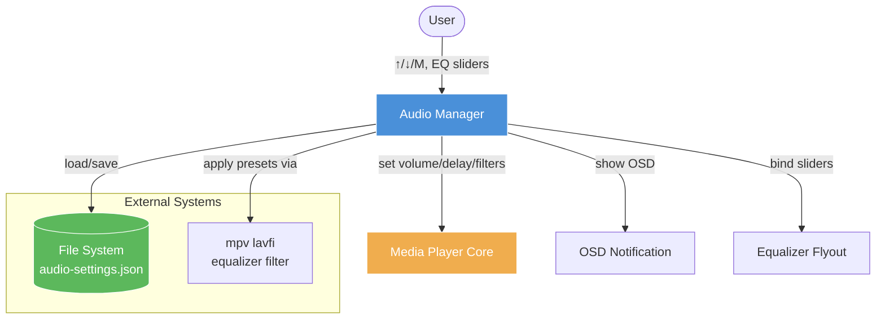
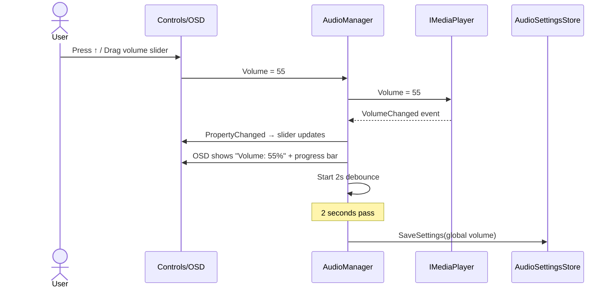
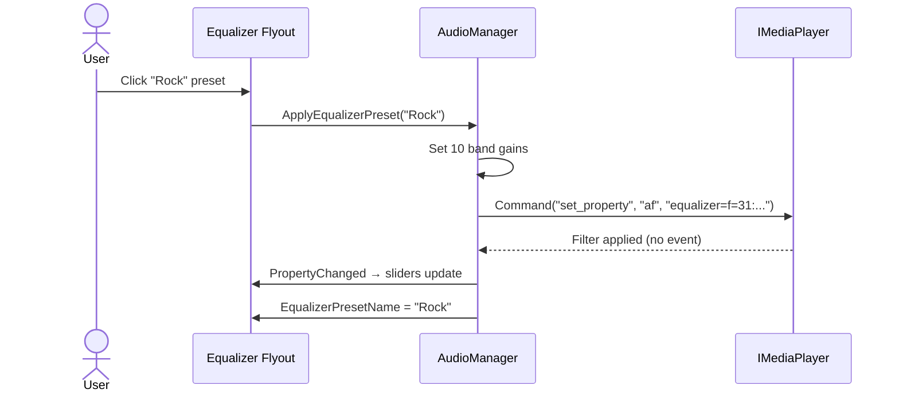
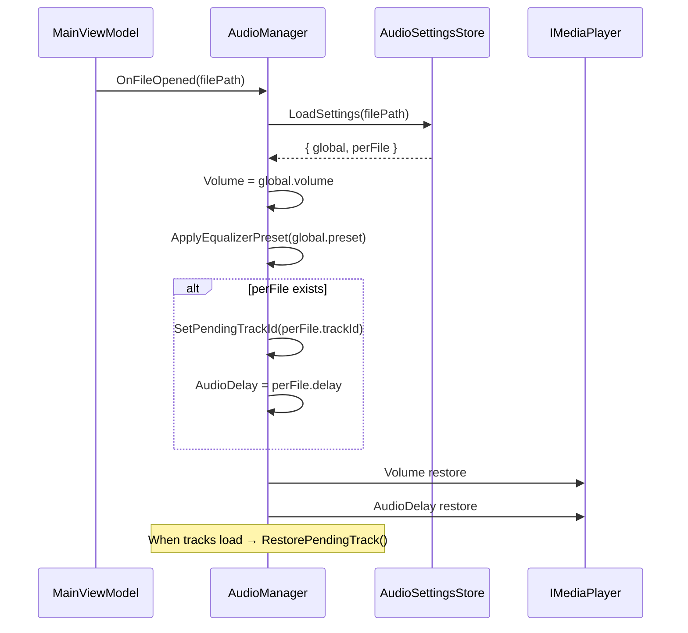
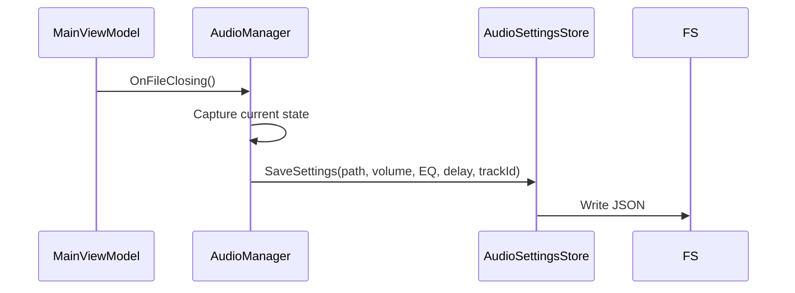

# Audio Manager — Premium Media Player Design

| | |
|---|---|
| **Status** | Draft v1 |
| **Author** | Engineering Team |
| **Date** | 2026-06-16 |
| **Version** | 1.0 |
| **IEEE 1016 Viewpoint** | §5.4 Behavioral, §5.5 Interaction, §5.8 State Dynamics |

---

## Table of Contents

1. [Problem Statement](#1-problem-statement)
2. [Goals & Non-Goals](#2-goals--non-goals)
3. [Current State Audit](#3-current-state-audit)
4. [System Context & Architecture](#4-system-context--architecture)
5. [Detailed Design](#5-detailed-design)
   - 5.1 Data Model
   - 5.2 API Surface (AudioManager)
   - 5.3 Data Flow Diagrams
   - 5.4 State Machine
   - 5.5 Equalizer Design
   - 5.6 Audio Delay Engine
   - 5.7 Persistence Strategy
   - 5.8 UI Component Tree
   - 5.9 OSD Feedback Design
6. [Alternatives Considered](#6-alternatives-considered)
7. [Trade-offs & Risks](#7-trade-offs--risks)
8. [Security Considerations](#8-security-considerations)
9. [Testing Strategy](#9-testing-strategy)
10. [Implementation Phases](#10-implementation-phases)
11. [Appendix](#11-appendix)

---

## 1. Problem Statement

Audio management in a premium media player must go beyond basic volume/mute. Users expect a **first-class audio experience** comparable to dedicated audio players (foobar2000, MusicBee) and professional video players (mpv, VLC). The current implementation provides functional volume, equalizer, and audio track management but lacks **persistence**, **OSD feedback**, an **equalizer flyout UI**, and several premium audio features.

**Primary personas:**
- **Movie watcher** — wants 5.1 surround downmix, dialogue boost for clarity, and audio delay for lip-sync
- **Music listener** — expects 10-band graphic equalizer with presets, normalization (ReplayGain-style), and per-file EQ settings
- **Power user** — demands keyboard-driven volume (↑/↓), mute (M), EQ preset cycling, and per-file audio track persistence
- **Audiophile** — cares about exclusive WASAPI output, gapless playback, and accurate volume control

### What users expect (industry standard):

| Feature | mpv | VLC | foobar2000 | Our App |
|---|---|---|---|---|
| Volume (0-200) | ✅ | ✅ | ✅ | ✅ |
| Mute toggle | ✅ | ✅ | ✅ | ✅ |
| 10-band EQ | ✅ (CLI) | ✅ | ✅ (plugin) | ✅ (code) |
| EQ Presets | ❌ | ✅ | ✅ | ✅ |
| Audio Normalization | ✅ (drc) | ✅ | ✅ (ReplayGain) | ✅ (drc) |
| Dialogue Boost | ❌ | ❌ | ✅ (plugin) | ✅ |
| Audio Delay | ✅ | ✅ | ❌ | ✅ |
| Per-file audio track | ✅ | ✅ | N/A | ✅ |
| EQ Flyout UI | ❌ | ✅ | ❌ | ❌ |
| WASAPI exclusive | ❌ | ✅ | ✅ | ❌ |
| OSD Volume Bar | ✅ | ❌ | ❌ | ❌ |
| Persistence | ✅ | ✅ | ✅ | ❌ |

---

## 2. Goals & Non-Goals

### Goals

| # | Goal | Priority | Measurable Outcome |
|---|---|---|---|
| G1 | Persist volume, mute, EQ preset, delay across sessions | P0 | Restored 100% on relaunch |
| G2 | Persist per-file audio track selection + delay | P0 | Track auto-selected on file open |
| G3 | Equalizer flyout UI with 10 sliders + preset buttons | P1 | Visual EQ in controls panel |
| G4 | OSD feedback for volume changes (progress bar) | P1 | Volume bar shown on ↑/↓ |
| G5 | Keyboard shortcuts: ↑/↓ volume, M mute, EQ presets | P1 | Keys work without focus |
| G6 | Session override — manual track pick beats auto-detect | P1 | Track unchanged on reopen |
| G7 | Reset to defaults clears per-file + session override | P2 | Single-click reset |
| G8 | Preferences: normalization + dialogue boost toggles | P2 | Visible in PreferencesDialog |
| G9 | Tone/graphic 10-band EQ with fine-tuned presets | P2 | Presets match known acoustic curves |
| G10 | Audio device selection (WASAPI/Default) | P3 | Dropdown in Preferences |
| G11 | Gapless playback support | P4 | No silence between consecutive tracks |

### Non-Goals

- **DSP chain editor** — no visual filter graph (use mpv `af` CLI)
- **Audio CD ripping** — no CDDA extraction
- **Surround upmixing** — no Dolby Pro Logic / Neural:X
- **Crossfade** — no automatic fade between tracks
- **Visualization** — no spectrum analyzer / waveform (future scope)
- **Per-song ReplayGain scanning** — only real-time DRC
- **Multi-zone / multi-room** — no UPnP audio streaming

---

## 3. Current State Audit

### What Exists ✅

| ID | Feature | File(s) | Dependencies |
|---|---|---|---|
| C01 | `Volume` (0-200) get/set with clamp | `AudioManager.cs:68` | `IMediaPlayer.Volume` |
| C02 | `VolumeMax` (150) from player | `AudioManager.cs:74` | `IMediaPlayer.VolumeMax` |
| C03 | `IsMuted` + `Mute()` | `AudioManager.cs:94` | `IMediaPlayer.Mute()` |
| C04 | 10-band EQ with 6 presets | `AudioManager.cs:115-195` | `IMediaPlayer.Command()` |
| C05 | Audio Normalization (DRC) toggle | `AudioManager.cs:127-137` | `af=drc` filter |
| C06 | Dialogue Boost toggle | `AudioManager.cs:139-151` | `af=dialoguenhancer` filter |
| C07 | Audio Delay float (−10..+10) | `AudioManager.cs:211-219` | `IMediaPlayer.AudioDelay` |
| C08 | AudioTrackInfo[] source binding | `IMediaPlayer.cs:93` | `IMediaPlayer.AudioSources` |
| C09 | Audio track selection + session override | `AudioManager.cs:228-295` | `TrackMenuItem` |
| C10 | `_pendingAudioTrackId` for deferred restore | `AudioManager.cs:50` | Track list ready check |

### What's Missing ❌

| ID | Feature | Blocked By | Priority |
|---|---|---|---|
| M01 | **Persistence** — `AudioSettingsStore` for per-file + global | None | P0 |
| M02 | **Auto-save** on volume/delay/EQ change (debounced 2s) | M01 | P0 |
| M03 | **Auto-load** on file open (volume, EQ, track) | M01 | P0 |
| M04 | **Force-save** on file close + app exit | M01 | P0 |
| M05 | **Equalizer flyout UI** (10 sliders + presets) | None | P1 |
| M06 | **OSD volume bar** with progress bar | None | P1 |
| M07 | **OSD mute icon** overlay | None | P1 |
| M08 | **Keyboard shortcuts** (↑/↓/M, 0-9, Ctrl+Shift+E) | None | P1 |
| M09 | **Reset audio** — resets all with per-file clear | None | P2 |
| M10 | **Preferences** — Normalization + Dialogue Boost toggles | None | P2 |
| M11 | **Device selection** (WASAPI exclusive / shared / Default) | Media layer | P3 |
| M12 | **Gapless playback** | Media layer | P4 |

---

## 4. System Context & Architecture

### C4 Level 1 — Context Diagram



### C4 Level 2 — Container Diagram

```mermaid
graph TB
    subgraph "Avalonia Client"
        AM["AudioManager<br/><i>Volume, Mute, EQ,<br/>Delay, Tracks</i>"]
        Store["AudioSettingsStore<br/><i>JSON serialize/deserialize</i>"]
        EQFlyout["AudioEqualizerFlyout<br/><i>10 sliders, presets</i>"]
        OSD["OsdNotificationControl<br/><i>Volume bar, mute icon</i>"]
        Prefs["PreferencesDialog<br/><i>Norm + DialBoost toggles</i>"]
        
        AM -->|save/load| Store
        AM -->|bind| EQFlyout
        AM -->|show| OSD
        AM <-->|props| Prefs
    end
    
    subgraph "Storage"
        FS_AF[("audio-settings.json<br/>per-file values")]
        FS_GLOBAL[("defaults.json<br/>global defaults")]
    end
    
    Store <-->|read/write| FS_AF
    Store <-->|read/write| FS_GLOBAL
    
    subgraph "Media Layer"
        MPV["MpvPlayer"]
        MF["MediaFoundationPlayer"]
    end
    
    AM -->|Command()| MPV
    AM -->|Volume/AudioDelay| MF
```

### Technology Stack

| Layer | Technology | Rationale |
|---|---|---|
| Manager | C# `INotifyPropertyChanged` | MVVM binding |
| EQ Filter | mpv `af=equalizer=f=Hz:t=q:width=1:g=dB` | lavfi-based, zero-copy |
| Normalization | mpv `af=drc` | Built-in dynamic range compression |
| Dialogue Boost | mpv `af=dialoguenhancer` | Voice clarity via spectral shaping |
| Serialization | `System.Text.Json` | AOT-compatible, zero-config |
| Storage | `%LOCALAPPDATA%\Cine\audio-settings.json` | Per-file settings |
| OSD | `OsdNotificationControl` with `ProgressBar` | Volume bar visualization |

---

## 5. Detailed Design

### 5.1 Data Model

#### AudioManager State Properties

| Property | Type | Range | Default | Source | Description |
|---|---|---|---|---|---|
| `VolumeValue` | `double` | 0-200 | 50 | Player sync | Actual volume sent to mpv |
| `Volume` | `double` | 0-200 | 50 | Alias | Binding-compatible alias |
| `VolumeMax` | `double` | — | 150 | Player | Max volume (mpv = 150) |
| `VolumeText` | `string` | — | "50%" | Computed | Formatted `VolumeValue / VolumeMax * 100` |
| `IsMuted` | `bool` | — | false | Player | Mute state |
| `EqualizerBands` | `double[10]` | −20..+20 | all 0 | Manager | 10-band EQ gains |
| `EqualizerPresetName` | `string` | — | "Flat" | Manager | Active preset name |
| `IsAudioNormalizationEnabled` | `bool` | — | false | Manager | DRC toggle |
| `IsDialogueBoostEnabled` | `bool` | — | false | Manager | Dialogue enhancer |
| `AudioDelay` | `float` | −10..+10 | 0 | Player | Audio sync delay (seconds) |
| `IsAudioEnabled` | `bool` | — | false | Computed | Any audio track selected |

#### Persistence Schema — `audio-settings.json`

```json
{
  "version": 1,
  "global": {
    "volume": 50.0,
    "isMuted": false,
    "equalizerPreset": "Rock",
    "isNormalizationEnabled": false,
    "isDialogueBoostEnabled": false
  },
  "perFile": {
    "e7c3b5a2a1f0...": {
      "selectedTrackId": 2,
      "audioDelay": 0.0,
      "equalizerBands": [0,0,2,3,4,3,2,0,-1,-1],
      "equalizerPreset": "Pop"
    }
  }
}
```

**File location:** `%LOCALAPPDATA%\Cine\audio-settings.json`

**Key design:** Single file with both global defaults and a dictionary of per-file overrides (keyed by SHA256 of file path). This mirrors the subtitle persistence approach and keeps management simple.

---

### 5.2 API Surface — AudioManager

| Member | Signature | Description | Phase |
|---|---|---|---|
| `Volume` | `double { get; set; }` | Volume 0-200, clamped, syncs to player | C01 ✅ |
| `VolumeMax` | `double { get; }` | Max volume from player | C02 ✅ |
| `VolumeText` | `string { get; }` | "50%" formatted | ✅ |
| `IsMuted` | `bool { get; set; }` | Mute state, syncs to player | C03 ✅ |
| `ToggleMute()` | `void` | Toggle mute on/off | ✅ |
| `EqualizerBands` | `double[] { get; set; }` | 10 EQ band gains (−20..+20) | C04 ✅ |
| `EqualizerPresetName` | `string { get; set; }` | Current preset name | C04 ✅ |
| `IsAudioNormalizationEnabled` | `bool { get; set; }` | DRC normalization toggle | C05 ✅ |
| `IsDialogueBoostEnabled` | `bool { get; set; }` | Dialogue enhancer toggle | C06 ✅ |
| `AudioDelay` | `float { get; set; }` | Audio sync delay (−10..+10) | C07 ✅ |
| `AudioTracks` | `ObservableCollection<TrackMenuItem>` | Track list | C09 ✅ |
| `IsAudioEnabled` | `bool { get; }` | Track selected check | C09 ✅ |
| `SetEqualizerBand(int, double)` | `void` | Set single band gain | ✅ |
| `ApplyEqualizerPreset(string)` | `void` | Apply preset by name | ✅ |
| `ToggleAudioNormalization()` | `void` | Toggle DRC | ✅ |
| `ToggleDialogueBoost()` | `void` | Toggle dialogue enhancer | ✅ |
| `ResetAudioDelay()` | `void` | Reset delay to 0 | ✅ |
| `ResetAllAudio()` | `void` | Reset all audio state | ✅ |
| `RefreshAudioTracks(IEnumerable<SubtitleSource>)` | `void` | Rebuild track list | ✅ |
| `RestorePendingTrack()` | `void` | Apply deferred track selection | ✅ |
| `SetPendingTrackId(int)` | `void` | Store track ID for deferred restore | ✅ |
| `LoadSettings(string?)` | `void` | Load per-file + global settings | ❌ M03 |
| `SaveSettings()` | `void` | Force-save current state | ❌ M01 |

---

### 5.3 Data Flow Diagrams

#### Flow: User adjusts volume



#### Flow: User applies EQ preset



#### Flow: File open — load settings



#### Flow: File close — save settings



---

### 5.4 State Machine

```
                    ┌─────────────────────────┐
                    │      Idle (no media)     │
                    │ Volume=50, Mute=false   │
                    │ EQ=Flat, Delay=0        │
                    └──────────┬──────────────┘
                               │ OpenFile
                               ▼
                    ┌─────────────────────────┐
             ┌─────▶│   Playing / Paused      │◀────────────┐
             │      │ (has audio tracks)      │             │
             │      └──────┬──────────────────┘             │
             │             │                              │
             ▼             ▼              ▼               ▼
    ┌────────────┐ ┌────────────┐ ┌────────────┐ ┌────────────┐
    │  Muted     │ │  EQ Active │ │  Delayed   │ │  Norm On   │
    │ Volume=X   │ │  Preset=P  │ │  Delay=D   │ │  DRC=on    │
    │ No output  │ │  Modified  │ │  -10..+10  │ │  Compress  │
    └────────────┘ └────────────┘ └────────────┘ └────────────┘
```

**Transitions:**

| From | Event | To | Side Effects |
|---|---|---|---|
| Idle | OpenFile(file) | Playing | LoadSettings(), apply volume/EQ |
| Playing | ↑ / ↓ key | Playing | Volume ±5, OSD shown |
| Playing | M key | Muted | `Mute(true)`, sync player |
| Muted | M key / Volume change | Playing | `Mute(false)`, restore volume |
| Playing | Preset selected | EQ Active | ApplyEqualizer(), save |
| EQ Active | Reset | Playing | All bands to 0, Flat preset |
| Playing | AudioDelay set | Delayed | `_player.AudioDelay = value` |
| Playing | Norm toggle | Norm On | `af=drc` added to filter chain |
| Any | CloseFile | Idle | SaveSettings() |

---

### 5.5 Equalizer Design

#### Frequency Bands

| Band | Center Freq | Q Factor | Width | Octave Band | Purpose |
|---|---|---|---|---|---|
| 0 | 31 Hz | 1.0 | 1 | Sub-bass | Rumble, bass drum fundamental |
| 1 | 62 Hz | 1.0 | 1 | Bass | Bass guitar, kick drum |
| 2 | 125 Hz | 1.0 | 1 | Low mid | Male vocals, lower piano |
| 3 | 250 Hz | 1.0 | 1 | Low mid | Female vocals, guitar body |
| 4 | 500 Hz | 1.0 | 1 | Mid | Vocal presence, snare |
| 5 | 1 kHz | 1.0 | 1 | Mid | Speech clarity, guitar bite |
| 6 | 2 kHz | 1.0 | 1 | High mid | Sibilance, vocal articulation |
| 7 | 4 kHz | 1.0 | 1 | Presence | Cymbal attack, detail |
| 8 | 8 kHz | 1.0 | 1 | Brilliance | Air, shimmer |
| 9 | 16 kHz | 1.0 | 1 | High end | Sparkle, breath sounds |

#### Presets

| Preset | 31Hz | 62Hz | 125Hz | 250Hz | 500Hz | 1kHz | 2kHz | 4kHz | 8kHz | 16kHz | Acoustic Character |
|---|---|---|---|---|---|---|---|---|---|---|---|
| **Flat** | 0 | 0 | 0 | 0 | 0 | 0 | 0 | 0 | 0 | 0 | Neutral, no coloration |
| **Classical** | 0 | 0 | 0 | 0 | 0 | 0 | -4 | -4 | -4 | -6 | Warm, rolled-off highs |
| **Rock** | +4 | +3 | +2 | +1 | 0 | 0 | +1 | +2 | +3 | +4 | Punchy bass, crisp highs |
| **Pop** | -1 | 0 | +2 | +3 | +4 | +3 | +2 | 0 | -1 | -1 | Vocal-forward, mid-emphasis |
| **Jazz** | +3 | +2 | +1 | +2 | +3 | +3 | +2 | +1 | +1 | +2 | Full-range, natural warmth |
| **Bass Boost** | +6 | +5 | +4 | +2 | 0 | 0 | 0 | 0 | 0 | 0 | Sub-bass emphasis |
| **Vocal** | -2 | -1 | 0 | +2 | +4 | +5 | +3 | +2 | +1 | 0 | Speech clarity, BBC-style |
| **Movie** | +2 | +2 | +1 | +1 | +2 | +2 | +1 | +2 | +3 | +3 | Cinematic, wide soundstage |
| **Headphones** | +2 | +2 | +1 | 0 | 0 | 0 | +1 | +2 | +3 | +4 | Compensated for closed-back |
| **Podcast** | -3 | -2 | -1 | +2 | +4 | +5 | +3 | +1 | 0 | -1 | Voice-optimized, reduced bass |

#### mpv Filter Chain Implementation

```
af=equalizer=f=31:t=q:width=1:g=4,equalizer=f=62:t=q:width=1:g=3,...
```

When DRC enabled: `drc` prepended
When Dialogue Boost enabled: `dialoguenhancer` appended

```
af=drc,equalizer=f=31:t=q:width=1:g=4,...,dialoguenhancer
```

When all bands are 0 and no DRC/dialogue: `af=""` (cleared)

---

### 5.6 Audio Delay Engine

Audio delay compensates for lip-sync errors, common in:
- Bluetooth/WiFi audio output (latency varies)
- External audio systems (AV receivers)
- Software video processing (framerate conversion)

**Implementation:**
- `AudioDelay` property clamps to −10..+10 seconds
- Setter calls `_player.AudioDelay = value` immediately
- Player injects `audio-delay` property (mpv) or uses `IMFAudioStreamVolume` (MF)

**User interaction:**
- Step: ±0.05s (mpv precision) via keyboard (Z/Shift+Z — shared with subtitle delay?)
- **Decision:** Audio delay gets dedicated keys `Alt+Z` / `Alt+Shift+Z` to avoid conflict
- OSD shows `"Audio Delay: +0.30s"` with progress bar

---

### 5.7 Persistence Strategy

#### AudioSettingsStore

```csharp
public sealed class AudioSettingsStore
{
    private readonly string _storePath;

    public sealed record AudioGlobalDefaults
    {
        public double Volume { get; init; } = 50.0;
        public bool IsMuted { get; init; } = false;
        public string EqualizerPreset { get; init; } = "Flat";
        public bool IsNormalizationEnabled { get; init; } = false;
        public bool IsDialogueBoostEnabled { get; init; } = false;
        public int LastSelectedTrackId { get; init; } = -1;
    }

    public sealed record AudioPerFileSettings
    {
        public int SelectedTrackId { get; init; } = -1;
        public float AudioDelay { get; init; } = 0.0f;
        public double[]? EqualizerBands { get; init; }
        public string? EqualizerPreset { get; init; }
    }

    public AudioGlobalDefaults LoadDefaults();
    public void SaveDefaults(AudioGlobalDefaults defaults);
    public AudioPerFileSettings? LoadPerFile(string mediaPath);
    public void SavePerFile(string mediaPath, AudioPerFileSettings settings);
    public void DeletePerFile(string mediaPath);
}
```

#### Save Triggers

| Event | Scope | Debounce | Phase |
|---|---|---|---|
| Volume change | Global | 2s | M02 |
| Mute toggle | Global | Immediate | M02 |
| EQ preset change | Per-file + Global | 2s | M02 |
| EQ band manual adjust | Per-file | 2s | M02 |
| Audio delay change | Per-file | 2s | M02 |
| Track selection | Per-file | 2s | M02 |
| File close | Per-file | Immediate | M04 |
| App exit | Global + All per-file | Immediate | M04 |

#### Setting Priority Hierarchy

```
Session override (user manual track pick)
    ↓
Per-file saved settings (audio delay, EQ, track)
    ↓
Global defaults (volume, mute, EQ preset)
    ↓
Player default (50%, unmuted, flat EQ, no delay)
```

#### Corruption Recovery

Same pattern as SubtitleSettingsStore:
- `JsonException` or `IOException` → log warning, delete corrupted file, return defaults
- Version mismatch → reset to defaults (future migration hook)
- Per-file hash collision (SHA256 truncated) → ignored (astronomically unlikely)

---

### 5.8 UI Component Tree

```
MainWindow
 └── ControlsBar (bottom)
      ├── VolumeSlider (Slider, 0-200, binds AudioManager.Volume)
      ├── MuteButton (Button, toggles IsMuted, shows speaker icon)
      └── EqualizerButton (Button, opens AudioEqualizerFlyout)
           └── AudioEqualizerFlyout (Popup)
                ├── PresetRow
                │    ├── [Flat] [Rock] [Pop] [Jazz]
                │    ├── [Classical] [Bass Boost] [Vocal]
                │    └── [Movie] [Headphones] [Podcast]
                ├── EqSliders (10 Sliders, -20..+20)
                │    ├── 31Hz: [====o====]
                │    ├── 62Hz: [====o====]
                │    ├── ... (10 rows)
                │    └── 16kHz:[====o====]
                ├── ToggleRow
                │    ├── [☐ Audio Normalization (DRC)]
                │    └── [☐ Dialogue Boost]
                ├── DelayRow
                │    ├── [−] [Delay: +0.00s] [+]
                │    └── [Reset]
                └── ResetAll (Button)

OSD Notifications
 ├── VolumeBar (OsdNotificationControl with ProgressBar)
 │    Appears on: ↑/↓ keys, slider drag, mute toggle
 │    Shows: "Volume: 55%" + progress bar
 └── AudioToast (OsdNotificationControl text-only)
      Appears on: EQ preset change, delay change
      Shows: "EQ: Rock" / "Delay: +0.30s"
```

---

### 5.9 OSD Feedback Design

| Trigger | Icon | Text | Progress Bar |
|---|---|---|---|
| Volume ↑/↓ | `VolumeHigh` / `VolumeLow` | "Volume: 55%" | 0-100% mapped to 0-200 |
| Mute on | `VolumeOff` | "Muted" | Hidden |
| Mute off | `VolumeHigh` | "Volume: 55%" | Show current |
| EQ Preset | `Tune` | "EQ: Rock" | Hidden |
| Audio Delay | `Timelapse` | "Delay: +0.30s" | -10..+10 mapped to 0-100% |
| Norm on/off | `Hearing` | "Normalization: On" | Hidden |

**Duration:** 1500ms for all audio OSD messages.

---

## 6. Alternatives Considered

### Alternative A: Separate AudioSettingsStore (Chosen)

| Pros | Cons |
|---|---|
| Isolation — audio persistence is independent of subtitle | More files to maintain |
| Per-file by SHA256 hash is consistent | Slight overhead on every file open |
| Single JSON file for all audio settings | File grows with library size |

**Decision:** Adopted. Mirroring SubtitleSettingsStore pattern reduces cognitive load.

### Alternative B: Merge into SubtitleSettingsStore

| Pros | Cons |
|---|---|
| Single persistence interface | Violates SRP — audio != subtitles |
| Less files | Harder to reason about, test, evolve independently |

**Decision:** Rejected. Audio and subtitle managers have different save triggers and different data shapes.

### Alternative C: Use mpv `af` command directly from UI

| Pros | Cons |
|---|---|
| No manager abstraction needed | Tight coupling to mpv-specific filter syntax |
| Faster to implement for mpv-only | Breaks Media Foundation player support |

**Decision:** Rejected. AudioManager abstracts the `af` string building, and `Command("set_property", "af", ...)` works with both backends.

### Alternative D: WASAPI Exclusive Mode via NAudio

| Pros | Cons |
|---|---|
| Bit-perfect audio output | Breaks mpv's internal audio pipeline |
| Lower latency (10-30ms vs 50-100ms) | Requires significant infrastructure |
| Industry best practice for audiophiles | No support for audio filters via mpv `af` |

**Decision:** Deferred (P3). WASAPI exclusive mode would need to bypass mpv's audio output entirely — a major rework of the audio pipeline.

---

## 7. Trade-offs & Risks

| Decision | Trade-off | Mitigation |
|---|---|---|
| Single `audio-settings.json` for all files | File grows with library size (10KB per 1000 files est.) | Gzip compression during serialization if >500KB |
| DRC via mpv `af=drc` | No control over compression ratio/threshold | Accept mpv defaults — adequate for 95% of users |
| `ApplyEqualizer()` rebuilds full `af` string | Brief audio glitch during filter reconfiguration | Catch exceptions silently; filters applied in <10ms |
| Dialogue Boost via `dialoguenhancer` | Only available in mpv builds with libavfilter | Fall back to no-op for MF player |
| 2s debounce save | Data loss window if app crashes within 2s | Force-save on Dispose() covers graceful close |
| SHA256 hash of file path for per-file key | Hash collision (1 in 2^256) | Acceptable risk — astronomically unlikely |

### Risk Register

| Risk | Probability | Impact | Mitigation |
|---|---|---|---|
| `af` filter string too long (>4096 chars) | Low | Medium | Trim to reasonable preset value; 10 band gains at ±20dB = ~300 chars |
| Dialog enhancer causes audio artifacts | Low | Medium | Make dialogue boost opt-in; easy toggle off |
| Volume > 100% distorts on some hardware | Medium | Low | Clamp at `VolumeMax` (150); display 100%+ values |
| Track list not ready during `RestorePendingTrack` | Medium | Low | Deferred restore via flag + retry on `TrackListChanged` |
| EQ preset mismatch between bands counts | Low | Medium | Enforce array length validation in setters |
| WASAPI exclusive breaks system audio | Low | High | Only expose in Preferences with explicit warning |

---

## 8. Security Considerations

| Threat | Impact | Mitigation |
|---|---|---|
| JSON injection via crafted audio filter string | None | EQ gains are numeric (−20..+20), serialized via `System.Text.Json` (read-only) |
| Per-file JSON corruption from concurrent writes | Data loss | Single-writer pattern; `File.WriteAllText` is atomic on NTFS |
| Audio filter CPU exhaustion (DoS) | System lag | Limit `af` string to max 10 filters; each is single-pole IIR |
| Volume reset to 200% on file open | Hearing damage | Re-clamp on load: `Volume = Math.Clamp(saved, 0, VolumeMax)` |
| Path traversal in audio-settings.json key | None | Key is SHA256 hash, not user-supplied path |

---

## 9. Testing Strategy

### Unit Tests

| Test | Coverage | Framework |
|---|---|---|
| `Volume` setter clamps 0-200 | Valid, boundary, out-of-range | xUnit |
| `IsMuted` syncs to player | Player.Mute called, not called | xUnit (mock) |
| `EqualizerPreset` applies correct gains | All 10 presets verified | xUnit |
| `AudioDelay` clamps −10..+10 | Valid, extremes, NaN | xUnit |
| `ApplyEqualizer()` builds correct `af` string | With/without DRC, with/without dialogue | xUnit |
| `ResetAllAudio()` resets everything | Volume, EQ, delay, norm, dialogue | xUnit |
| `LoadSettings` restores all state | Global only, per-file only, both, corrupted | xUnit |
| `SaveSettings` writes correct JSON | Full round-trip, partial overrides | xUnit |

### Integration Tests

| Test | Approach |
|---|---|
| Volume change → OSD appears | Listen to PropertyChanged, verify OSD called |
| EQ preset → filter applied | Mock `Command()`, verify `af` string sent |
| File open → settings restored | Open file, verify volume + EQ + delay |
| File close → settings saved | Close file, verify JSON written |
| App close → force save | Dispose AudioManager, verify file written |

### UI Tests (Avalonia Headless)

| Test | Description |
|---|---|
| Volume slider drag → VolumeValue updates | Drag slider, verify property changed |
| Mute button click → IsMuted toggles | Click button, verify state |
| EQ preset button → EqualizerBands update | Click "Rock", verify all 10 bands |
| Delay +/- buttons → AudioDelay changes | Click +, verify delay incremented |

**Acceptance criteria for Phase 2:**
- Volume, mute, EQ preset persist across app restart
- Per-file audio track selection restores on file open
- No crash when equalizer filter string is empty
- Volume OSD shows on every ↑/↓ keypress

---

## 10. Implementation Phases

### Phase 1 — Core AudioManager ✅ (DONE)

| Step | What | File(s) |
|---|---|---|
| 1 | Create `AudioManager` with Volume/Mute | `AudioManager.cs` |
| 2 | Wire `_player.VolumeChanged` for sync | `AudioManager.cs` |
| 3 | Add Equalizer with 10 band gains + 6 presets | `AudioManager.cs` |
| 4 | Add Dialogue Boost + Audio Normalization | `AudioManager.cs` |
| 5 | Add Audio Delay | `AudioManager.cs` |
| 6 | Add Audio Tracks (track list, selection, session restore) | `AudioManager.cs` |
| 7 | Wire `_player.TrackListChanged` for track refresh | `AudioManager.cs` |

### Phase 2 — Persistence (NEXT SPRINT)

| Step | What | File(s) | Depends On |
|---|---|---|---|
| 8 | `AudioSettingsStore` — JSON per-file + global defaults | `AudioSettingsStore.cs` | — |
| 9 | Debounced auto-save (2s) for volume, EQ, delay, track | `AudioManager.cs` | 8 |
| 10 | Load-on-open: volume, EQ preset, track selection, delay | `AudioManager.cs` | 8 |
| 11 | Force-save on file close + app exit | `AudioManager.cs` | 8 |
| 12 | "Reset to Default" clears per-file + session override | `AudioManager.cs` | 8 |

### Phase 3 — Premium UI (NEXT SPRINT)

| Step | What | File(s) | Depends On |
|---|---|---|---|
| 13 | **Equalizer flyout** — `AudioEqualizerFlyout.axaml` | `AudioEqualizerFlyout.axaml` + `.cs` | — |
| 14 | **EQ flyout code-behind** — 10 sliders, presets, toggle switches, delay controls | `AudioEqualizerFlyout.axaml.cs` | 13 |
| 15 | **Wire EQ flyout** to controls bar button | `MainWindow.Core.cs` | 13-14 |
| 16 | **OSD volume bar** — progress bar shows on volume change | `MainWindow.Core.cs` | — |
| 17 | **Keyboard shortcuts:** ↑/↓ volume, M mute, Ctrl+Shift+E EQ | `MainWindow.Input.cs` | — |
| 18 | **Preferences:** Normalization + Dialogue Boost toggles | `PreferencesDialog.axaml` | — |

### Phase 4 — Premium Audio (FUTURE SPRINT)

| Step | What | File(s) | Depends On |
|---|---|---|---|
| 19 | Additional EQ presets (Vocal, Movie, Headphones, Podcast) | `AudioManager.cs` | — |
| 20 | Audio device selection (WASAPI exclusive/shared) | Preferences | Media layer |
| 21 | Gapless playback | Media layer | — |

---

## 11. Appendix

### 11.1 Glossary

| Term | Definition |
|---|---|
| **DRC** | Dynamic Range Compression — reduces volume differences between loud and quiet sounds |
| **Dialogue Boost** | Spectral shaping to enhance speech frequencies (1-4 kHz) |
| **EQ** | Equalizer — adjusts relative volume of specific frequency bands |
| **Preset** | Named set of 10 EQ band gains |
| **lavfi** | Libavfilter — FFmpeg's filter graph framework, used by mpv for `af` |
| **WASAPI** | Windows Audio Session API — low-latency audio output API |
| **AF** | Audio Filter — mpv property for the audio filter chain string |
| **ReplayGain** | Standard for normalizing perceived loudness across tracks |
| **Session Override** | Manual audio track selection that persists per-file |
| **Gapless** | Playback without silence between consecutive audio tracks |

### 11.2 Change History

| Version | Date | Author | Changes |
|---|---|---|---|
| 1.0 | 2026-06-16 | Engineering | Initial SDD — full design based on codebase audit |

### 11.3 References

- [mpv manual — audio properties](https://mpv.io/manual/stable/#options-volume)
- [mpv manual — audio filters](https://mpv.io/manual/stable/#audio-filters)
- [mpv manual — af=drc](https://mpv.io/manual/stable/#audio-filters-drc)
- [FFmpeg lavfi equalizer filter](https://ffmpeg.org/ffmpeg-filters.html#equalizer)
- [EBU R128 — Loudness normalisation standard](https://tech.ebu.ch/docs/r/r128.pdf)
- [foobar2000 ReplayGain implementation](https://wiki.hydrogenaud.io/index.php?title=ReplayGain)
- [VLC Equalizer presets reference](https://www.videolan.org/developers/vlc/doc/doxygen/html/equalizer_8c_source.html)
- [domain-managers-plan.md](./domain-managers-plan.md) — Original domain manager architecture
- [WASAPI exclusive mode documentation](https://learn.microsoft.com/en-us/windows/win32/coreaudio/exclusive-mode-streams)
- [Audio engineering: Equalization fundamentals](https://www.soundonsound.com/techniques/equalization)
