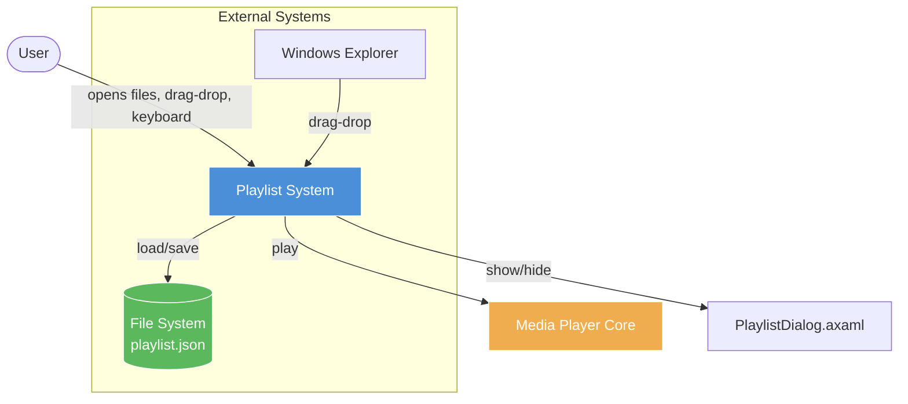
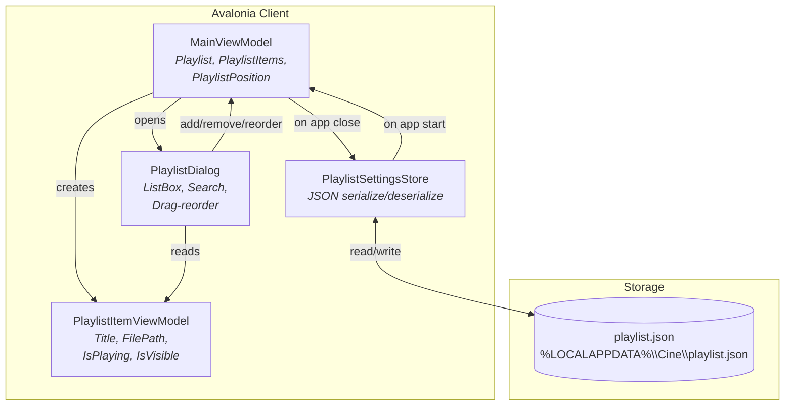
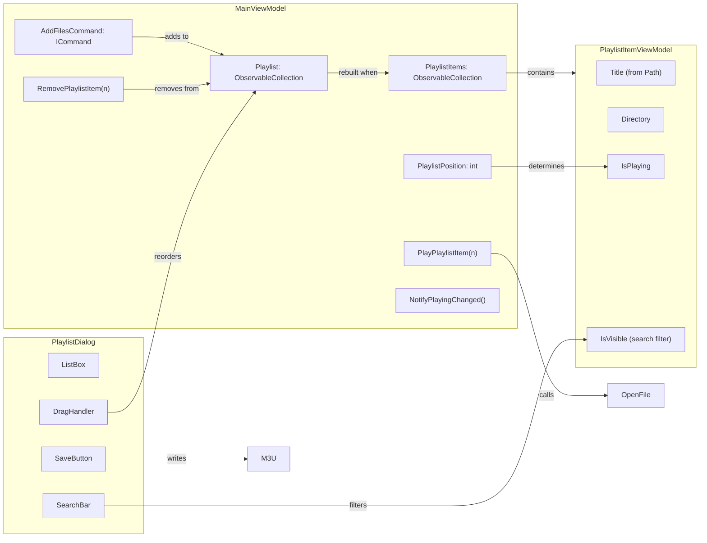
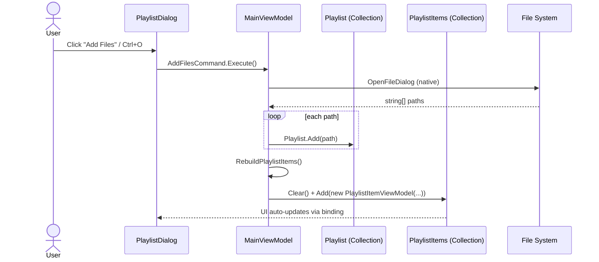
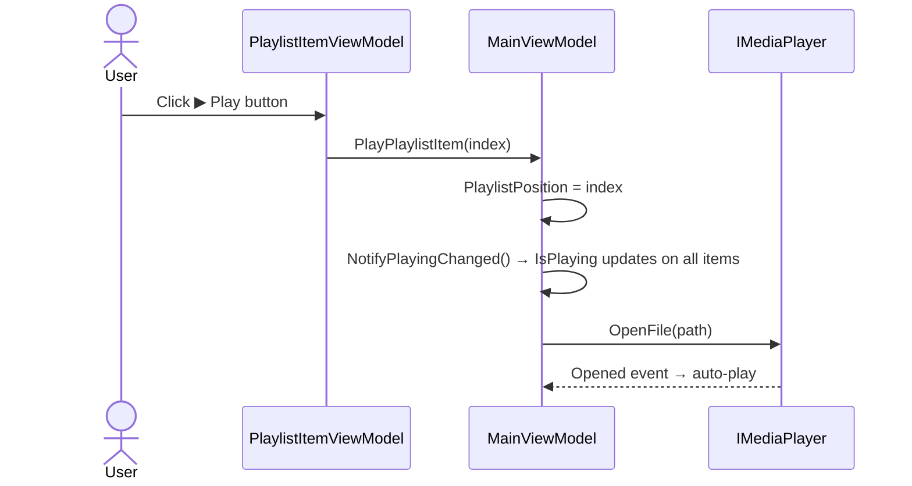
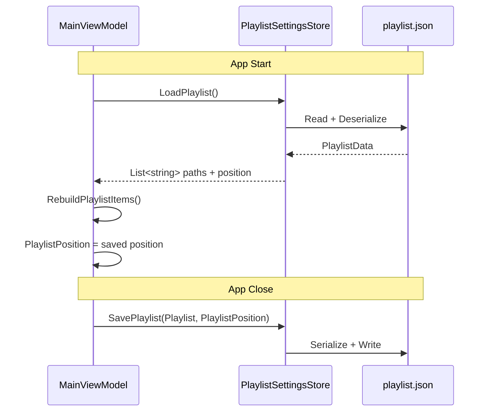

# Playlist / Queue — Premium Media Player Design

| | |
|---|---|
| **Status** | Draft v2 |
| **Author** | Engineering Team |
| **Date** | 2026-06-16 |
| **Version** | 2.0 |
| **IEEE 1016 Viewpoint** | §5.4 Behavioral, §5.5 Interaction, §5.8 State Dynamics |

---

## Table of Contents

1. [Problem Statement](#1-problem-statement)
2. [Goals & Non-Goals](#2-goals--non-goals)
3. [Current State Audit](#3-current-state-audit)
4. [System Context & Architecture](#4-system-context--architecture)
5. [Detailed Design](#5-detailed-design)
   - 5.1 Data Model
   - 5.2 API Surface (MainViewModel)
   - 5.3 API Surface (PlaylistItemViewModel)
   - 5.4 Data Flow Diagrams
   - 5.5 State Machine
   - 5.6 Persistence Strategy
   - 5.7 UI Component Tree
6. [Alternatives Considered](#6-alternatives-considered)
7. [Trade-offs & Risks](#7-trade-offs--risks)
8. [Security Considerations](#8-security-considerations)
9. [Testing Strategy](#9-testing-strategy)
10. [Implementation Phases](#10-implementation-phases)
11. [Appendix](#11-appendix)

---

## 1. Problem Statement

Users need to manage sequences of media files (playlists) with persistent state across sessions. The current implementation provides a functional dialog with search, drag-reorder, and save-as-M3U, but has **zero persistence** — all items are lost on app close. There is no "Play Next" queue, no context menu, no keyboard shortcuts for navigation, and no way to clear or batch-remove items.

**Primary personas:**
- **Casual viewer** — opens a folder of episodes, expects them to auto-queue and continue playback
- **Music listener** — builds a curated session, expects track ordering and next/previous
- **Power user** — expects keyboard-driven workflow, drag-drop from Explorer, and cross-session persistence

---

## 2. Goals & Non-Goals

### Goals

| # | Goal | Priority | Measurable Outcome |
|---|---|---|---|
| G1 | Persist playlist across app restarts | P0 | Playlist restored 100% on relaunch |
| G2 | Keyboard shortcuts for navigation (next/prev) | P1 | N/P keys work without focus |
| G3 | "Play Next" queue mode | P1 | Inserts after current item |
| G4 | Clear playlist button + confirmation | P2 | Single-click clear with Undo toast |
| G5 | Context menu (play, remove, reveal in Explorer, properties) | P2 | Right-click menu on any item |
| G6 | Auto-scroll to currently playing item | P2 | Playing item centered in list |
| G7 | Multi-select for batch remove | P3 | Ctrl+click, Shift+click, Delete removes all |
| G8 | Sort by (title, date added, duration) | P3 | Column headers sort |
| G9 | Shuffle / repeat playlist | P3 | Shuffle button randomizes order |
| G10 | M3U metadata parsing | P3 | EXTINF title, EXTVLCOPT parsed |
| G11 | Drag from file Explorer onto playlist | P3 | External files accepted on ListBox |
| G12 | Recently played section | P4 | Last 20 items logged |

### Non-Goals

- **Server-side sync** — no cloud playlist, no shared playlists
- **Smart playlists** — no auto-generated playlists by genre/rating
- **DLNA/UPnP** — no media server integration
- **Playlist import from proprietary formats** — M3U/M3U8 only
- **Cross-device resume** — per-machine only

---

## 3. Current State Audit

### What Exists ✅

| ID | Feature | File(s) | Dependencies |
|---|---|---|---|
| C01 | `Playlist` collection (`ObservableCollection<string>`) | `MainViewModel.cs:93` | None |
| C02 | `PlaylistItems` (`ObservableCollection<PlaylistItemViewModel>`) | `MainViewModel.cs:94` | `PlaylistItemViewModel` |
| C03 | `PlaylistItemViewModel` — Title, FilePath, IsPlaying, IsVisible | `PlaylistItemViewModel.cs` | `MainViewModel` |
| C04 | `PlaylistDialog.axaml` — ListBox, header, icons | `PlaylistDialog.axaml` | — |
| C05 | Search bar with 100ms debounce + clear button | `PlaylistDialog.axaml.cs` | — |
| C06 | Save playlist as `.m3u8` via `StorageProvider` | `PlaylistDialog.axaml.cs` | `StorageProvider` |
| C07 | Drag-reorder via pointer pressed/moved/released | `PlaylistDialog.axaml.cs` | — |
| C08 | Empty state + No results overlays | `PlaylistDialog.axaml` | — |
| C09 | File drag-drop onto window | `PlaylistDialog.axaml.cs` | — |
| C10 | Keyboard navigation (Enter/Del/Esc) | `PlaylistDialog.axaml.cs` | — |
| C11 | Play/Remove per-item buttons | `PlaylistDialog.axaml` | C03 |

### What's Missing ❌

| ID | Feature | Blocked By | Priority |
|---|---|---|---|
| M01 | **Playlist persistence** (save/restore across restarts) | None — standalone store needed | P0 |
| M02 | **"Play Next" queue** (insert after current) | M01 | P1 |
| M03 | **Clear playlist** button | None | P2 |
| M04 | **Context menu** (right-click actions) | None | P2 |
| M05 | **Auto-scroll** to current playing item | None | P2 |
| M06 | **Multi-select** for batch remove | C07 (conflicts with drag-reorder) | P3 |
| M07 | **Sort by** (title, date added, duration) | None | P3 |
| M08 | **Shuffle / repeat** playlist controls | None | P3 |
| M09 | **Drag from file Explorer** directly onto ListBox | C09 (partial — window-level only) | P3 |
| M10 | **Keyboard shortcuts: N / P / Shift+N** | None | P1 |
| M11 | **M3U extended metadata** parsing | None | P3 |
| M12 | **Recently played** section | None | P4 |

---

## 4. System Context & Architecture

### C4 Level 1 — Context Diagram



### C4 Level 2 — Container Diagram



### C4 Level 3 — Component Diagram



### Technology Stack

| Layer | Technology | Rationale |
|---|---|---|
| UI Framework | Avalonia UI | Cross-platform, MVVM-native |
| Collection | `ObservableCollection<T>` | Automatic UI binding |
| Serialization | `System.Text.Json` | Built-in, AOT-compatible, zero-config |
| Storage | `%LOCALAPPDATA%\Cine\playlist.json` | Standard Windows location |
| File Format (export) | M3U8 (UTF-8) | Universal player interop |

---

## 5. Detailed Design

### 5.1 Data Model

#### PlaylistItemViewModel Properties

| Property | Type | Access | Source | Description |
|---|---|---|---|---|
| `Title` | `string` | get | `Path.GetFileNameWithoutExtension(_path)` | Display name |
| `Directory` | `string` | get | `Path.GetFileName(Path.GetDirectoryName(_path))` | Parent folder |
| `FilePath` | `string` | get | `_path` | Full absolute path |
| `Index` | `int` | get | Constructor arg | Position in playlist |
| `IsPlaying` | `bool` | get | `_parent.PlaylistPosition == _index` | Currently playing indicator |
| `IsVisible` | `bool` | get/set | Search filter | Controls ListBox visibility |

#### Persistence Schema — `playlist.json`

```json
{
  "version": 1,
  "items": [
    "C:\\Movies\\Movie1.mkv",
    "C:\\Movies\\Movie2.mkv"
  ],
  "currentPosition": 0,
  "lastPlayed": "2026-06-16T10:30:00Z"
}
```

**Why no title in persistence:** Title is derived from the file path (`Path.GetFileNameWithoutExtension`). Storing only paths avoids desync when files are renamed or moved.

#### M3U Export Format

```
#EXTM3U
#EXTINF:123,Movie Title
C:\Movies\Movie1.mkv
#EXTINF:456,Another Movie
C:\Movies\Movie2.mkv
```

`#EXTINF` duration is read from media file metadata (via `IMediaPlayer.Duration`). Title is the `Title` property.

---

### 5.2 API Surface — MainViewModel

| Member | Signature | Description | Phase |
|---|---|---|---|
| `Playlist` | `ObservableCollection<string>` | Raw file path collection | C01 ✅ |
| `PlaylistItems` | `ObservableCollection<PlaylistItemViewModel>` | UI display models, rebuilt from `Playlist` | C02 ✅ |
| `PlaylistPosition` | `int` | Index of currently playing item (−1 = none) | C03 ✅ |
| `IsLoopPlaylistEnabled` | `bool` | Loop entire playlist on end | ✅ |
| `HasMultiplePlaylistItems` | `bool` | Playlist.Count > 1 | ✅ |
| `HasPlaylistItems` | `bool` | PlaylistItems.Count > 0 | ✅ |
| `AddFilesCommand` | `ICommand` | Opens file picker, adds to Playlist | ✅ |
| `PlayPlaylistItem(n)` | `void` | Sets position, opens file, updates IsPlaying | ✅ |
| `RemovePlaylistItem(n)` | `void` | Removes at index, decrements position if needed | ✅ |
| `NotifyPlayingChanged()` | `void` | Fires PropertyChanged on all items' IsPlaying | ✅ |
| `OpenFiles(paths)` | `void` | Bulk add from dialog/drag | ✅ |
| `PlayNext()` | `void` | PlaylistPosition+1, wraps if looping | ❌ M10 |
| `PlayPrevious()` | `void` | PlaylistPosition−1, wraps if looping | ❌ M10 |
| `ClearPlaylist()` | `void` | Removes all items with confirmation | ❌ M03 |
| `InsertAfterCurrent(path)` | `void` | Queue mode — insert at position+1 | ❌ M02 |
| `Shuffle()` | `void` | Randomize Playlist order | ❌ M08 |
| `ToggleRepeat()` | `void` | Toggle IsLoopPlaylistEnabled | ❌ M08 |

---

### 5.3 API Surface — PlaylistItemViewModel

| Member | Signature | Description |
|---|---|---|
| `Title` | `string` (get) | Display name from filename |
| `FilePath` | `string` (get) | Full path |
| `Index` | `int` (get) | Position in playlist |
| `IsPlaying` | `bool` (get) | True if current |
| `IsVisible` | `bool` (get/set) | Search filter state |
| `NotifyPlayingChanged()` | `void` | Refresh IsPlaying binding |
| `Play()` | `void` | Calls `_parent.PlayPlaylistItem(_index)` |
| `Remove()` | `void` | Calls `_parent.RemovePlaylistItem(_index)` |

---

### 5.4 Data Flow Diagrams

#### Flow: User opens files via dialog



#### Flow: User clicks Play on item



#### Flow: App lifecycle — save/restore



---

### 5.5 State Machine

```
                    ┌─────────────┐
                    │   Empty     │
                    │ (no items)  │
                    └──────┬──────┘
                           │ AddFiles / Drag
                           ▼
                    ┌─────────────┐
             ┌──────│  Populated  │──────┐
             │      │ (has items) │      │
             │      └──────┬──────┘      │
             │             │             │
             ▼             ▼             ▼
      ┌──────────┐  ┌──────────┐  ┌──────────┐
      │ Playing  │  │ Paused   │  │ Searching│
      │ (index=N)│  │ (index=N)│  │ (filter) │
      └──────────┘  └──────────┘  └──────────┘
             │
             ├──► Next() → Playing(index+1)
             ├──► Previous() → Playing(index-1)
             ├──► Stop() → Populated
             └──► End reached → Empty or Loop → Playing(0)
```

**Transitions:**

| From | Event | To | Guard |
|---|---|---|---|
| Empty | AddFiles | Populated | paths.Length > 0 |
| Populated | Click Play | Playing | item index >= 0 |
| Playing | Next() | Playing | index+1 < Count |
| Playing | Next() | Empty | index+1 >= Count AND !IsLoopPlaylistEnabled |
| Playing | Next() | Playing | index+1 >= Count AND IsLoopPlaylistEnabled → reset to 0 |
| Playing | Previous() | Playing | index > 0 → index-1 |
| Playing | Previous() | Playing | index == 0 AND IsLoopPlaylistEnabled → last item |
| Populated | ClearPlaylist() | Empty | confirmed |
| Populated | Search text | Searching | text.Length > 0 |
| Searching | Clear search | Populated | text.Length == 0 |

---

### 5.6 Persistence Strategy

#### PlaylistSettingsStore

```csharp
public sealed class PlaylistSettingsStore
{
    private readonly string _storePath;

    // Schema
    private sealed record PlaylistData(
        int Version,
        List<string> Items,
        int CurrentPosition,
        DateTime? LastPlayed
    );

    public List<string>? LoadPlaylist(out int currentPosition);
    public void SavePlaylist(List<string> items, int currentPosition);
    public void ClearPlaylist();
}
```

**File location:** `%LOCALAPPDATA%\Cine\playlist.json`

**Save triggers:**
- On add file(s) — debounced 2s
- On remove item — debounced 2s
- On reorder — debounced 2s
- On clear — immediate
- On app close (`MainViewModel.Dispose()`) — immediate

**Load triggers:**
- On app start (`MainWindow.Core.cs` after VM init)

**Corruption recovery:**
- On `JsonException` or `IOException` → log warning, delete corrupted file, return empty list
- Version mismatch → return empty list (migration added in future)

---

### 5.7 UI Component Tree

```
MainWindow
 └── PlaylistDialog (modal window)
      ├── Header (Grid)
      │    ├── Title ("Playlist")
      │    ├── Close button (✕)
      │    └── Search bar (TextBox + ClearButton)
      ├── Content (StackPanel)
      │    ├── [Empty State] — icon + "Add to Playlist" text (when Count == 0)
      │    ├── [No Results] — "No matching items" text (when search yields 0)
      │    └── ListBox (virtualized)
      │         └── PlaylistItemTemplate (Grid)
      │              ├── NowPlaying indicator (▶ icon / color bar)
      │              ├── Text (Title + Directory subtitle)
      │              ├── Play button (▶)
      │              └── Remove button (✕)
      ├── Footer (selection count)
      └── Button Row
           ├── "Add Files" button
           ├── "Save as M3U" button
           ├── "Clear All" button [Phase 2]
           └── "Shuffle" toggle [Phase 3]
```

---

## 6. Alternatives Considered

### Alternative A: SQLite Database for Persistence

| Pros | Cons |
|---|---|
| ACID guarantees, concurrent-safe | Heavier dependency (~10MB) |
| Queryable (sort, filter, group) | Overkill for simple array of paths |
| Migration-friendly | Requires SQLitePCLRaw NuGet |

**Decision:** Rejected. Playlist is an ordered list of file paths — a JSON file is simpler, zero-dependency, and human-readable. If we need querying in the future, we can migrate.

### Alternative B: Media Player Stores Playlist Internally

| Pros | Cons |
|---|---|
| Zero code needed from us | Tied to mpv's internal playlist |
| mpv has built-in `playlist-next/prev` | Cannot persist, cannot reorder, no search |
| Lower coupling | Cannot add metadata (title, duration) |

**Decision:** Rejected. We need full control over UI features (search, drag-reorder, multi-select) that mpv's playlist doesn't expose.

### Alternative C: M3U File as Primary Storage

| Pros | Cons |
|---|---|
| Universal format, editable by user | Parsing is lossy (no position tracking) |
| No custom JSON format needed | User can delete/modify the file externally |
| Easy import/export | No built-in debounce (re-save on every change) |

**Decision:** Rejected for primary storage. M3U is used for **export only**. Internal JSON storage gives us reliable position tracking and avoids file corruption from external edits.

### Alternative D: PersistentQueue<T> Backed by SQLite

| Pros | Cons |
|---|---|
| "Play Next" semantics built-in | Over-engineering for a media player |
| Thread-safe enqueue/dequeue | Cannot easily reorder or search |

**Decision:** Rejected. An `ObservableCollection` with manual index management is simpler and more flexible for the UI operations needed.

---

## 7. Trade-offs & Risks

| Decision | Trade-off | Mitigation |
|---|---|---|
| JSON over SQLite | No ACID, risk of corruption on crash | Corruption detection + auto-recovery; write is infrequent |
| `ObservableCollection<string>` as source of truth | Must rebuild `PlaylistItems` on every change | Rebuild is O(n); playlist sizes are typically < 500 items |
| File path as unique key | Moving/renaming file breaks reference | Failed open → show error toast, keep item for manual removal |
| Drag-reorder vs multi-select | Mouse gestures conflict | Disable drag during search; multi-select uses Ctrl/Shift modifiers |
| No server-side sync | Playlist is per-machine only | Documented non-goal; future work if demanded |
| Debounced save (2s) | Partial data loss if app crashes within 2s of last change | Force-save on Dispose() covers close; 2s window is acceptable UX risk |

### Risk Register

| Risk | Probability | Impact | Mitigation |
|---|---|---|---|
| JSON corruption on power loss | Low | Medium | Corruption detection + auto-delete corrupt file |
| Playlist > 1000 items performance | Low | Medium | Virtualized ListBox with UI virtualization |
| Drag-reorder conflicts with ListBox scroll | Medium | Low | Hit-test threshold (8px) distinguishes drag vs scroll |
| Unicode paths in M3U export | Low | Low | UTF-8 encoding always used |
| External file deleted while in playlist | Medium | Low | Catch FileNotFoundException on play → keep item, show warning |

---

## 8. Security Considerations

| Threat | Impact | Mitigation |
|---|---|---|
| Path traversal in M3U import | Malicious file reads outside media dir | Normalize paths, reject paths with `..` |
| Large file drag-drop (DoS) | Memory exhaustion | Cap playlist at 10,000 items with warning |
| JSON injection via crafted file path | None | `System.Text.Json` is read-only; paths are encoded strings |
| Sensitive paths in exported M3U | Privacy leak | User explicitly saves; no auto-export to public locations |

---

## 9. Testing Strategy

### Unit Tests

| Test | Coverage | Framework |
|---|---|---|
| `PlaylistItemViewModel.Title` from path | All path formats | xUnit |
| `PlaylistItemViewModel.IsPlaying` sync | Single item, multi-item, no match | xUnit |
| `PlayPlaylistItem` updates position correctly | valid index, -1, out of bounds | xUnit |
| `RemovePlaylistItem` adjusts position | remove before, at, after current | xUnit |
| `ClearPlaylist` empties both collections | populated, empty | xUnit |
| `PlayNext()` wrap behavior | wrap on, wrap off, single item | xUnit |
| `PlaylistSettingsStore` read/write cycle | normal, corrupted, missing file | xUnit |

### Integration Tests

| Test | Approach |
|---|---|
| Save → restart → restore | Launch app, add items, close, relaunch, verify items present |
| Drag-reorder → save → restore | Reorder, close, relaunch, verify order preserved |
| Search filters items | Type text, verify ListBox items hidden/shown |
| M3U export round-trip | Export, verify file valid, re-import |

### UI Tests (Avalonia Headless)

| Test | Description |
|---|---|
| Empty state shown when no items | Verify overlay visible |
| Item added after file dialog | Mock dialog return, verify item in ListBox |
| Playing item highlighted | Set position, verify CSS class applied |
| Context menu appears on right-click | Verify menu opened |

**Acceptance criteria for Phase 1:**
- Items persist across app restart (P0)
- Keyboard shortcuts N/P work from main window (P1)
- No crash on any playlist operation with 500+ items

---

## 10. Implementation Phases

### Phase 1 — Core (✅ DONE)

| Step | What | File(s) | Depends On |
|---|---|---|---|
| 1 | `Playlist` + `PlaylistItems` collections | `MainViewModel.cs:93-94` | — |
| 2 | `PlaylistItemViewModel` with Title, FilePath, IsPlaying, IsVisible | `PlaylistItemViewModel.cs` | — |
| 3 | `PlaylistDialog.axaml` — full layout with ListBox, header, icons | `PlaylistDialog.axaml` | — |
| 4 | Search bar with 100ms debounce + filter + clear button | `PlaylistDialog.axaml.cs` | C02 |
| 5 | Save playlist as `.m3u8` via `StorageProvider` | `PlaylistDialog.axaml.cs` | — |
| 6 | Drag-reorder via pointer pressed/moved/released event handlers | `PlaylistDialog.axaml.cs` | C01 |
| 7 | Empty state + No results overlay | `PlaylistDialog.axaml` | C02 |
| 8 | File drag-drop onto window | `PlaylistDialog.axaml.cs` | C04 |
| 9 | Play/Remove per-item buttons + keyboard nav (Enter/Del/Esc) | `PlaylistDialog.axaml` + `.cs` | C02 |

### Phase 2 — Persistence & Queue (NEXT SPRINT)

| Step | What | File(s) | Depends On |
|---|---|---|---|
| 10 | `PlaylistSettingsStore` — JSON serialize/deserialize | `PlaylistSettingsStore.cs` | — |
| 11 | Auto-save on add/remove/reorder (debounced 2s) | `MainViewModel.cs` | 10 |
| 12 | Auto-load on app start (restore playlist + position) | `MainWindow.Core.cs` | 10 |
| 13 | Force-save on `MainViewModel.Dispose()` | `MainViewModel.cs` | 10 |
| 14 | `PlayNext()` / `PlayPrevious()` with wrap | `MainViewModel.cs` | — |
| 15 | Keyboard shortcuts: `N` (next), `P` (prev) | `MainWindow.Input.cs` | 14 |
| 16 | Clear playlist button + confirmation dialog | `PlaylistDialog.axaml` | — |

### Phase 3 — Premium UX (FUTURE SPRINT)

| Step | What | File(s) | Depends On |
|---|---|---|---|
| 17 | "Play Next" queue — `InsertAfterCurrent(path)` | `MainViewModel.cs` | 10 |
| 18 | Context menu (play, remove, reveal in Explorer, properties) | `PlaylistDialog.axaml.cs` | — |
| 19 | Auto-scroll to current playing item | `PlaylistDialog.axaml.cs` | — |
| 20 | Multi-select (Ctrl+click, Shift+click, Delete batch remove) | `PlaylistDialog.axaml.cs` | — |
| 21 | Sort by (title, date added, custom order) | `PlaylistDialog.axaml` | — |
| 22 | Shuffle / repeat playlist toggle buttons | `PlaylistDialog.axaml` | — |
| 23 | Drag from file Explorer directly onto ListBox | `PlaylistDialog.axaml.cs` | — |
| 24 | Shuffle | `MainViewModel.cs` | — |

### Phase 4 — Extended Features (FUTURE)

| Step | What | File(s) | Depends On |
|---|---|---|---|
| 25 | M3U metadata parsing (EXTINF, EXTVLCOPT) | `PlaylistDialog.axaml.cs` | — |
| 26 | Recently played section (last 20 items) | `MainViewModel.cs` | 10 |

---

## 11. Appendix

### 11.1 Glossary

| Term | Definition |
|---|---|
| **Playlist** | Ordered list of media file paths displayed in the UI |
| **Queue** | Insertion mode that places items after the currently playing track |
| **M3U8** | UTF-8 encoded M3U playlist file format |
| **Shuffle** | Random reordering of playlist items |
| **EXTINF** | Extended M3U tag containing duration and title metadata |
| **Drag-reorder** | Pointer-based repositioning of items within the list |
| **Debounced save** | Save operation delayed until 2 seconds after the last change |

### 11.2 Change History

| Version | Date | Author | Changes |
|---|---|---|---|
| 1.0 | 2026-06-15 | Engineering | Initial draft based on codebase audit |
| 2.0 | 2026-06-16 | Engineering | Full SDD rewrite: architecture diagrams, state machine, alternatives, risks, testing |

### 11.3 References

- [IEEE 1016-2009 — Software Design Descriptions](https://standards.ieee.org/ieee/1016/4507/)
- [C4 Model for Visualising Software Architecture](https://c4model.com/)
- [M3U format specification — Wikipedia](https://en.wikipedia.org/wiki/M3U)
- [VLC playlist format reference](https://wiki.videolan.org/Documentation:Play_HowTo/)
- [Foobar2000 playlist management](https://wiki.hydrogenaud.io/index.php?title=Foobar2000:Playlist)
- [mpv manual — playlist properties](https://mpv.io/manual/stable/#options-playlist)
- [Avalonia UI — ObservableCollection binding](https://docs.avaloniaui.net/docs/data-binding)
- [domain-managers-plan.md](./domain-managers-plan.md) — Original domain manager architecture
- [System.Text.Json documentation](https://learn.microsoft.com/en-us/dotnet/standard/serialization/system-text-json/)
