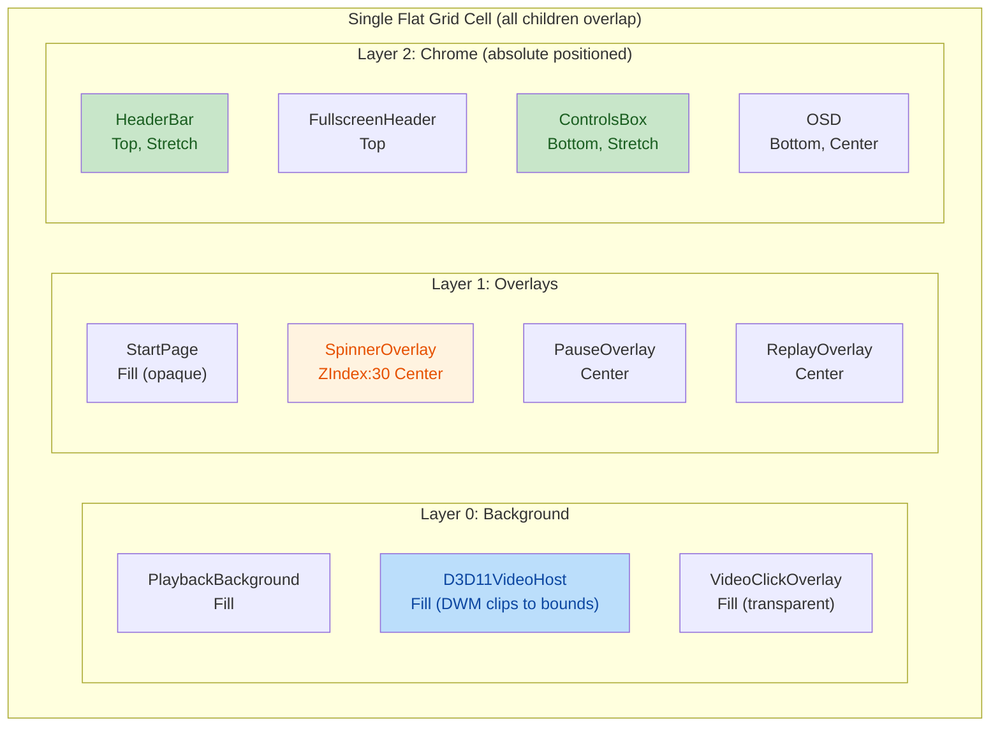
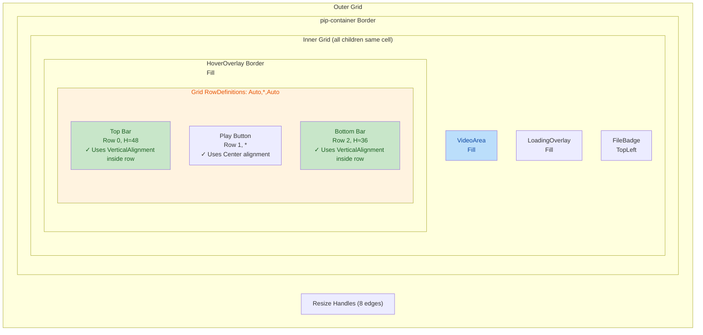
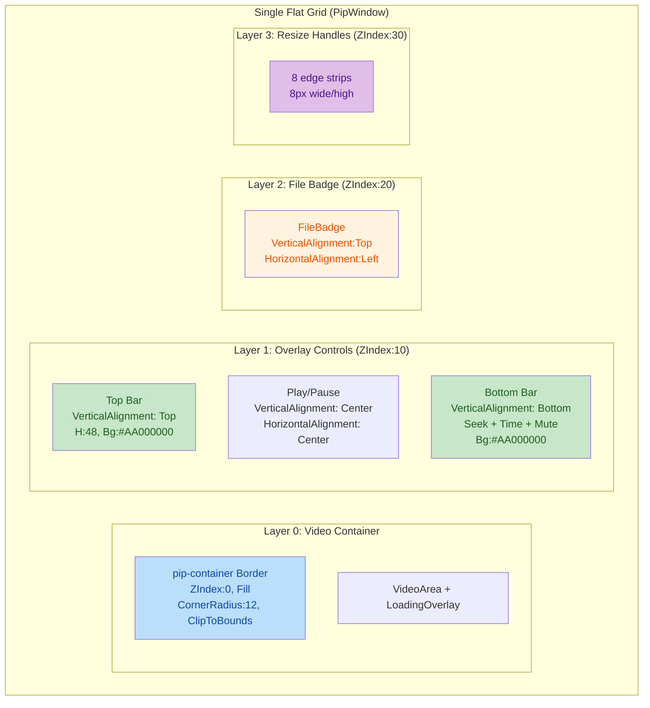

# PiP & MainWindow — Absolute Positioning + Z-Index Integration Plan

## ═══════════════════════════════════════════════════════════════════
## 1. HOW MAINWINDOW WORKS (Reference Architecture)
## ═══════════════════════════════════════════════════════════════════

### Layout: Single Flat `<Grid>` — React Native `position: absolute` equivalent

[MainWindow.axaml](file:///x:/Development/Cine_CSharp_DotNet/src/App/UI/Views/MainWindow.axaml) uses a **single Grid with all children in one cell**:

```xml
<Grid x:Name="MainOverlay" Background="Transparent">

    <!-- LAYER 0: Video + backdrop (renders first, behind overlays) -->
    <Border x:Name="PlaybackBackground" IsHitTestVisible="False" />
    <D3D11VideoHost x:Name="VideoHost"
                    HorizontalAlignment="Stretch" VerticalAlignment="Stretch" />
    <Border x:Name="VideoClickOverlay" Background="Transparent"
            HorizontalAlignment="Stretch" VerticalAlignment="Stretch" />
    <Border Vignette IsHitTestVisible="False" />

    <!-- LAYER 1: UI Overlays (float on top of video) -->
    <StartPage x:Name="StartPage" />
    <SpinnerOverlayControl x:Name="LoadingSpinnerOverlay" ZIndex="30" />
    <PauseOverlayControl x:Name="PauseOverlay" />
    <ReplayOverlayControl x:Name="ReplayOverlay" />
    <DragDropOverlayControl x:Name="DropIndicatorOverlay" />

    <!-- Absolute positioned: pinned to edges via VerticalAlignment -->
    <HeaderBarControl VerticalAlignment="Top" HorizontalAlignment="Stretch" />
    <FullscreenHeaderControl VerticalAlignment="Top" Height="44" />
    <ControlsBoxControl VerticalAlignment="Bottom" HorizontalAlignment="Stretch" />
    <OsdNotificationControl VerticalAlignment="Bottom" HorizontalAlignment="Center"
                             Margin="0,0,0,110" />
</Grid>
```

**Key principles:**
- All children share the SAME Grid cell → natural z-ordering (declared later = on top)
- Positioning uses `VerticalAlignment`/`HorizontalAlignment` — NOT RowDefinitions
- `VerticalAlignment="Top"` → pinned to top edge (like `position:absolute; top:0`)
- `VerticalAlignment="Bottom"` → pinned to bottom (like `position:absolute; bottom:0`)
- `VerticalAlignment="Stretch"` → fills entire area (video)
- Explicit `ZIndex` only used for spinner (must be above everything)



### DWM Thumbnail Clipping in MainWindow

MainWindow clips the DWM thumbnail to the **VideoHost bounds only** (from `SyncThumbnailRect` in [MainWindow.Core.cs](file:///x:/Development/Cine_CSharp_DotNet/src/App/UI/Shell/MainWindow.Core.cs#L544)). The header bar and controls are **outside** the DWM clip rect, so they're always visible. DWM never paints over the chrome.

### Auto-Hide System

[MainWindow.AutoHide.cs](file:///x:/Development/Cine_CSharp_DotNet/src/App/UI/Shell/MainWindow.AutoHide.cs):
- `VideoClickOverlay.PointerMoved` → shows controls, resets 3s timer
- Per-element `PointerEntered`/`Exited` on header, controls, fullscreen-header
- Timer tick checks hover flags before hiding — if any are true, resets timer
- `ShowUiControls`/`HideUiControls` toggle `IsVisible` + `Opacity` + `IsHitTestVisible`

---

## ═══════════════════════════════════════════════════════════════════
## 2. HOW PIPWINDOW CURRENTLY WORKS (Issues)
## ═══════════════════════════════════════════════════════════════════

### Layout: Nested Grids — Unnecessarily Complex

[PipWindow.axaml](file:///x:/Development/Cine_CSharp_DotNet/src/App/UI/Screens/Dialogs/PipWindow.axaml):

```xml
<Grid>  <!-- Outer Grid: container + resize handles -->
    <Border Classes="pip-container">
        <Grid>  <!-- Inner Grid: video + overlay children -->
            <Border x:Name="VideoArea" />           <!-- DWM surface -->
            <Border x:Name="LoadingOverlay" />
            <Border x:Name="HoverOverlay">          <!-- Controls -->
                <Grid RowDefinitions="Auto,*,Auto"> <!-- NESTED Grid! -->
                    <Grid Row="0">Top Bar</Grid>
                    <Button Row="1">Play</Button>
                    <Grid Row="2">Bottom Bar</Grid>
                </Grid>
            </Border>
            <Border x:Name="FileBadge">
        </Grid>
    </Border>
    <!-- resize handles (8 edges) -->
</Grid>
```



### ISSUE 1: Unnecessary RowDefinitions Nesting

The `RowDefinitions="Auto,*,Auto"` inside HoverOverlay is **redundant and over-constrains the layout**. The Top Bar and Bottom Bar are already pinned to edges by being Row 0 and Row 2 of this internal Grid. But this means:
- The center play button occupies Row 1 (*) which **shares height with the video center area** — correct behavior
- BUT the nested Grid adds complexity. MainWindow achieves the same using `VerticalAlignment` on individual children

### ISSUE 2: Controls Background Opacity Exposes DWM Rendering Artifacts

Current: `pip-top-bar Background="#AA000000"` (semi-transparent)
- Video bleeds through the semi-transparent background
- During resize, DWM may flicker through the transparency
- User sees video "through" controls (confusing)

Fix: Use fully opaque backgrounds like MainWindow

### ISSUE 3: Opacity Transition Doesn't Work Correctly

`HideAllControls` sets `IsVisible=false` immediately after `Opacity=0`, killing the 200ms transition.

### ISSUE 4: `Canvas.SetLeft` on Grid Children — Fixed

Was using `Canvas.SetLeft()` on elements inside `<Grid>`. Now uses `Margin`. Fixed.

### ISSUE 5: Seek Position Race During Drag — Fixed

`UpdatePosition` skips seek visuals when `_isSeeking`. Fixed.

### ISSUE 6: Play/Pause Icon Optimistic Toggle — Fixed

No longer toggles icon before ViewModel confirms. Fixed.

### ISSUE 7: FileBadge Z-Order

FileBadge is a sibling of HoverOverlay in the inner Grid. When HoverOverlay is visible, FileBadge is on top (declared after). When HoverOverlay hides, FileBadge remains visible. This is correct behavior but the current opacity/sync logic is slightly off — badge fades in/out but should be independent.

### ISSUE 8: Resize Handles Outside pip-container

Resize handles are children of the outer Grid, outside pip-container. They need to overlay on top of the rounded-corner container for the 8px edge strips. This is correct structurally but needs `ZIndex` to ensure they're above the rounded container.

---

## ═══════════════════════════════════════════════════════════════════
## 3. TARGET ARCHITECTURE
## ═══════════════════════════════════════════════════════════════════

### PipWindow should mirror MainWindow's flat Grid pattern:

```xml
<Window>
    <Grid>  <!-- SINGLE flat cell — ALL children overlap -->
        
        <!-- LAYER 0: Container with rounded corners -->
        <Border Classes="pip-container" ZIndex="0">
            <Grid>
                <!-- DWM video surface -->
                <Border x:Name="VideoArea" />
                <!-- Loading overlay -->
                <Border x:Name="LoadingOverlay" />
            </Grid>
        </Border>

        <!-- LAYER 1: Controls — absolute positioned, floats on top of video -->
        <Border x:Name="HoverOverlay" ZIndex="10"
                HorizontalAlignment="Stretch" VerticalAlignment="Stretch">
            <!-- NO RowDefinitions! Use VerticalAlignment instead -->
            
            <!-- Top bar: pinned to top -->
            <Grid Classes="pip-top-bar"
                  VerticalAlignment="Top" Height="48">
                <!-- title, pin, expand, close buttons -->
            </Grid>

            <!-- Center play/pause button -->
            <Button VerticalAlignment="Center" HorizontalAlignment="Center">
            </Button>

            <!-- Bottom bar: pinned to bottom -->
            <Grid Classes="pip-bottom-bar"
                  VerticalAlignment="Bottom">
                <!-- seek bar, time, mute -->
            </Grid>
        </Border>

        <!-- Layer 2: File badge (always on top when visible) -->
        <Border Classes="pip-file-badge" ZIndex="20"
                VerticalAlignment="Top" HorizontalAlignment="Left"
                Margin="10,10,0,0" />

        <!-- Layer 3: Resize handles — highest ZIndex -->
        <Border ZIndex="30" VerticalAlignment="Top" Height="8" ... />
        <Border ZIndex="30" VerticalAlignment="Bottom" Height="8" ... />
        <!-- ... other resize edges ... -->
    </Grid>
</Window>
```



### DWM Strategy

DWM thumbnail **always fills the full window** (what we have now after simplification). Controls overlay on top via normal Avalonia z-ordering. DWM is at DWM compositor layer (below Avalonia surface). Avalonia controls render on top. No clipping needed.

---

## ═══════════════════════════════════════════════════════════════════
## 4. PHASE PLAN
## ═══════════════════════════════════════════════════════════════════

### Phase 1: Flatten Layout (Structural Alignment with MainWindow)
| Step | What | Why |
|------|------|-----|
| 1.1 | Remove `RowDefinitions="Auto,*,Auto"` from HoverOverlay Grid | Use VerticalAlignment like MainWindow |
| 1.2 | Reposition controls with `VerticalAlignment` instead of Grid.Row | True absolute positioning |
| 1.3 | Add explicit ZIndex to all layers (container=0, overlay=10, badge=20, resize=30) | Ensure stable z-order |
| 1.4 | Remove `MuteButton` from SeekBar Grid, make it a separate sibling | Cleaner structure |
| 1.5 | Simplify code-behind: remove `_hoverBottomBar` and seek-related hover state | Simpler hover tracking |

### Phase 2: Control Visibility & Transitions
| Step | What | Why |
|------|------|-----|
| 2.1 | Fix `HideAllControls`: fade Opacity→0 first, then IsVisible=false after 250ms | Transition actually plays |
| 2.2 | Fix `ShowAllControls`: ensure Opacity transition from 0→1 works | Smooth fade-in |
| 2.3 | Make control backgrounds fully opaque (#FF) | Controls look solid on top of video |
| 2.4 | FileBadge: show when controls hidden, hide when controls shown (inverted) | Clear visual state |

### Phase 3: Seek Bar Polish
| Step | What | Why |
|------|------|-----|
| 3.1 | Fix `PipSeekArea` width measurement — use `ActualWidth` when `Bounds.Width` is 0 | Seek works immediately |
| 3.2 | Ensure seek preview dot position uses `Margin` (already fixed) | Correct positioning |
| 3.3 | Add `ZIndex` to PipSeekArea to ensure it captures events above other elements | Reliable interaction |

### Phase 4: Edge Cases & Robustness
| Step | What | Why |
|------|------|-----|
| 4.1 | `RestoreState`: iterate all screens (already fixed) | Multi-monitor safety |
| 4.2 | Throttle `SyncThumbnailRect` during resize (already fixed) | Performance |
| 4.3 | Guard `UpdatePosition` during user seek drag (already fixed) | No thumb jump |
| 4.4 | Remove `_isUpdatingSeekFromExternal` dead field (already fixed) | Cleanup |

---

## ═══════════════════════════════════════════════════════════════════
## 5. FILES TO MODIFY
## ═══════════════════════════════════════════════════════════════════

| Phase | File | Changes |
|-------|------|---------|
| P1 | [PipWindow.axaml](file:///x:/Development/Cine_CSharp_DotNet/src/App/UI/Screens/Dialogs/PipWindow.axaml) | Flatten layout: remove RowDefinitions, use VerticalAlignment, add ZIndex |
| P1 | [PipWindow.axaml.cs](file:///x:/Development/Cine_CSharp_DotNet/src/App/UI/Screens/Dialogs/PipWindow.axaml.cs) | Simplify hover state, remove HoverOverlay nesting from seek area |
| P2 | PipWindow.axaml.cs | Fix ShowAllControls/HideAllControls transitions, opacity values |
| P2 | PipWindow.axaml | Update background opacities to #FF |
| P3 | PipWindow.axaml.cs | Fix seek bar width measurement, ZIndex on seek area |
| P4 | PipWindow.axaml.cs | (Most already done — verify guards are working) |
