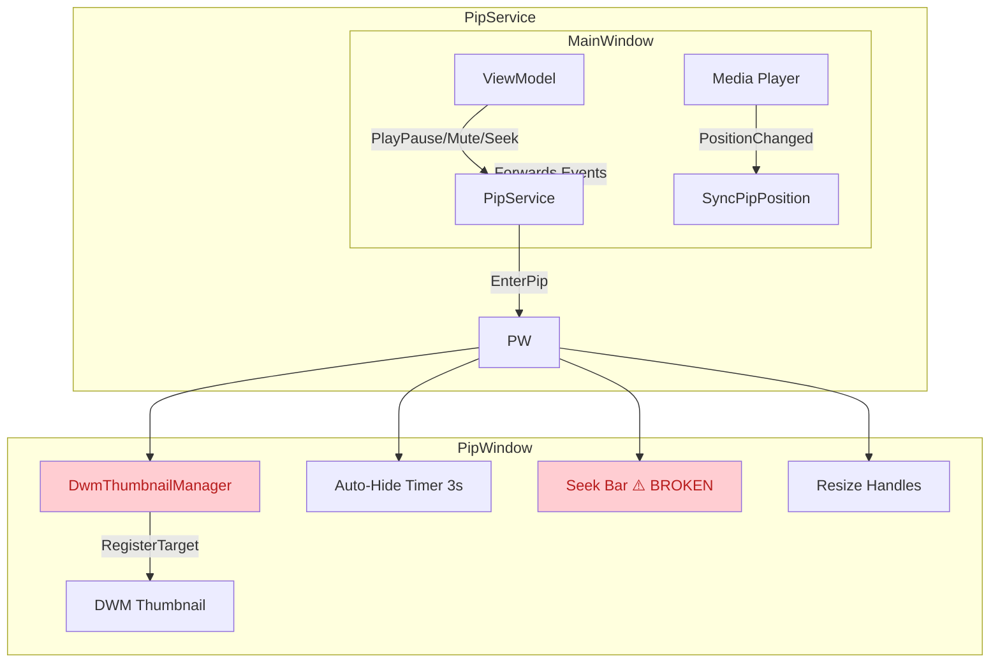

# PiP Overlay & Controls — Fix Action Plan (Revised)

## Current Status

The PiP window architecture is structurally sound (DWM mirroring, resize, event wiring to MainWindow), but **several foundational bugs prevent the overlay from working correctly**. The previous plan focused on feature gaps (chapters, ripple, prev/next buttons); this revision identifies real code-level defects first.

Architecture overview:


---

## ═══════════════════════════════════════════════
## CRITICAL BUGS — These make the overlay non-functional
## ═══════════════════════════════════════════════

### BUG 1 [CRITICAL] — `Canvas.SetLeft()` on Grid Children — Seek Bar Visually Broken

**Files:**
- [PipWindow.axaml.cs](file:///x:/Development/Cine_CSharp_DotNet/src/App/UI/Screens/Dialogs/PipWindow.axaml.cs#L292-L300) (thumb positioning)
- [PipWindow.axaml.cs](file:///x:/Development/Cine_CSharp_DotNet/src/App/UI/Screens/Dialogs/PipWindow.axaml.cs#L509-L513) (preview dot positioning)
- [PipWindow.axaml](file:///x:/Development/Cine_CSharp_DotNet/src/App/UI/Screens/Dialogs/PipWindow.axaml#L216-L249) (pip-seek-area definition)

**Problem:** `PipSeekThumb` and `PipSeekPreviewDot` are child elements of a **`<Grid>`** (`PipSeekArea`), but the code uses `Canvas.SetLeft()` to position them. This attached property has **zero effect** on Grid children — the thumb and preview dot always remain at their default position (x=0).

**Buggy code — UpdateSeekVisuals (line 299):**
```csharp
Canvas.SetLeft(PipSeekThumb, fillWidth);  // ❌ No-op inside <Grid>
```

**Buggy code — OnPipSeekPointerMoved (line 512):**
```csharp
Canvas.SetLeft(PipSeekPreviewDot, n * (aw - 10));  // ❌ No-op inside <Grid>
```

**How MainWindow does it correctly:** [SeekBarControl.axaml.cs](file:///x:/Development/Cine_CSharp_DotNet/src/App/UI/Controls/SeekBar/SeekBarControl.axaml.cs#L197) uses `Margin` for Grid children:
```csharp
SeekThumb.Margin = new Thickness(thumbLeft, 0, 0, 0);
```
And chapter markers use `Canvas.SetLeft` correctly — they're inside an actual `<Canvas>` ItemsPanel: [SeekBarControl.axaml](file:///x:/Development/Cine_CSharp_DotNet/src/App/UI/Controls/SeekBar/SeekBarControl.axaml#L61)

**Fix:** Replace `Canvas.SetLeft(PipSeekThumb, ...)` with `PipSeekThumb.Margin = new Thickness(fillWidth, 0, 0, 0)`. Same for `PipSeekPreviewDot`.

**Result without fix:** User drags on seek bar, `_seekNormalized` updates correctly, `SeekRequested` fires correctly (functional seek), but the **thumb never moves** — it stays pinned at pixel 0. The preview dot on hover also never appears at the right position. The fill bar width `PipSeekFill.Width` IS correct (it's a direct Border property, not a Canvas-ism).

---

### BUG 2 [CRITICAL] — Opaque `VideoArea` Background Blocks DWM Thumbnail

**File:** [PipWindow.axaml](file:///x:/Development/Cine_CSharp_DotNet/src/App/UI/Screens/Dialogs/PipWindow.axaml#L103-L107)

```xml
<Border x:Name="VideoArea"
        Background="#FF0D0D0D"   <!-- ❌ Alpha=FF = fully opaque -->
        ClipToBounds="True"
        CornerRadius="12"
        PointerPressed="OnVideoAreaPointerPressed" />
```

**Problem:** The DWM thumbnail is composited by Windows **behind** Avalonia's rendering surface. The `VideoArea` Border stretches to fill the entire PiP window and has a fully opaque (`#FF`) background. Avalonia renders this as an opaque dark rectangle, **completely occluding the DWM thumbnail**.

The window has `TransparencyLevelHint="Transparent"` and `Background="Transparent"`, which allows the DWM thumbnail to show through — but only in areas where Avalonia doesn't render opaque pixels. The `VideoArea` border covers the entire content area with a solid fill.

**Evidence it may be working anyway:** If the build succeeds and video is visible in the PiP window, the DWM compositor may be rendering the thumbnail on top of the Avalonia surface (Windows compositor behavior varies by GPU driver and DWM version). But this is fragile and driver-dependent.

**Fix:** Change `Background="#FF0D0D0D"` to `Background="Transparent"`. The dark background can be provided by the outer `pip-container` Border instead. Actually, check the `.pip-container` style — it already has `Background="#FF0D0D0D"` with `CornerRadius="12"` at [PipWindow.axaml](file:///x:/Development/Cine_CSharp_DotNet/src/App/UI/Screens/Dialogs/PipWindow.axaml#L22-L26). So `VideoArea` having a solid fill is redundant and harmful.

---

## ═══════════════════════════════════════════════
## MAJOR ISSUES — Degraded UX
## ═══════════════════════════════════════════════

### BUG 3 [MAJOR] — Opacity Transitions Never Animate

**Files:**
- [PipWindow.axaml](file:///x:/Development/Cine_CSharp_DotNet/src/App/UI/Screens/Dialogs/PipWindow.axaml#L26-L32) (style with DoubleTransition)
- [PipWindow.axaml.cs](file:///x:/Development/Cine_CSharp_DotNet/src/App/UI/Screens/Dialogs/PipWindow.axaml.cs#L399-L432) (ShowAllControls / HideAllControls)

**Problem:** The XAML defines a 200ms Opacity transition on `pip-hover-overlay`, but `ShowAllControls()` and `HideAllControls()` toggle `IsVisible` simultaneously with `Opacity`. Setting `IsVisible = false` removes the element from the visual tree **immediately**, so the Opacity transition never has a chance to run.

```csharp
// ShowAllControls — Opacity transition CAN work here (IsVisible=true → element enters visual tree,
// then Opacity starts animating to 1)
HoverOverlay.IsVisible = true;   // enters visual tree
HoverOverlay.Opacity = 1;        // transition from previous value of 0 → 1 (200ms)

// HideAllControls — Opacity transition CANNOT work
HoverOverlay.IsVisible = false;  // ← IMMEDIATELY removes from visual tree
HoverOverlay.Opacity = 0;        // ← This line has NO visual effect — element is already gone
```

**Fix (HideAllControls):** First set `Opacity = 0` and let the transition play, **then** set `IsVisible = false` after the transition duration (or on `TransitionCompleted`). Same for `FileBadge`.

**Fix (ShowAllControls):** The show path actually works because the element enters the visual tree at Opacity=0 (its last set value before being hidden), then the Opacity=1 assignment triggers the transition. But this is accidental — making it explicit is safer.

---

### BUG 4 [MAJOR] — `Window.PointerMoved` May Not Fire Over DWM Thumbnail Area

**File:** [PipWindow.axaml](file:///x:/Development/Cine_CSharp_DotNet/src/App/UI/Screens/Dialogs/PipWindow.axaml#L21) / [PipWindow.axaml.cs](file:///x:/Development/Cine_CSharp_DotNet/src/App/UI/Screens/Dialogs/PipWindow.axaml.cs#L346-L350)

**Problem:** The auto-hide system depends on `Window.PointerMoved` (on the `<Window>` element itself) to detect any mouse activity:
```csharp
private void OnPipWindowPointerMoved(object? sender, PointerEventArgs e)
{
    if (!_controlsVisible)
        ShowAllControls();
    ResetHoverTimer();
}
```

When `HoverOverlay.IsVisible = false` and `IsHitTestVisible = false`, pointer events should bubble up from the `VideoArea` (which fills the entire window) to the `Window`. However, if the DWM thumbnail is rendering on top of the Avalonia surface (DWM compositor behavior), pointer events in the center of the window may not reach Avalonia at all. The only hit-testable surface in that area is `VideoArea`, and it only handles `PointerPressed`.

**Mitigation factor:** The `pip-bottom-bar` and `pip-top-bar` cover the edges (where the user would move the mouse to find controls), so this may not be noticeable in practice. But if the user moves the mouse over pure video area, controls may not re-appear.

**Fix:** Add `PointerMoved` handler on `VideoArea` as a fallback trigger, or verify that Window-level events bubble correctly with a `Debug.WriteLine` on pointer move while overlay is hidden.

---

## ═══════════════════════════════════════════════
## MEDIUM ISSUES — Correctness
## ═══════════════════════════════════════════════

### BUG 5 — `_isUpdatingSeekFromExternal` Flag Set But Never Checked

**File:** [PipWindow.axaml.cs](file:///x:/Development/Cine_CSharp_DotNet/src/App/UI/Screens/Dialogs/PipWindow.axaml.cs#L268-L294)

```csharp
public void UpdatePosition(double positionSec, double durationSec)
{
    _isUpdatingSeekFromExternal = true;   // ← SET
    try { ... UpdateSeekVisuals(_seekNormalized); }
    finally { _isUpdatingSeekFromExternal = false; }
}
```

The flag is intended to prevent user seek handlers from reacting to external position updates. But it's **never checked** in `OnPipSeekPointerMoved`, `OnPipSeekPointerPressed`, or `UpdateSeekVisuals`. If the user is mid-drag seeking and an external position tick arrives, the thumb jumps to the external position.

**Fix:** Add a guard in `UpdateSeekVisuals`: `if (_isUpdatingSeekFromExternal) return;` when `_isSeeking` is true. Or more cleanly, skip setting `_seekNormalized` externally during a user drag.

---

### BUG 6 — `OnVideoAreaPointerPressed` Play/Pause Race Condition

**File:** [PipWindow.axaml.cs](file:///x:/Development/Cine_CSharp_DotNet/src/App/UI/Screens/Dialogs/PipWindow.axaml.cs#L439-L445)

```csharp
private void OnVideoAreaPointerPressed(object? sender, PointerPressedEventArgs e)
{
    _isPlaying = !_isPlaying;                          // ← Optimistically toggles
    SetPlayingState(_isPlaying);                       // ← Updates icon immediately
    PlayPauseRequested?.Invoke(this, EventArgs.Empty);  // ← Fires event to MainWindow
}
```

The PipWindow immediately swaps the icon **before** the ViewModel processes the request. If the ViewModel rejects the play/pause (e.g., no media loaded, decoder error), the PipWindow icon is now out of sync. It will only correct on the next `SyncPipPlayState()` call, which is triggered by ViewModel `IsPlaying` change — but if `IsPlaying` didn't actually change, no sync occurs.

**Fix:** Don't toggle `_isPlaying` / `SetPlayingState` here. Let the ViewModel confirm, and let `SyncPipPlayState()` update the icon. Alternatively, add a timeout revert: if `SyncPipPlayState` hasn't confirmed within ~200ms, revert the icon.

---

## ═══════════════════════════════════════════════
## LOW ISSUES — Hygiene
## ═══════════════════════════════════════════════

### BUG 7 — Compiler Warning: `_isUpdatingSeekFromExternal` Assigned But Never Used

**File:** [PipWindow.axaml.cs](file:///x:/Development/Cine_CSharp_DotNet/src/App/UI/Screens/Dialogs/PipWindow.axaml.cs#L34)

```
warning CS0414: The field 'PipWindow._isUpdatingSeekFromExternal' is assigned but its value is never used
```

Either wire the guard (see BUG 5) or remove the field.

---

### BUG 8 — Missing `using System.IO` in PipService

**File:** [PipService.cs](file:///x:/Development/Cine_CSharp_DotNet/src/App/Application/Services/PipService.cs#L1-L8)

`Path.Combine`, `File.AppendAllText`, etc. are used without explicit `using System.IO`. Works only because of project-level implicit usings — fragile if usings are cleaned up.

---

### BUG 9 — `SyncThumbnailRect()` Called Every Frame During Resize

**File:** [PipWindow.axaml.cs](file:///x:/Development/Cine_CSharp_DotNet/src/App/UI/Screens/Dialogs/PipWindow.axaml.cs#L70-L74)

```csharp
this.SizeChanged += (_, _) =>
{
    SyncThumbnailRect();          // ← Called every SizeChanged, which fires
    if (!_isApplyingAspectRatio)  //    on every pixel of resize drag
        ApplyAspectRatioConstraint();
};
```

During resize drag, `Width`/`Height` change on every pointer-move event, triggering `SizeChanged` → `SyncThumbnailRect()` → `DwmUpdateThumbnailProperties()`. This is a cross-process kernel call at mouse-move frequency. Should throttle or defer to drag release.

---

### BUG 10 — `RestoreState()` Only Checks Primary Screen for Off-Screen Recovery

**File:** [PipWindow.axaml.cs](file:///x:/Development/Cine_CSharp_DotNet/src/App/UI/Screens/Dialogs/PipWindow.axaml.cs#L640-L655)

Uses `screens[0]` (primary) for bounds checking. If the user has multiple monitors and the saved position was on a secondary monitor that is now disconnected, the window may appear partially off-screen.

---

## ═══════════════════════════════════════════════
## FIX PRIORITY ORDER
## ═══════════════════════════════════════════════

```
1. BUG 1  ─ Canvas.SetLeft fix ─────────── CRITICAL — seek visuals completely broken
2. BUG 2  ─ VideoArea Background fix ───── CRITICAL — DWM thumbnail may be invisible
3. BUG 3  ─ Opacity transition fix ─────── MAJOR — overlay flickers instead of fading
4. BUG 4  ─ PointerMoved reliability ───── MAJOR — auto-show may fail
5. BUG 5  ─ _isUpdatingSeekFromExternal ── MEDIUM — seek race condition
6. BUG 6  ─ Play/pause icon race ───────── MEDIUM — icon desync
7. BUG 7  ─ CS0414 warning ─────────────── LOW — cleanup
8. BUG 8  ─ Missing using ──────────────── LOW — robustness
9. BUG 9  ─ Resize throttle ────────────── LOW — performance
10. BUG 10 ─ Multi-monitor off-screen ──── LOW — edge case
```

---

## ═══════════════════════════════════════════════
## FILES TO MODIFY
## ═══════════════════════════════════════════════

| Bug | File | Change |
|-----|------|--------|
| 1 | `src/App/UI/Screens/Dialogs/PipWindow.axaml.cs` | Replace `Canvas.SetLeft` → `Margin` for `PipSeekThumb` and `PipSeekPreviewDot` (2 lines) |
| 2 | `src/App/UI/Screens/Dialogs/PipWindow.axaml` | `VideoArea Background="Transparent"` (1 line) |
| 3 | `src/App/UI/Screens/Dialogs/PipWindow.axaml.cs` | Rewrite `HideAllControls` to animate Opacity→0 before `IsVisible=false` (~10 lines) |
| 4 | `src/App/UI/Screens/Dialogs/PipWindow.axaml.cs` | Add `PointerMoved` fallback on `VideoArea` or test bubbling behavior (investigation) |
| 5 | `src/App/UI/Screens/Dialogs/PipWindow.axaml.cs` | Guard `UpdateSeekVisuals` when `_isSeeking` + external update (2 lines) |
| 6 | `src/App/UI/Screens/Dialogs/PipWindow.axaml.cs` | Remove optimistic toggle from `OnVideoAreaPointerPressed` (2 lines) |
| 7 | `src/App/UI/Screens/Dialogs/PipWindow.axaml.cs` | Remove or wire `_isUpdatingSeekFromExternal` (1 line) |
| 8 | `src/App/Application/Services/PipService.cs` | Add `using System.IO` (1 line) |
| 9 | `src/App/UI/Screens/Dialogs/PipWindow.axaml.cs` | Throttle or defer `SyncThumbnailRect` during resize (~5 lines) |
| 10 | `src/App/UI/Screens/Dialogs/PipWindow.axaml.cs` | Iterate all screens in `RestoreState` (~5 lines) |
